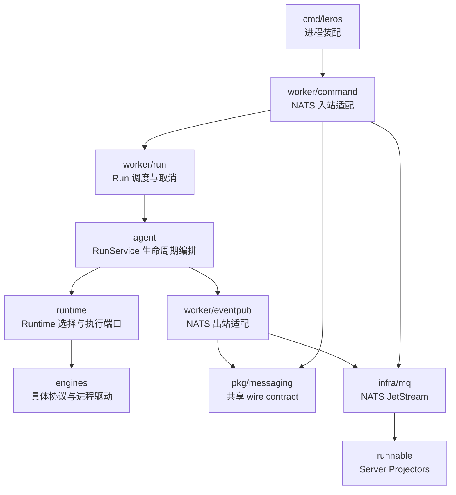
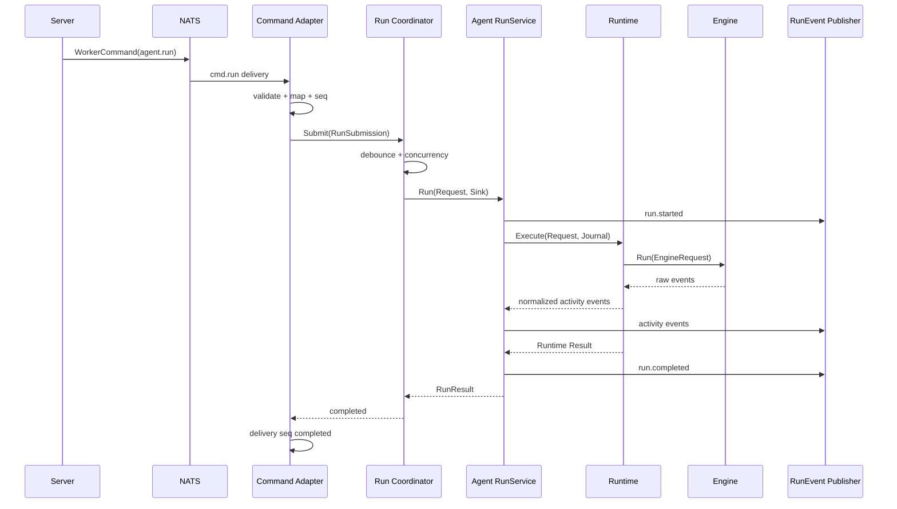

# Agent Runtime 架构调整计划

> 状态：设计方案
>
> 更新时间：2026-06-27
>
> 当前架构参考：[leros-architecture.html](./leros-architecture.html)

## 1. 背景与结论

当前 Server/Worker 分离、`WorkerCommand` 统一协议、四条 command lane，以及
`run.stream` / `run.state` 双 lane 已经形成清晰的跨进程通信边界。这些部分不需要重新设计。

当前复杂度主要集中在 Worker 内部：

1. `agent.Runner` 被 Runtime 路由、生命周期包装器和 Engine 适配器共同实现，同一接口承载三种语义。
2. `command/run.Handler` 同时负责传输适配、调度、Workspace 准备、取消、Agent 调用和失败补偿。
3. Engine、Runtime、lifecycle journal 和 Handler 都参与终端状态处理，事件所有权不够单一。
4. `runTask` 同时承载 wire payload、领域请求和 NATS delivery metadata。
5. Semaphore、WorkerPool、debouncer、pending waiters 和 active runs 分散维护 Run 调度状态。

本次调整的核心不是增加更多抽象，而是将当前混在一起的职责收敛为一条可直接追踪的链路：

```text
NATS Command
    → Command Adapter
    → Run Coordinator
    → Agent RunService
    → Runtime
    → Engine
```

事件反向链路：

```text
Engine 原始事件
    → Runtime 标准事件
    → RunJournal
    → RunEvent Publisher
    → NATS run.stream / run.state
    → Server Projector
```

## 2. 设计原则与尺度

### 2.1 设计原则

- **单一 Run 入口**：业务代码只通过 `RunService.Run` 启动 Agent Run。
- **单一终端事件所有者**：只有 RunService 产生 started/completed/failed/cancelled。
- **传输与领域分离**：`pkg/messaging` 保持 wire contract，不依赖 `internal/agent`。
- **依赖方向单向**：Agent 和 Runtime 不知道 NATS、JetStream、Worker lane 或 SSE。
- **显式映射**：wire request 只在 Command Adapter 映射一次；Agent event 只在 Publisher 映射一次。
- **渐进迁移**：保持现有消息 schema、数据库 schema 和部署方式，每个阶段可独立验证。

### 2.2 明确不做

- 不增加新的服务进程。
- 不增加新的 NATS stream 或 lane。
- 不引入事件溯源框架、工作流引擎或持久化状态机。
- 不设计通用插件系统或通用 middleware 框架。
- 不把 Server/Worker wire DTO 与内部 Agent 类型合并。
- 不在本次调整中重做 Worker Scheduler、WebSocket 管理或 Skill 系统。

## 3. 参考项目取舍

### 3.1 Pi

吸收：

- Agent 对一次运行的状态、事件和停止条件具有明确所有权。
- 模型/Provider 调用位于 Agent loop 的执行边界。
- 事件流是 Agent 的输出，不与消息总线绑定。

不照搬：

- SingerOS 同时支持 native 与外部完整 Agent CLI，不适合强制所有 Engine 进入同一种模型工具循环。

### 3.2 Multica

吸收：

- Backend 执行过程事件与最终 Result 分离。
- 每个 CLI Backend 只处理自身进程协议和事件解析。
- 调度层消费统一事件，不读取 Provider 私有输出。

不照搬：

- 不构建大型 Daemon 对象，不把仓库、调度、网络、执行和上报重新集中到一个类型。

### 3.3 Hermes Agent

吸收：

- Provider transport 只负责请求格式转换和响应标准化。
- Provider 私有字段保留在适配层，不污染通用事件字段。

不照搬：

- 不复制大型 conversation loop 和大量运行时全局状态。
- 不把重试、缓存、Provider 路由、工具执行和持久化集中在单个 Agent 类型。

## 4. 目标架构层级



### 4.1 进程装配层

路径：`backend/cmd/leros/`

职责：

- 加载配置。
- 创建 NATS、Runtime Registry、RunService、RunCoordinator 和 handlers。
- 启动 HTTP Server 与 Dispatcher。
- 注册进程关闭函数。

禁止：

- Run 调度或业务逻辑。
- Workspace 准备。
- 事件映射。

### 4.2 Command Adapter

目标路径：`backend/internal/worker/command/`

职责：

- 订阅 command lanes。
- 解析并校验 `messaging.WorkerCommand` envelope。
- 将 `RunCommandPayload` 映射为内部 `agent.Request`。
- 从 `*nats.Msg` 提取 stream sequence。
- 将请求、事件路由上下文和 delivery sequences 组装为 `RunSubmission`。
- 等待 Coordinator 返回后更新 delivery terminal state。

禁止：

- Workspace clone 或附件下载。
- Runtime 选择。
- Run 生命周期事件生产。
- 直接调用 Engine。

### 4.3 Run Coordinator

目标路径：`backend/internal/worker/run/`

职责：

- 按 Session key 进行 debounce 合并。
- 管理 Worker 级别并发上限。
- 串行化同一 Session 的 Run。
- 维护 active run 和 `context.CancelFunc`。
- 处理 `Submit`、`Cancel` 和优雅关闭。
- 将合并后的 `RunSubmission` 交给 RunService。

Coordinator 不解析 NATS 消息，也不生产业务事件。

### 4.4 Agent RunService

目标路径：`backend/internal/agent/`

RunService 是一次 Agent Run 的应用层所有者，内部只保留三个阶段：

1. **Prepare**
   - 请求标准化与校验。
   - Model、System Prompt、Session Context 构建。
   - Workspace 和附件准备。
   - 权限检查与 artifact baseline。
   - 创建 RunJournal 并发布 `run.started`。

2. **Execute**
   - 根据 `Runtime.Kind` 解析 Runtime。
   - 调用 Runtime。
   - Runtime 活动事件全部写入 RunJournal。

3. **Finalize**
   - Workspace push 和 artifact reconcile。
   - 生成最终 Result。
   - learning 与 session complete。
   - 恰好发布一个 completed、failed 或 cancelled。

RunService 不知道事件最终会写入 NATS、日志还是测试内存。

### 4.5 Runtime

端口定义：`backend/internal/agent/runtime.go`

实现路径：`backend/internal/runtime/`

职责：

- 根据 kind 选择 native、Claude、Codex 或 OpenCode Runtime。
- 将 Agent Request 转为 Engine Request。
- 消费 Engine 原始事件并标准化为 Agent Event。
- 管理 Provider session resume。
- 协调审批/提问 responder 与现有 `InteractionRouter`。
- 返回 Runtime Result。

Runtime 不生产 Run started/terminal event，也不依赖 NATS。

### 4.6 Engine

路径：`backend/engines/`

职责：

- 具体 CLI 或 native Engine 的准备和启动。
- 进程生命周期与 Provider 协议。
- 原始输出解析。
- Provider 特有 responder。

Engine 不负责：

- Agent Run 生命周期。
- Workspace 业务准备。
- NATS subject 或 wire envelope。
- Session message 持久化。

### 4.7 RunEvent Publisher

目标路径：`backend/internal/worker/eventpub/`

职责：

- 实现 RunCoordinator 使用的 `EventSinkFactory`，按 `RunEventContext` 创建 run-scoped sink。
- 将 `agent.Event` 映射为 `messaging.RunEvent`。
- 根据事件类型选择 `run.stream` 或 `run.state`。
- 填充 route、trace、reply message IDs。
- 对 terminal event 使用 detached timeout context。
- 调用 EventBus 发布。

未知事件类型必须返回错误，不能默认归入 stream lane。

### 4.8 Server Projector

保留当前路径：

- `session_run_state_projector.go`
- `session_run_stream_projector.go`

职责：

- state projector：处理 started、terminal、artifact 等关键状态。
- stream projector：记录 stream lane 首序号。
- SSE：消费 stream lane 并根据 `StreamStartSeq` 回放。

`StreamStartSeq` 和 `StateStartSeq` 始终来自各自 lane，禁止相互替代。

## 5. 目标目录

```text
backend/
├── cmd/leros/
│   ├── server.go
│   └── worker.go
│
├── pkg/messaging/
│   ├── envelope.go
│   ├── command.go
│   ├── event.go
│   └── subject.go
│
├── internal/
│   ├── infra/mq/
│   │   └── nats.go
│   │
│   ├── worker/
│   │   ├── command/
│   │   │   ├── dispatcher.go
│   │   │   ├── run_handler.go
│   │   │   ├── run_mapper.go
│   │   │   ├── control_handler.go
│   │   │   ├── interaction/
│   │   │   └── skill/
│   │   │
│   │   ├── run/
│   │   │   ├── coordinator.go
│   │   │   ├── submission.go
│   │   │   ├── debounce.go
│   │   │   └── active_runs.go
│   │   │
│   │   └── eventpub/
│   │       ├── publisher.go
│   │       └── mapper.go
│   │
│   ├── agent/
│   │   ├── service.go
│   │   ├── runtime.go
│   │   ├── request.go
│   │   ├── result.go
│   │   ├── event.go
│   │   ├── journal.go
│   │   └── lifecycle/
│   │       ├── prepare.go
│   │       ├── execute.go
│   │       └── finalize.go
│   │
│   ├── runtime/
│   │   ├── registry.go
│   │   └── adapter/
│   │       ├── engine.go
│   │       └── provider_session.go
│   │
│   └── runnable/
│       ├── session_run_state_projector.go
│       └── session_run_stream_projector.go
│
└── engines/
    ├── engine.go
    ├── native/
    ├── claude/
    ├── codex/
    └── opencode/
```

目录用于表达职责，不要求为每个小类型创建独立 package。迁移时优先保持较少的 package，
只有在依赖方向需要编译期隔离时才拆包。

## 6. 核心接口

### 6.1 RunService

```go
// RunService owns the complete lifecycle of one agent run.
type RunService interface {
    Run(
        ctx context.Context,
        req *Request,
        sink EventSink,
    ) (*RunResult, error)
}
```

约束：

- `Run` 返回前必须形成终态。
- `Run` 最多产生一个 terminal event。
- `Request` 不包含 EventSink、NATS route 或 delivery sequence。

### 6.2 Runtime

```go
// Runtime executes a prepared agent request using one runtime kind.
type Runtime interface {
    Kind() string
    Execute(
        ctx context.Context,
        req *Request,
        sink EventSink,
    ) (*RunResult, error)
}

// RuntimeResolver resolves the runtime selected by a request.
type RuntimeResolver interface {
    Resolve(kind string) (Runtime, error)
}
```

`Runtime` 与 `RuntimeResolver` 定义在 `agent` 包，由 `internal/runtime` 的 Registry
和 adapter 实现。这样 RunService 只依赖同包端口，Runtime 实现可以依赖 Agent
Request/Event，而不会形成 Go import cycle。

Runtime 可以输出活动事件，但 started 和 terminal event 会被 RunService 统一管理。

### 6.3 RunCoordinator

```go
// RunEventContext carries the routing data required by an event sink.
type RunEventContext struct {
    OrgID             uint
    WorkerID          uint
    SessionID         string
    RequestID         string
    TaskID            string
    RunID             string
    TraceID           string
    ParentID          string
    ReplyToMessageIDs []string
}

// RunSubmission joins a domain request with worker delivery metadata.
type RunSubmission struct {
    Request      *agent.Request
    EventContext RunEventContext
    DeliverySeqs []uint64
}

// EventSinkFactory creates a run-scoped sink without exposing NATS to Coordinator.
type EventSinkFactory interface {
    NewEventSink(ctx RunEventContext) agent.EventSink
}

// RunCoordinator schedules and cancels worker-local runs.
type RunCoordinator interface {
    Submit(ctx context.Context, submission RunSubmission) error
    Cancel(ctx context.Context, sessionID, runID string) error
    Close() error
}
```

### 6.4 Event Publisher

```go
// EventPublisher publishes one normalized agent event.
type EventPublisher interface {
    Publish(ctx context.Context, event *agent.Event) error
}
```

具体 NATS 实现可以实现 `agent.EventSink`，但 Agent 包只看到最小 Sink 接口。

## 7. 数据与事件边界

### 7.1 请求对象

| 对象 | 所属层 | 内容 |
|---|---|---|
| `messaging.WorkerCommand` | Wire | envelope、trace、route、command body |
| `messaging.RunCommandPayload` | Wire | 跨进程可序列化的 Run 参数 |
| `RunSubmission` | Worker application | Agent Request + event context + delivery seqs |
| `agent.Request` | Agent domain | 不可变执行快照 |
| `engines.RunRequest` | Engine port | Engine 所需的 prompt、model、workdir、session |

允许的映射：

```text
WorkerCommand → RunSubmission → agent.Request → engines.RunRequest
```

禁止：

- `pkg/messaging` import `internal/agent`。
- Agent Request 保存 `*nats.Msg` 或 JetStream sequence。
- Engine Request 保存 Server API DTO。

### 7.2 事件所有权

| 事件 | 生产者 | 下游 |
|---|---|---|
| `run.started` | RunService | RunJournal → Publisher |
| message/reasoning delta | Runtime | RunJournal → Publisher |
| tool/todo event | Runtime | RunJournal → Publisher |
| approval/question | Runtime interaction adapter | RunJournal → Publisher |
| artifact declared | RunService finalize | RunJournal → Publisher |
| completed/failed/cancelled | RunService | RunJournal → Publisher |

Engine 产生的 Provider started/completed/error 是 Runtime 内部信号，不直接成为 Run terminal event。

### 7.3 Lane 分类

保持现有分类：

- `run.stream`
  - `message.delta`
  - `reasoning.delta`
  - `message.completed`
  - `tool_call.started`
  - `tool_call.finished`
  - `todo.snapshot`
  - `todo.updated`

- `run.state`
  - `run.started`
  - `run.completed`
  - `run.failed`
  - `run.cancelled`
  - `artifact.declared`
  - `approval.requested/resolved`
  - `question.asked/answered`

分类函数对未知事件返回错误。

## 8. 关键流程

### 8.1 正常 Run



### 8.2 取消

1. `cmd.control` 到达 Command Adapter。
2. Adapter 解码 `run.cancel` 并调用 `Coordinator.Cancel(sessionID, runID)`。
3. Coordinator 查找 active run 并触发 cancel。
4. Runtime/Engine 通过 context 停止。
5. RunService 将 `context.Canceled` 归一化为 cancelled。
6. RunService 发布唯一的 `run.cancelled`。
7. Publisher 使用 detached timeout context 将终端事件发布到 state lane。

### 8.3 审批与提问

本次不重做 InteractionRouter：

1. Engine adapter 识别 Provider approval/question。
2. Runtime 发出标准 approval/question event。
3. 现有 InteractionRouter 阻塞等待。
4. `cmd.interaction` handler 写入决议或答案。
5. Runtime 将决议写回 Engine responder。

审批机制后续如需改为非阻塞状态机，应作为独立设计，不与本次 Run 分层调整混合。

## 9. 渐进迁移计划

### Phase 0：行为基线

- 为当前完整链路补充 characterization tests。
- 固化 command 和 event JSON shape。
- 固化 stream/state 分类。
- 固化取消时的终端事件和 session message 持久化行为。
- 固化 provider session resume、审批和提问行为。

完成标准：

- 后续阶段可以区分架构调整与行为回归。

### Phase 1：区分 RunService 与 Runtime

- 新增 `RunService`、`Runtime`、`RuntimeResolver`。
- 将当前 `RuntimeRouter` 适配为 RuntimeResolver。
- 将 `externalcli.Runner` 适配为 Runtime。
- 由 RunService 包装现有 lifecycle pipeline。
- Worker composition root 改为注入 RunService。

本阶段不移动 Workspace、debounce 和 NATS Publisher。

完成标准：

- 调用链中不再由三个不同层同时暴露 `agent.Runner`。
- native、Claude、Codex、OpenCode 行为保持不变。

### Phase 2：提取 RunCoordinator

- 新建 `worker/run`。
- 将 debounce、WorkerPool、pending waiters、active runs 和取消迁入 Coordinator。
- 引入 `RunSubmission`。
- 删除扁平 `runTask`。
- 移除 Semaphore 与 WorkerPool 的双重并发控制，只保留一个并发门。
- Command Handler 只负责 wire、delivery seq 和调用 Coordinator。

完成标准：

- Handler 不再持有 pool、debouncer、pending 或 activeRuns。
- 同 Session 合并、跨 Session 并发和 NATS ACK 时序与当前一致。

### Phase 3：收拢 Agent 生命周期

- 将 Workspace 和附件准备迁入 RunService Prepare。
- 将现有 lifecycle steps 按 prepare、execute、finalize 收拢。
- RunJournal 不再通过修改 `Request.EventSink` 注入。
- 从 Request 删除 EventSink。
- Handler 删除 `emitRunFailed` / `emitRunCancelled` 补发逻辑。

完成标准：

- 任意 prepare、runtime、finalize 错误都由 RunService 形成终态。
- 每个 Run 恰好一个 started 和一个 terminal event。

### Phase 4：提取 RunEvent Publisher

- 将 `MQStreamSink` 移到 `worker/eventpub`。
- 集中 Agent Event → `messaging.RunEvent` 映射。
- 未知事件改为显式错误。
- Server projector 直接依赖 wire event，不反向依赖 Worker runtime event。
- 保留 terminal detached context 和双 lane subject。

完成标准：

- Runtime、Engine 和 Agent 包中不存在 NATS import。
- Event 类型转换只存在于 Runtime adapter 和 RunEvent Publisher 两处明确边界。

### Phase 5：目录收敛与文档同步

- 删除兼容 alias、旧 Runner 和空转发文件。
- 更新 `PROJECT_STRUCTURE.md`。
- 更新 `leros-architecture.html` 为重构后的实际状态。
- 用 `rg` 验证旧包名和旧接口无引用。

## 10. 测试计划

### 10.1 Command Adapter

- 非法 envelope、command type、route 和 model 被拒绝。
- wire 字段完整映射到 Agent Request。
- reply message IDs 和 delivery sequences 不丢失。
- Adapter 不修改 wire DTO。

### 10.2 RunCoordinator

- 同 Session 在 debounce window 内合并。
- 不同 Session 不互相合并。
- 同 Session 不并发执行。
- Worker 并发上限生效且无双重 semaphore。
- Cancel 只取消匹配的 session/run。
- Close 等待或取消在途任务，不泄漏 waiter。
- 合并批次内全部 delivery seq 得到一致终态。

### 10.3 RunService

- 正常执行：started → activity → completed。
- Runtime 失败：started → failed。
- context cancel：started → cancelled。
- Prepare 失败和 Finalize 失败均形成唯一 terminal event。
- Event sequence 单调递增。
- Result、usage、artifact 和 archived events 正确进入 terminal payload。

### 10.4 Runtime 与 Engine

- 默认 Runtime 与显式 Runtime 选择。
- Runtime 不可用时返回清晰错误。
- Engine started/completed 不穿透为重复 Run lifecycle event。
- Provider session resume 保持。
- approval/question responder 保持。

### 10.5 Publisher 与 Projector

- 每种 Agent Event 映射到正确 wire payload。
- 每种事件进入正确 lane。
- 未知事件返回错误。
- terminal event 在原 context 已取消时仍可发布。
- StreamStartSeq 和 StateStartSeq 分别来自对应 lane。
- completed/failed/cancelled session message 内容、error_msg、chunks 和 artifacts 正确。

### 10.6 集成验证

使用 fake Runtime 和 fake EventBus 覆盖：

```text
WorkerCommand
→ Dispatcher
→ Command Adapter
→ Coordinator
→ RunService
→ Publisher
→ State/Stream Projector
→ Session Message
```

验证命令、事件、持久化和 replay metadata 的完整关联。

## 11. 验收标准

- 保持现有 NATS subject、stream、consumer 和 JSON wire schema。
- 保持现有数据库 schema。
- 每个 Run ID 恰好一个 started 和一个 terminal event。
- `content` 与 `error_msg` 继续保持分离。
- Runtime 和 Engine 不依赖 NATS。
- Command Handler 不承担 Workspace、Agent lifecycle 或终端事件补偿。
- RunService 不包含 transport route 或 JetStream delivery metadata。
- 双 lane replay sequence 语义不退化。
- targeted build、vet 和相关 package tests 通过。

## 12. 风险控制

| 风险 | 控制措施 |
|---|---|
| 终端事件重复或丢失 | Phase 0 固化事件计数；RunService 单一所有权 |
| debounce 后 ACK 过早 | RunSubmission 保留全部 delivery seq，Coordinator 完成后统一返回 |
| 取消后 terminal 发布失败 | Publisher 保留 detached timeout context |
| wire/domain 字段遗漏 | mapper table tests 和 JSON golden tests |
| provider session 恢复回归 | Runtime adapter characterization tests |
| 迁移同时改动过多 | 每个 Phase 独立提交，不跨阶段删除兼容实现 |
