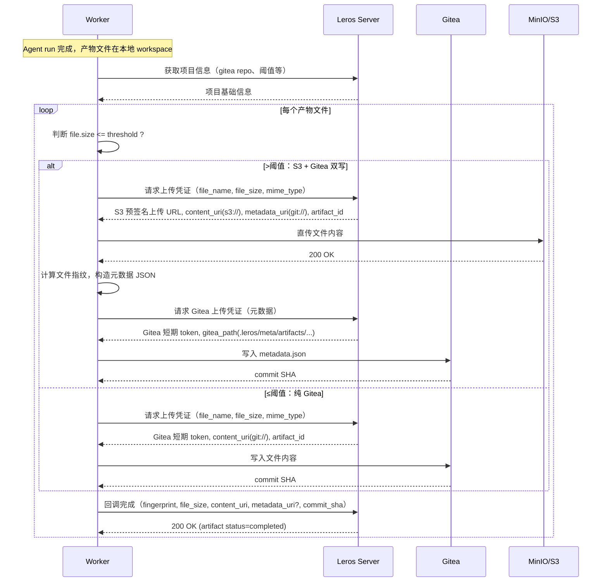
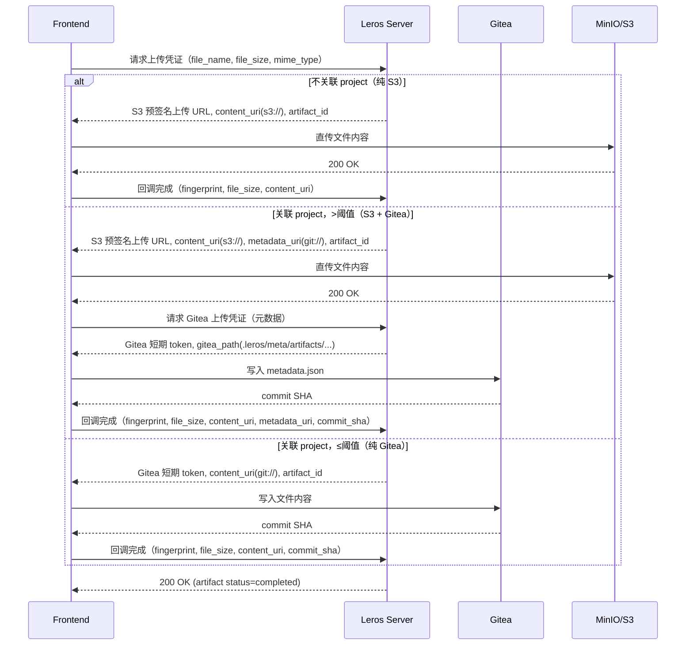
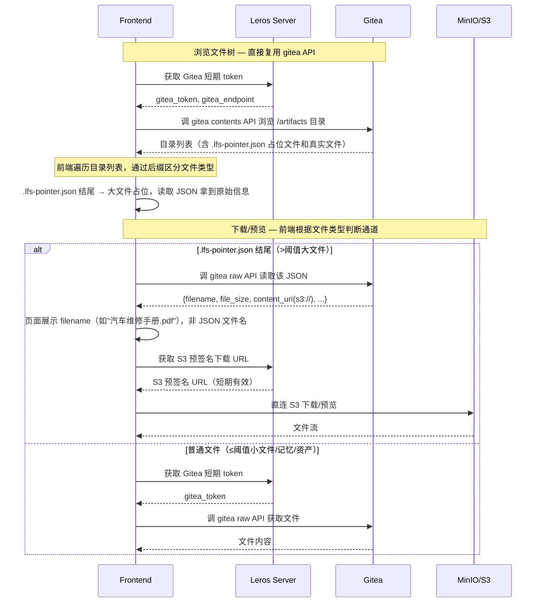

# 文件存储技术方案

> 主题：基于 s3 + gitea 的双层文件存储
> 范围：文件分类、URI 体系、存储方式声明、worker-server 交互协议

## 1. 背景与目标

当前 Leros 的产物文件存在 worker 本地 workspace，通过 server 与 worker 共享挂载目录读取（参见 `docs/AGENT_WORKSPACE_ARTIFACT_DESIGN.md`）。该方式存在以下问题：

- 没有独立的对象存储支撑，切换设备后的文件同步困难。
- 文件跟随 worker 生命周期，跨 worker / 跨服务访问困难。
- 项目记忆、长期资产没有独立存储边界。
- 用户上传文件没有统一通道。

本文档定义新的文件存储方案：

- **s3 兼容对象存储**（含 minio）保存大文件的原始字节。
- **gitea 服务**为每个 project 提供一个仓库，承担小文件内容、项目记忆、项目资产、大文件元数据索引。
- **按文件大小阈值路由**：≤阈值纯 gitea 写入，>阈值 s3 + gitea 双写。阈值可配，默认 1MB。
- **worker 通过 server API 获取上传凭证**：不持有 s3 / gitea 长期凭证，通过 server 签发短期 token / 预签名 URL 操作存储。
- **对外暴露 gitea 原生能力**：文件浏览、下载、预览直接复用 gitea API，Leros 不再自建文件树/产物接口。
- **统一 URI 体系**：所有文件用带 schema 的 URI 标识（`s3://`、`git://`），前端解析 URI 判断访问通道。

## 2. 文件分类

所有纳入管理的文件按来源和用途分为四类：

| 类别 | 来源 | 典型内容 |
|------|------|---------|
| 用户上传文件 | 前端 / API 主动上传 | 文档、图片、代码包 |
| Worker 产物文件 | Agent run 产生 | 报告、代码 patch、审查结果 |
| 项目记忆文件 | Agent 长期记忆序列化 | 对话摘要、知识图谱、偏好 |
| 项目资产文件 | 用户上传（会话中或直接上传）+ 项目配置 | 文档、logo、模板、配置文件 |

### 2.1 与项目/任务的关联

- 用户上传文件分为"关联 project/task"和"不关联 project/task"两种。
  - 不关联 project/task 的走纯 S3 存储，不纳入 Git 版本管理。
  - 关联 project/task 的按 S3 阈值路由策略处理。
- Worker 产物文件始终关联 project/task。
- 项目记忆文件始终关联 project。
- 项目资产文件始终关联 project。

## 3. 存储方式声明

### 3.1 大小阈值路由

**核心原则**：不以文件类别决定存储方式，以文件大小作为路由标准。阈值通过 `config.upload_file_size_threshold` 配置，默认 1MB。

```
if file_size <= upload_file_size_threshold:
    → 纯 Gitea（文件内容直接存入 project gitea 仓库）
else:
    → S3 + Gitea 双写（原始文件存 S3，元数据/索引存 gitea）
```

| 文件大小 | 存储策略 | 理由 |
|---------|---------|------|
| ≤ 阈值（默认 1MB） | 纯 Gitea | Git 友好，版本历史清晰，无额外存储开销 |
| > 阈值 | S3 存原始文件 + Gitea 存元数据（s3_key, sha256 等） | 避免 Git 仓库膨胀，S3 适合大文件 |

此规则对所有文件类别统一适用，不限制具体类型。

### 3.2 例外：不关联 project 的用户上传文件

不关联 project/task 的用户上传文件不适用阈值路由，始终走纯 S3 存储，不纳入 Git 版本管理。

### 3.3 存储方式汇总

| 场景 | 存储方式 | 说明 |
|------|---------|------|
| 用户上传（无 project/task 关联） | 纯 S3 | 独立上传通道，不走 gitea |
| 用户上传（关联 project，≤阈值） | 纯 Gitea | 写入 project gitea 仓库 |
| 用户上传（关联 project，>阈值） | S3 + Gitea 双写 | S3 存原始文件，Gitea 存元数据索引 |
| Worker 产物（≤阈值） | 纯 Gitea | 写入 project gitea 仓库 |
| Worker 产物（>阈值） | S3 + Gitea 双写 | S3 存原始文件，Gitea 存元数据索引 |
| 项目记忆（≤阈值） | 纯 Gitea | `.leros/memory/` 目录 |
| 项目记忆（>阈值） | S3 + Gitea 双写 | 大文件引用存 S3，记录存 gitea |
| 项目资产（≤阈值） | 纯 Gitea | `.leros/assets/` 目录 |
| 项目资产（>阈值） | S3 + Gitea 双写 | 大文件引用存 S3，记录存 gitea |

### 3.4 配置

```yaml
storage:
  upload_file_size_threshold: 1048576  # 1MB，≤此值纯 gitea，>此值 s3+gitea
  s3:
    endpoint: http://minio:9000
    access_key: <key>
    secret_key: <secret>
    use_ssl: false
    bucket: leros-artifacts
  gitea:
    endpoint: https://gitea.example.com
    admin_token: <token>
    default_owner: leros-system
    org_prefix: leros
```

## 4. URI 体系

**设计目标**：所有文件用带 schema 的 URI 标识，前端/Worker 通过解析 URI 即可判断访问通道。

**URI Schema 定义**：

| Schema | 格式 | 示例 | 用途 |
|--------|------|------|------|
| `s3://` | `s3://{bucket}/{key}` | `s3://leros-artifacts/projects/org123/prj456/artifacts/art_abc/manual.pdf` | S3 中的大文件原始内容 |
| `git://` | `git://{repo_full_name}/{path}` | `git://leros/leros-org123-prj456/.leros/artifacts/report.md` | Gitea 仓库内的小文件内容 |

**前端下载/预览路由**：前端从 gitea contents API 获取文件列表，通过文件名后缀区分文件类型：

```
文件名以 .lfs-pointer.json 结尾：
    → 读取该 JSON 获取 content_uri(s3://)、filename 等信息
    → 页面展示 filename（非 JSON 文件名）
    → 下载/预览走 S3 预签名 URL
其他文件名：
    → 直接走 gitea raw API 获取文件内容
```

## 5. 总体架构

```
                 ┌───────────────────────┐
                 │     Frontend (Web)    │
                 └──┬───────┬───────┬────┘
                    │       │       │
          ┌─────────┘       │       └─────────┐
          ▼                 ▼                 ▼
   ┌──────────────┐  ┌──────────────┐  ┌──────────────┐
   │ Leros Server │  │ Gitea API    │  │ S3 Presigned │
   │ (鉴权+签发)  │  │ (文件浏览)   │  │ (大文件直连) │
   └──────┬───────┘  └──────┬───────┘  └──────┬───────┘
          │                 │                 │
          ▼                 ▼                 ▼
   ┌──────────────┐  ┌──────────────┐  ┌──────────────┐
   │  凭证签发    │  │ Gitea (外部) │  │ S3 / MinIO   │
   │  + Artifact  │  │ project 仓库 │  │ leros bucket │
   │  状态管理    │  │              │  │              │
   └──────────────┘  └──────────────┘  └──────────────┘
```

**关键原则：**

- **文件浏览走 gitea 原生 API**：Leros 不建文件树接口，前端直接调 gitea contents API 浏览 project 仓库目录。Leros Server 仅在需要时签发短期 token。
- **不建产物接口**：不暴露独立的 artifact 列表/详情 API。文件列表就是 gitea 仓库目录树，文件操作就是 gitea contents API + S3 预签名 URL。
- **Server 只做鉴权和凭证签发**：前端/Worker 拿到短期凭证后直连 gitea/S3。
- **gitea 仓库归属 project**：每 project 一个 gitea 仓库。
- **worker 不持凭证**：通过 server API 获取短期 token/预签名 URL。

## 6. Worker-Server 跨服务交互

### 6.1 Worker 侧交互

Worker 需要从 Server 获取以下信息才能完成文件持久化：

1. **获取项目信息**：Worker 调 Server 获取 gitea 仓库地址、大小阈值等基础信息。
2. **获取上传凭证**：Worker 根据文件大小向 Server 请求上传凭证：
   - ≤阈值：Server 返回 Gitea 短期 token，Worker 直连 Gitea API 写入文件。
   - >阈值：Server 返回 S3 预签名上传 URL，Worker 直传 S3；随后再获取 Gitea token 写入元数据索引。

两次请求后 Server 均返回 `content_uri`（和可选的 `metadata_uri`），Worker 写入完成后回调 Server 更新 artifact 状态。

### 6.2 Worker 产物上传时序图



### 6.3 用户上传时序图



### 6.4 前端浏览/下载/预览时序图




## 7. gitea 仓库与 project 绑定

**绑定时机**：在 project 创建（`project_service`）流程中同步创建 gitea 仓库。gitea 仓库创建失败时，project 创建事务回滚。

**project 新增字段**：

| 字段 | 说明 |
| --- | --- |
| `gitea_repo_id` | gitea 内部仓库 id |
| `gitea_repo_full_name` | `org/repo_name`，定位仓库用 |
| `gitea_default_branch` | 默认分支名，默认 `main` |

**仓库命名规则**：`leros-{org_public_id}-{project_public_id}`。例如 `leros-org123-prj456`。

**仓库所有者**：使用 leros 系统 gitea 账号（server config 配 token），保证所有 project 仓库由统一身份管理。gitea 端不允许 org 成员直接访问仓库，全部读写经系统账号代为执行。

**仓库初始结构**：仓库创建时一次性 init commit：

```
.leros/
  memory/             # 项目记忆（agent 长期记忆）
  assets/             # 项目资产（用户上传文档、图标、模板等）
  artifacts/          # 所有项目文件
    a.txt             #   ≤阈值：真实文件内容
    report.md         #   ├──
    b.pdf.lfs-pointer.json  # >阈值：元数据占位（含 content_uri 指 S3 真实文件）
README.md             # 仓库说明，写入创建时间、project 名称
```

**文件命名规则**：

| 文件类型 | gitea 路径 | 说明 |
|---------|-----------|------|
| ≤阈值文件 | `/artifacts/{filename}` | 真实文件内容，如 `a.txt` |
| >阈值文件 | `/artifacts/{filename}.lfs-pointer.json` | 元数据占位，内容为 JSON，如 `汽车维修手册.pdf.lfs-pointer.json` |
| 项目记忆 | `/memory/{agent_id}/{session_id}.json` | 遵循大小阈值路由 |
| 项目资产 | `/assets/{filename}` | 遵循大小阈值路由 |

`.lfs-pointer.json` 后缀是前端区分文件类型的唯一依据：以该后缀结尾的文件是大文件占位，需读取 JSON 后走 S3；其余为真实文件，直接走 gitea。

## 8. 文件元数据

### 8.1 ≤阈值文件

≤阈值的文件内容直接存入 gitea 仓库对应路径，无需额外元数据。前端从 gitea contents API 直接获取文件列表和内容。

### 8.2 >阈值文件元数据格式（`.lfs-pointer.json`）

存入 `/artifacts/{filename}.lfs-pointer.json`，前端读取后按原始 `filename` 展示：

```json
{
  "filename": "汽车维修手册.pdf",
  "mime_type": "application/pdf",
  "file_size": 1073741824,
  "fingerprint": "sha256:e3b0c44298fc1c149afbf4c8996fb92427ae41e4649b934ca495991b7852b855",
  "content_kind": "worker_output",
  "content_uri": "s3://leros-artifacts/projects/org123/prj456/artifacts/art_abc/manual.pdf",
  "source": "agent_declared",
  "created_at": "2026-06-12T10:00:00Z"
}
```

指纹算法采用 SHA-256，`fingerprint` 字段以 `sha256:{hash_hex}` 格式存储。

### 8.3 S3 key 命名规则

```
projects/{org_public_id}/{project_public_id}/artifacts/{artifact_public_id}/{filename}
```

如 `s3://leros-artifacts/projects/org123/prj456/artifacts/art_abc/manual.pdf`。

## 9. 项目记忆

Agent 长期记忆是 agent run 结束时由 server 序列化后 commit 到 gitea 仓库 `.leros/memory/` 目录。不约束记忆的具体 schema（由 agent runtime 决定），只约束：

- 写入路径：`.leros/memory/{agent_id}/{session_id}.json` 或按 agent 自行约定的目录布局。
- 写入时机：在 artifact 持久化完成之后、run 完成事件发送之前。
- 同样遵循 S3.1 大小阈值路由：≤1MB 纯 gitea 写入，>1MB s3+gitea 双写。
- 失败处理：记忆 commit 失败不影响主流程，不阻塞 artifact 持久化；后台重试补 commit。

## 10. 失败处理

| 故障 | 行为 |
| --- | --- |
| S3 上传失败 | 后台重试，最多 5 次；仍失败告警 |
| Gitea commit 失败 | 后台重试；S3 已写入不回滚 |
| 上传凭证签发后源文件丢失 | 不创建文件，状态标记为丢失 |
| Gitea 服务整体不可用 | project 创建阻塞（创建期 hard 依赖）；运行期文件创建不阻塞，gitea 状态延后 |
| 短期 token/预签名 URL 过期 | Worker/Frontend 需重新请求 Server 获取新凭证 |

### 10.1 后台重试

Server 后台扫描未完成写入的文件，按策略分批重试 S3/Gitea 写入，写入审计日志。

## 11. 权限与安全

- **gitea 系统账号**：仅 leros server 持有 long-term token，配置在 server config。前端/Worker 不接触。
- **s3 凭证**：同 gitea，server 持有。前端/Worker 不接触。
- **短期凭证**：Worker 和前端通过 server API 获取 S3 预签名 URL（过期 ≤ 5min）或 Gitea 短期 token（过期 ≤ 5min）。
- **artifact 鉴权**：artifact 操作经现有 `identify` 中间件，按 `org_id` 隔离。
- **gitea 仓库可见性**：默认 private，gitea 端不允许 org 成员直接访问。leros 通过系统账号代为读写。
- **下载审计**：记录 `user_id`、`file_path`、`uri`、`ip`、`ts`。

## 12. 对现有业务流程的影响

**项目创建**：创建项目时需同步在 gitea 创建对应仓库，含 `.leros/{memory,assets,artifacts}` 初始目录结构和 README。gitea 仓库创建失败时，项目创建事务回滚。Project 需新增 `gitea_repo_full_name` 等字段记录仓库信息。

**Worker 任务执行**：Worker 工作区准备从 `git init` 裸初始化改为 `git clone` 项目仓库。任务开始前 `git pull` 同步最新代码，任务结束后 `git add` + `git commit` + `git push` 提交 Agent 产物。Agent 现有的文件基线对比（baseline → reconcile）逻辑不变，仍然操作本地文件。

**文件存储**：当前两套存储（Agent 产物在 workspace 本地文件系统、用户上传在 filestore 对象存储）统一为 gitea 仓库 + S3 双层存储。≤阈值文件直接存 gitea，>阈值文件原始内容存 S3、元数据占位 `.lfs-pointer.json` 存 gitea。

**产物下载与预览**：当前通过自定义 API 从本地 workspace 读取文件的方式废弃。≤阈值文件通过 gitea raw API 获取，>阈值文件通过 S3 预签名 URL 直连下载。

**项目记忆**：项目记忆文件 `.leros/memory/` 从本地文件系统迁移至 gitea 仓库，随 git 版本化。Agent 写入后通过 git push 同步。读取可从 gitea raw API 或本地工作区获取。

**前端文件浏览**：当前通过自定义 API 获取文件树的方式废弃，改为直接调 gitea contents API。前端页面等同于 gitea 仓库的浏览器视图。

## 13. 前端访问协议

**文件浏览**：Leros 不自建文件树接口。前端获取 gitea 短期 token 后直接调 gitea contents API 浏览 project 仓库目录。

**文件展示**：前端从 gitea contents API 拿到目录列表后，按文件名后缀判断文件类型：

| 文件名特征 | 含义 | 前端行为 |
|-----------|------|---------|
| `.lfs-pointer.json` 结尾 | >阈值大文件的元数据占位 | 读取 JSON，从中提取 `filename`、`file_size`，按原始文件名展示；下载/预览走 S3 预签名 URL |
| 其他 | ≤阈值真实文件 | 直接展示文件名；下载/预览走 gitea raw API |

**文件下载/预览**：`.lfs-pointer.json` 文件 → 读 JSON 拿 `content_uri` → 调 Server 获取 S3 预签名 URL → 直连 S3；普通文件 → 调 Server 获取 Gitea 短期 token → 直连 Gitea raw API。

**关键约束**：
- 不向前端/Worker 返回 s3 / gitea 长期凭证，短期凭证过期时间 ≤ 5 min
- 前端展示给用户的文件名始终是原始文件名（大文件从 `.lfs-pointer.json` 中读取 `filename` 字段展示）
- 同一文件的多版本通过 gitea commit history 查看

## 14. 验收标准

1. 创建 project 自动在 gitea 创建仓库，含 `.leros/{memory,assets,artifacts}` 目录和 README。
2. gitea 仓库创建失败时 project 创建事务回滚。
3. ≤阈值文件内容直接存入 gitea 仓库 `/artifacts/` 目录。
4. >阈值文件原始内容在 S3，元数据占位 `.lfs-pointer.json` 在 gitea `/artifacts/` 目录。
5. 用户上传不关联 project 的文件走纯 S3 存储。
6. Worker/前端不持有 S3/Gitea 长期凭证，通过 Server 签发短期凭证。
7. 前端通过 gitea contents API 浏览文件，通过 `.lfs-pointer.json` 后缀区分小文件和大文件。
8. 前端展示给用户的文件名始终是原始文件名（大文件从元数据 JSON 中读取）。
9. 同名文件多次上传通过文件指纹去重，指纹相同不产生新版本，指纹不同 gitea 记录版本历史。
10. S3 写入失败可后台重试并最终一致。
11. Gitea commit 失败不影响 S3 已有文件的状态。
12. 下载/预览操作有审计日志。
13. `upload_file_size_threshold` 通过配置可调。

## 15. gitea LFS 存储后端选型

当前主方案（第 3-4 节）采用自定义 `.lfs-pointer.json` 指针机制（S3 + Gitea 双层存储）。gitea 自身内置 [Git LFS](https://docs.gitea.com/administration/lfs) 支持，但要求后端存储服务**符合 S3 协议**。本节对比两种后端存储选型。

### 15.1 现有存储驱动现状

Leros 通过 `storage-go` 库（v0.0.5）管理对象存储，`filestore` 模块（`backend/internal/infra/filestore/init.go`）是其业务封装层。`storage-go` 提供以下 driver：

| Driver | S3 协议兼容 | 说明 |
|--------|-----------|------|
| `local` | **否** | 本地文件系统独立实现，预签名为自定义 HMAC-SHA256 方案（`SignSecret` 签名），**不含任何 S3 语义** |
| `minio` | **是** | 复用 `s3driver` 基类，通过 AWS SDK 操作，兼容 S3 协议 |
| `cos` | **是** | 复用 `s3driver` 基类，S3 兼容（未注册到当前项目） |
| `seaweedfs` | **是** | 复用 `s3driver` 基类，S3 兼容（未注册到当前项目） |

当前默认 `driver: local`，存储于本地磁盘。`driver: minio` 已通过 `blank import` 注册到项目中，仅需配置切换即可启用。

### 15.2 方案 A：gitea 原生 LFS + minIO（S3 兼容）

#### A1：gitea LFS + `driver: local`（不符合 S3 协议）

| 维度 | 说明 |
|------|------|
| S3 兼容性 | `driver: local` 是本地文件系统实现，**不符合 S3 协议**。gitea LFS 要求后端实现 S3 REST API（PutObject/GetObject/HeadObject 等），local driver 无法直接对接 |
| 改造目标 | 在 local driver 之上增加 S3 兼容网关层，对外暴露 S3 REST API，将 S3 语义操作翻译为 `storage-go` 接口调用 |
| 改造内容 | 1. 新增 S3 兼容网关（HTTP endpoint，实现 S3 XML 协议解析与响应）<br>2. 预签名从自定义 HMAC 切换为 AWS SigV4 标准签名<br>3. Multipart upload 适配 S3 分段上传协议<br>4. Bucket 操作（ListObjects、HeadBucket 等）适配 |
| 改造量 | **高**。本质上是在现有存储抽象层之上再构建一层 S3 协议适配，大量代码增量 |
| 适用场景 | 无外网环境、无法部署 minIO 的极端受限场景（单机离线部署） |
| 结论 | **不推荐**。为支持 gitea LFS 而改造 local driver 为 S3 兼容代价过高 |

#### A2：gitea LFS + `driver: minio`（符合 S3 协议）

| 维度 | 说明 |
|------|------|
| S3 兼容性 | `driver: minio` 原生兼容 S3 协议，底层通过 `s3driver` 基类 + AWS SDK 操作，可直接对接 gitea LFS |
| 部署增量 | docker-compose 新增 minIO + gitea 两个服务 |
| 配置 | gitea `[lfs]` 配置块指定 minIO 的 endpoint/bucket/access_key/secret_key；Leros `StorageConfig` 中 `driver` 从 `local` 切换为 `minio`，填写对应 endpoint/access_key/secret_key/bucket |
| 代码改造 | **零**。`driver: minio` 已在 `init.go` 注册，无需新增任何代码 |
| Worker 交互 | Worker `git clone` 通过 LFS 协议自动拉取大文件指针，Leros Server 无需感知 LFS 细节 |
| 前端交互 | 前端通过 gitea LFS API 获取大文件，gitea 内部处理 S3 重定向 |
| 版本管理 | Git 原生 LFS pointer + commit history，大文件版本完整记录 |
| 局限性 | 需部署 minIO 服务；LFS 文件不直接出现在 gitea contents API 目录树中 |

#### gitea LFS 配置示例（minIO 后端）

```toml
# gitea app.ini
[lfs]
PATH = /data/git/lfs
STORAGE_TYPE = minio
MINIO_ENDPOINT = minio:9000
MINIO_ACCESS_KEY_ID = <access_key>
MINIO_SECRET_ACCESS_KEY = <secret_key>
MINIO_BUCKET = gitea-lfs
MINIO_USE_SSL = false
MINIO_LOCATION = us-east-1
```

minIO 侧需预先创建 bucket `gitea-lfs` 并设置相应访问策略。

### 15.3 方案 B：自定义 leros-lfs-pointer + S3 存储

即本文档第 3-4 节描述的当前方案，Server 侧实现大小阈值路由、`.lfs-pointer.json` 元数据占位、双写编排。

### 15.4 选型对比总表

| | A1: gitea LFS + local | A2: gitea LFS + minIO | B: leros-lfs-pointer + minIO |
|---|---|---|---|
| S3 协议兼容 | 否 | 是 | S3 侧是（minIO driver） |
| 代码增量 | 高（实现 S3 兼容网关） | 零（配置切换） | 高（Server + Worker + 前端全部适配） |
| 部署增量 | gitea | minIO + gitea | minIO + gitea |
| Worker 适配 | 零（`git clone` LFS 原生） | 零（`git clone` LFS 原生） | 需适配凭证获取 + 直连 gitea/S3 |
| 前端适配 | gitea LFS API | gitea LFS API | gitea contents API + S3 presigned URL |
| 大文件版本管理 | Git LFS 原生历史 | Git LFS 原生历史 | S3 侧无版本，仅占位文件有 Git 历史 |
| 协议标准化 | 标准 Git LFS | 标准 Git LFS | 自定义协议 |
| 当前可用性 | local driver 不可用 | minIO driver 已注册 | 需全新实现 |
| gitea 耦合度 | 紧耦合 | 紧耦合 | 松耦合（Git 服务可替换） |

### 15.5 结论

- **不推荐 A1**：为 gitea LFS 将 `driver: local` 改造为 S3 兼容的代价过高，且当前不存在无法部署 minIO 的硬性约束
- **推荐 A2（gitea 原生 LFS + driver: minio）作为主方案**：代码零改造，仅需部署 minIO + gitea 并切换配置；Worker 侧 `git clone` 即可自动处理 LFS 文件；大文件版本管理走标准 Git LFS 协议
- **方案 B（leros-lfs-pointer）保留为备选**：当需要不依赖 gitea LFS 协议独立演进、或需要自定义阈值路由策略时可用

## 16. 后续扩展

- S3 多 bucket 路由（按 project/org 隔离 bucket）。
- 大文件分片上传 / 断点续传。
- Gitea 短期 token 支持按路径粒度授权（当前为仓库级）。
- 项目记忆版本化（gitea 仓库内多分支 / tag）。
- S3 / gitea 跨 region 灾备。
- 资产 thumbnail 生成与缓存。
