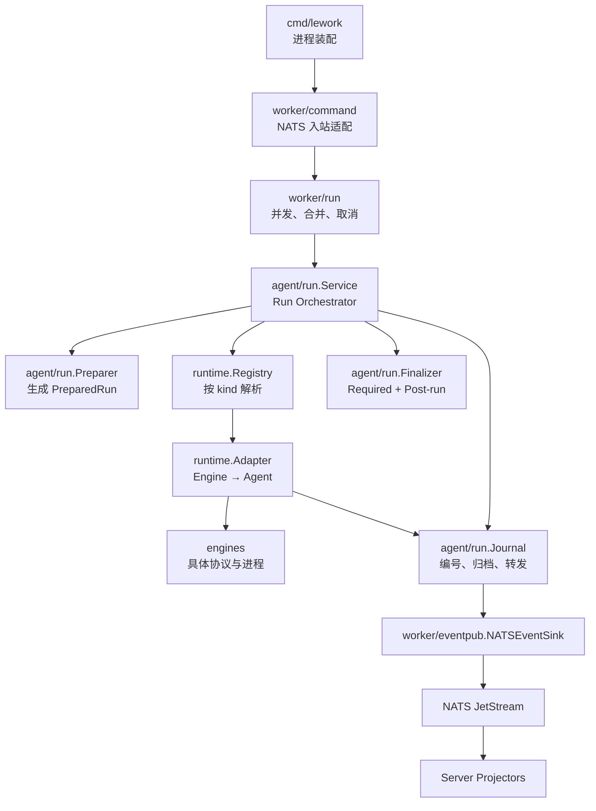
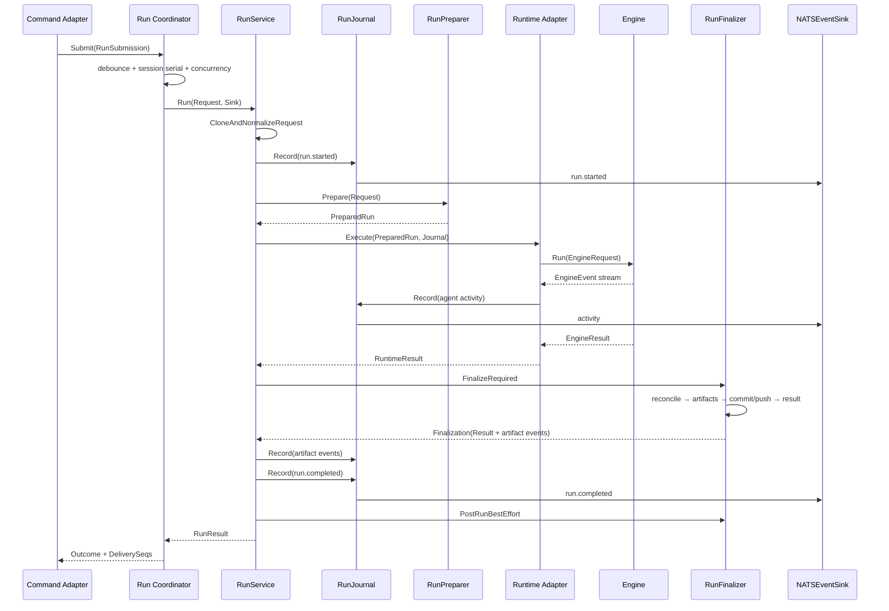

# Agent Runtime 架构

> 状态：当前架构设计文档
>
> 更新时间：2026-07-01
>
> 相关架构参考：[lework-architecture.html](./lework-architecture.html)

## 1. 架构概述

当前 Server/Worker 分离、`WorkerCommand` 统一协议、四条 command lane，以及
`run.stream` / `run.state` 双 lane 已经形成稳定的跨进程边界。

Worker 内部的 Agent Run 执行链路：

```text
NATS Command
    → Command Adapter
    → Run Coordinator
    → Agent RunService
    → RunPreparer
    → PreparedRun
    → Runtime Registry
    → Runtime Adapter
    → Engine
    → RunFinalizer
```

事件链路：

```text
EngineEvent
    → Runtime Adapter
    → agent.Event
    → RunJournal
    → NATSEventSink
    → NATS run.stream / run.state
    → Server Projector
```

### 关键设计决策

1. 原始 `agent.Request` 与准备后的 `agent.PreparedRun` 完全分离。
2. RunService 是流程 Orchestrator，不直接实现所有准备和收尾逻辑。
3. 上层只保留一个 `agent.EventSink` 接口；不再定义重复的 EventPublisher 接口。
4. RunJournal 只编号、记录、聚合和转发，不判断 Run 终态。
5. Required Finalize 与 best-effort post-run 明确分开。
6. RunCoordinator 只管理 Worker 本地调度，不理解 Workspace、Model、Engine 或 Event 类型。
7. Runtime Registry 与 Runtime Adapter 分离。
8. Engine 只能输出 `EngineEvent` 和 `EngineResult`，不能引用 Agent、Messaging 或 Session 领域类型。

## 2. 设计尺度

### 2.1 保留

- Server / Worker 两进程模型。
- `pkg/messaging` wire contract。
- 四条 Worker command lane。
- `run.stream` / `run.state` 双 lane。
- JetStream sequence tracking。
- Session 级 debounce。
- Provider session resume。
- InteractionRouter 审批/提问机制。
- Server state/stream projectors。

### 2.2 不做

- 不增加服务进程、NATS stream 或 lane。
- 不引入工作流引擎、事件溯源框架或持久化状态机。
- 不重做 Worker Scheduler、WebSocket 管理或 Skill 系统。
- 不把每个 Prepare/Finalize 步骤做成独立 package 或 Step 对象。
- 不让 `pkg/messaging` 依赖 `internal/agent`。
- 不让 RunService、Runtime 或 Engine 访问 NATS。

## 3. 目标分层与依赖方向



依赖约束：

```text
cmd
  → worker adapters
  → worker/run
  → agent/run
  → agent ports

runtime implementation
  → agent ports
  → engines

engines
  → 不依赖 agent/runtime/messaging/NATS
```

`Runtime` 与 `RuntimeResolver` 端口定义在 `internal/agent`，由 `internal/runtime`
实现。这样 Agent RunService 不需要 import Runtime 实现包，避免 Go import cycle。

## 4. 核心数据模型

### 4.1 Request：原始不可变输入

`agent.Request` 表达调用方意图：

- Run/Trace/Task 标识。
- Assistant 与 Actor 快照。
- Conversation 和原始输入。
- 请求的 Project/Workspace 标识。
- 请求的 Runtime kind。
- 原始 Model 配置。
- Capability 与 Policy。

Request 不包含：

- 最终 WorkDir、RepoDir、TaskDir。
- 构建后的 System Prompt。
- 解析后的 tools/skills。
- Artifact baseline。
- EventSink。
- NATS route、subject 或 delivery sequence。

Go 无法对普通 struct 强制不可变，因此采用以下约束：

- Command Mapper 创建 Request 后不再修改。
- RunService 入口先执行 deep clone 和最小规范化。
- Preparer 只读 normalized Request。
- PreparedRun 拥有独立的 slice/map 副本。
- 使用测试对比 Run 前后的 Request，防止回归。

### 4.2 PreparedRun：准备完成的执行上下文

```go
type PreparedRun struct {
    // Request is the normalized immutable input retained for audit/finalization.
    Request *Request

    RuntimeKind string
    Spec        ExecutionSpec
    Workspace   PreparedWorkspace
    Baseline    ArtifactBaseline
}

type ExecutionSpec struct {
    SystemPrompt   string
    Prompt         string
    Messages       []InputMessage
    Model          PreparedModel
    AllowedTools   []string
    PermissionMode string
    MaxSteps       int
}

type PreparedWorkspace struct {
    WorkDir string
    RepoDir string
    TaskDir string
}

type ArtifactBaseline struct {
    Ref string
}
```

约束：

- Runtime 只消费 `PreparedRun.Spec` 与 `PreparedRun.Workspace`。
- Runtime 不回写 PreparedRun。
- `PreparedRun.Request` 只用于关联、审计、finalize 和 post-run。
- Baseline 可以引用磁盘快照，不要求把完整文件树加载到内存。

### 4.3 RuntimeResult：执行结果，不是 Run 终态

```go
type RuntimeResult struct {
    Message                string
    Usage                  *Usage
    ToolCalls              []ToolCallRecord
    ProviderConversationID string
    Metadata               map[string]string
}
```

RuntimeResult 不包含：

- `RunStatus`。
- completed/failed/cancelled。
- Session 数据库状态。
- NATS payload。

Runtime 执行失败通过返回 `error` 表达；RunService 根据 error/context 决定最终 RunStatus。

### 4.4 RunResult：Required Finalize 后的最终结果

RunResult 是 Agent Run 的最终业务结果，包含：

- RunID、TraceID。
- completed/failed/cancelled。
- 用户可见 Message。
- 独立 Error。
- Usage、ToolCalls、Artifacts。
- StartedAt、CompletedAt。
- Run metadata。

`content` 与技术错误继续分离：Message 不回退到 Error。

## 5. 核心接口

### 5.1 EventSink：唯一上层事件接口

```go
type EventSink interface {
    Emit(ctx context.Context, event *Event) error
}
```

不再增加公开的 `EventPublisher` 接口。

Worker 侧提供具体实现：

```go
type RunEventContext struct {
    OrgID             uint
    WorkerID          uint
    SessionID         string
    TraceID           string
    RequestID         string
    TaskID            string
    RunID             string
    ParentID          string
    ReplyToMessageIDs []string
}

type NATSEventSink struct {
    context RunEventContext
    bus     EventBus
}
```

以及供 Coordinator 使用的最小工厂：

```go
type EventSinkFactory interface {
    NewEventSink(eventContext RunEventContext) agent.EventSink
}
```

`NATSEventSink` 可以在实现内部使用 publisher 命名，但不形成第二套抽象。

### 5.2 Journal

```go
type Journal interface {
    Record(ctx context.Context, event *agent.Event) error
    Snapshot() JournalSnapshot
}

type JournalFactory interface {
    New(req *agent.Request, sink agent.EventSink) Journal
}
```

Journal 负责：

- 填充 RunID、TraceID。
- 分配单调递增的 event sequence。
- 填充 timestamp 和 event ID。
- 归档 activity events。
- 聚合 Message、Usage、ToolCalls 和 artifact facts。
- 将事件转发到 EventSink。

Journal 不负责：

- 判断成功、失败或取消。
- 将 Engine completed 转成 Run completed。
- 在 `Close` 时隐式补发 terminal。
- 选择 NATS lane 或 subject。
- 持久化 Session。

RunService 必须显式记录终端事件：

```go
if err := journal.Record(ctx, runCompletedEvent(result)); err != nil {
    // Handle according to existing delivery policy.
}
```

`JournalSnapshot` 归档非终端 activity facts；terminal event 可以被记录和转发，
但不再次嵌入自身的 archived events。

### 5.3 RunPreparer

```go
type RunPreparer interface {
    Prepare(ctx context.Context, req *agent.Request) (*agent.PreparedRun, error)
}
```

Preparer 内部以具体方法组织，不恢复通用 Step pipeline：

```text
validate input
→ resolve model
→ build session context
→ resolve skills/tools
→ build system prompt
→ prepare workspace
→ ingest attachments
→ authorize
→ capture baseline
→ build ExecutionSpec
```

Preparer 可以由一个具体 struct 实现，内部复用现有 ContextBuilder、Workspace helpers
和 model router，不为每一步创建接口。

### 5.4 Runtime 与 RuntimeResolver

```go
type Runtime interface {
    Kind() string
    Execute(
        ctx context.Context,
        run *PreparedRun,
        sink EventSink,
    ) (*RuntimeResult, error)
}

type RuntimeResolver interface {
    Resolve(kind string) (Runtime, error)
}
```

约束：

- Runtime 接收 PreparedRun，不接收原始 Request。
- Runtime 只输出 activity events 和 RuntimeResult。
- Runtime 不输出 run.started 或 terminal events。
- Registry 只注册和解析 Runtime，不执行适配逻辑。
- Adapter 只负责 Engine request/result/event 转换和 provider session resume。

### 5.5 RunFinalizer

```go
type RunFinalizer interface {
    FinalizeRequired(
        ctx context.Context,
        run *agent.PreparedRun,
        runtimeResult *agent.RuntimeResult,
        snapshot JournalSnapshot,
    ) (*Finalization, error)

    PostRunBestEffort(
        ctx context.Context,
        run *agent.PreparedRun,
        result *agent.RunResult,
        snapshot JournalSnapshot,
    )
}

type Finalization struct {
    Result *agent.RunResult
    Events []*agent.Event
}
```

Required Finalize 顺序固定：

```text
reconcile workspace
→ collect artifact facts
→ stage/commit/push workspace
→ build final RunResult
```

要求：

- reconcile 必须先于 push。
- clean working tree 不是错误。
- required finalize 失败会使 Run 进入 failed。
- Finalizer 返回 artifact facts/events，由 RunService 在 terminal event 之前显式写入 Journal。

Post-run Best Effort 在 terminal event 之后执行：

- learning。
- metrics。
- diagnostics。
- 经验提取。

Post-run 错误只记录日志/指标，不修改 RunResult，也不再发布第二个 terminal event。

Worker 不执行 Session complete。Server projector 根据 terminal event 完成真正的
Session message 状态提交。

### 5.6 RunService

```go
type Service struct {
    preparer        RunPreparer
    runtimeResolver agent.RuntimeResolver
    finalizer       RunFinalizer
    journalFactory  JournalFactory
}
```

RunService 主体保持显式顺序：

```go
func (s *Service) Run(
    ctx context.Context,
    input *agent.Request,
    sink agent.EventSink,
) (*agent.RunResult, error) {
    req, err := agent.CloneAndNormalizeRequest(input)
    if err != nil {
        return nil, err // rejected before a Run is accepted
    }

    journal := s.journalFactory.New(req, sink)
    if err := journal.Record(ctx, agent.NewRunStarted(req)); err != nil {
        return nil, err
    }

    prepared, err := s.preparer.Prepare(ctx, req)
    if err != nil {
        return s.finishError(ctx, req, nil, journal, "prepare", err)
    }

    runtime, err := s.runtimeResolver.Resolve(prepared.RuntimeKind)
    if err != nil {
        return s.finishError(ctx, req, prepared, journal, "runtime_resolve", err)
    }

    runtimeResult, err := runtime.Execute(ctx, prepared, journalSink(journal))
    if err != nil {
        return s.finishError(ctx, req, prepared, journal, "execute", err)
    }

    finalized, err := s.finalizer.FinalizeRequired(
        ctx,
        prepared,
        runtimeResult,
        journal.Snapshot(),
    )
    if err != nil {
        return s.finishError(ctx, req, prepared, journal, "finalize", err)
    }

    for _, event := range finalized.Events {
        if err := journal.Record(ctx, event); err != nil {
            return finalized.Result, err
        }
    }

    if err := journal.Record(ctx, agent.NewRunCompleted(finalized.Result)); err != nil {
        return finalized.Result, err
    }

    s.finalizer.PostRunBestEffort(
        ctx,
        prepared,
        finalized.Result,
        journal.Snapshot(),
    )
    return finalized.Result, nil
}
```

RunService 的固定语义：

- RunService 只编排，不实现 Prepare/Runtime/Finalize 细节。
- accepted Run 恰好产生一个 started 和一个 terminal event。
- prepare/resolve/execute/finalize 任一失败都显式生成 failed/cancelled。
- post-run 在 terminal 后执行，不能改变终态。
- 原始 Request 和 PreparedRun 均不被 Runtime 修改。

### 5.7 RunCoordinator

```go
type RunSubmission struct {
    Request      *agent.Request
    EventContext RunEventContext
    DeliverySeqs []uint64
}

type ExecuteFunc func(
    ctx context.Context,
    submission RunSubmission,
    sink agent.EventSink,
) (*agent.RunResult, error)

type RunOutcome struct {
    Result       *agent.RunResult
    DeliverySeqs []uint64
}

type RunCoordinator interface {
    Submit(ctx context.Context, submission RunSubmission) (RunOutcome, error)
    Cancel(ctx context.Context, sessionID, runID string) error
    Close() error
}
```

Coordinator 只理解：

- RunID。
- SessionID。
- RunSubmission。
- debounce key。
- concurrency slot。
- active cancellation。
- ExecuteFunc。
- execution outcome。

Coordinator 明确禁止依赖：

- Workspace。
- Model。
- Engine。
- Artifact。
- 具体 EventType。
- NATS subject。
- Server Session 持久化。

Submission 合并由 `RunSubmission.Merge` 或注入的 merge function 完成。Coordinator
不读取 Model/Input 的业务字段。合并操作必须创建新的 Request 和输入切片，不能修改
任一原始 Submission 中的 Request。

Command Adapter 仍负责 NATS stream sequence tracking。Coordinator 返回后，Adapter
根据合并批次中的全部 DeliverySeqs 更新 terminal delivery state。

## 6. Engine 边界

### 6.1 Engine 不能使用 Agent Event

`engines` 包不允许 import：

- `internal/agent`。
- `internal/runtime/events`。
- `pkg/messaging`。
- NATS。

Engine 定义自己的最小协议：

```go
type EngineEventType string

type EngineEvent struct {
    Type       EngineEventType
    OccurredAt time.Time
    Content    string
    Payload    json.RawMessage
}

type EngineResult struct {
    Message                string
    Usage                  *EngineUsage
    ProviderConversationID string
    Err                    error
}

type Execution struct {
    Process   Process
    Events    <-chan EngineEvent
    Result    <-chan EngineResult
    Approvals ApprovalResponder
    Questions QuestionResponder
}

type Engine interface {
    Prepare(ctx context.Context, req PrepareRequest) error
    Run(ctx context.Context, req RunRequest) (*Execution, error)
}
```

约束：

- Run 启动失败通过返回 error 表达。
- 启动成功后，Result channel 恰好产生一个 EngineResult。
- EngineEvent 只描述 provider activity，不包含 RunStatus。
- Engine 不产生 run.started/completed/failed/cancelled。
- Engine RunRequest 使用 ProviderConversationID/ResumeRef，不引用 Lework Session 类型。
- native Engine 不再调用 Session API 或自行加载历史；Preparer 将已准备的 messages
  写入 ExecutionSpec，Runtime 再映射到 Engine RunRequest。
- Provider 私有 payload 使用具名结构或 `json.RawMessage`，不使用
  `map[string]interface{}` 传递业务数据。
- `ProviderConversationID` 是 Provider resume 标识，不是 Lework Session。

### 6.2 Runtime Adapter 是唯一翻译层

Runtime Adapter 负责：

```text
PreparedRun
→ engines.RunRequest

EngineEvent
→ agent.Event

EngineResult
→ agent.RuntimeResult / error
```

Provider session store 和 InteractionRouter 保留在 Runtime Adapter，因为它们需要同时
理解 Provider responder 与 Agent activity event。

### 6.3 Registry 与 Adapter 分离

`runtime.Registry`：

- 按 kind 注册 Runtime。
- 处理默认 kind。
- 返回不可用错误。

`runtime.Adapter`：

- 包装一个 Engine。
- 管理 Provider resume。
- 消费 Engine Events/Result。
- 转换为 Agent Runtime 契约。

Registry 不解析 Engine event；Adapter 不管理全局 Runtime 注册。

## 7. Event 与终态所有权

| 事件/结果 | 唯一所有者 | 说明 |
|---|---|---|
| EngineEvent | Engine | Provider activity |
| agent activity event | Runtime Adapter | 标准 message/tool/todo/interaction |
| run.started | RunService | accepted Run 开始 |
| artifact.declared | RunService | 记录 Finalizer 返回的 artifact event |
| run.completed | RunService | Required Finalize 成功 |
| run.failed | RunService | prepare/execute/finalize 失败 |
| run.cancelled | RunService | context cancel/deadline |
| event sequence/timestamp | RunJournal | 不决定事件类型 |
| stream/state lane | NATSEventSink | 不决定 Run 状态 |
| Session message 状态 | Server state projector | Worker 无 DB 所有权 |

禁止的隐式行为：

- Journal `Close()` 自动生成 terminal。
- Runtime 将 Engine completed 直接透传为 run.completed。
- Handler 在 RunService 已形成终态后再次补发失败事件。
- Publisher 根据 error 猜测 RunStatus。

## 8. 完整执行顺序



失败路径：

```text
prepare error
runtime resolve error
runtime execute error
required finalize error
        ↓
RunService classify failed/cancelled
        ↓
build RunResult
        ↓
journal.Record(explicit terminal)
        ↓
post-run diagnostics only
```

## 9. 目录结构

```text
backend/
├── cmd/lework/
│   └── worker.go                     # composition root
│
├── pkg/messaging/                    # wire contract，保持不变
│   ├── envelope.go
│   ├── command.go
│   ├── event.go
│   └── subject.go
│
├── internal/
│   ├── worker/
│   │   ├── command/
│   │   │   ├── dispatcher.go
│   │   │   ├── run_handler.go        # decode/validate/map/seq
│   │   │   ├── run_mapper.go
│   │   │   ├── control_handler.go
│   │   │   ├── interaction/
│   │   │   └── skill/
│   │   │
│   │   ├── run/
│   │   │   ├── coordinator.go
│   │   │   ├── submission.go
│   │   │   └── active_runs.go
│   │   │
│   │   └── eventpub/
│   │       ├── nats_sink.go
│   │       └── mapper.go
│   │
│   ├── agent/
│   │   ├── request.go                # Request
│   │   ├── prepared_run.go           # PreparedRun/ExecutionSpec
│   │   ├── runtime.go                # Runtime/Resolver/RuntimeResult ports
│   │   ├── result.go
│   │   ├── event.go
│   │   └── run/
│   │       ├── service.go
│   │       ├── preparer.go
│   │       ├── finalizer.go
│   │       ├── journal.go
│   │       └── postrun.go
│   │
│   ├── runtime/
│   │   ├── registry.go
│   │   ├── adapter.go
│   │   └── provider_session.go
│   │
│   └── runnable/
│       ├── session_run_state_projector.go
│       └── session_run_stream_projector.go
│
└── engines/
    ├── engine.go                     # EngineEvent/EngineResult/Execution
    ├── native/
    ├── claude/
    ├── codex/
    └── opencode/
```

目录规模控制：

- `agent/run` 只有一个 package，Preparer/Finalizer 不继续拆子包。
- `worker/run` 只有一个 package，不引入通用 scheduler framework。
- Runtime Adapter 可以先用单个 `adapter.go`，没有第二种实现前不创建 adapter 子目录。

## 10. 验收标准

- 原始 Request 在一次 Run 前后保持不变。
- Runtime 只接收 PreparedRun。
- RunService 只编排，不实现 Engine 或 Workspace 细节。
- RunJournal 不判断终态、不选择 lane、不隐式补发事件。
- 上层只有一个 EventSink 接口。
- Required Finalize 与 Post-run Best Effort 分离。
- reconcile 先于 workspace push。
- Worker 不执行 Session 数据库完成逻辑。
- Coordinator 不理解 Workspace、Model、Engine、Artifact、EventType 或 NATS subject。
- Registry 不解析 Engine event；Adapter 不管理全局注册。
- Engine 不依赖 agent、runtime event、messaging、NATS 或 RunStatus。
- 每个 accepted Run 恰好一个 started 和一个 terminal。
- wire schema、数据库 schema 和双 lane replay 语义保持不变。
- `content` 与 `error_msg` 保持分离。
- targeted build、vet、unit 和链路集成测试通过。
