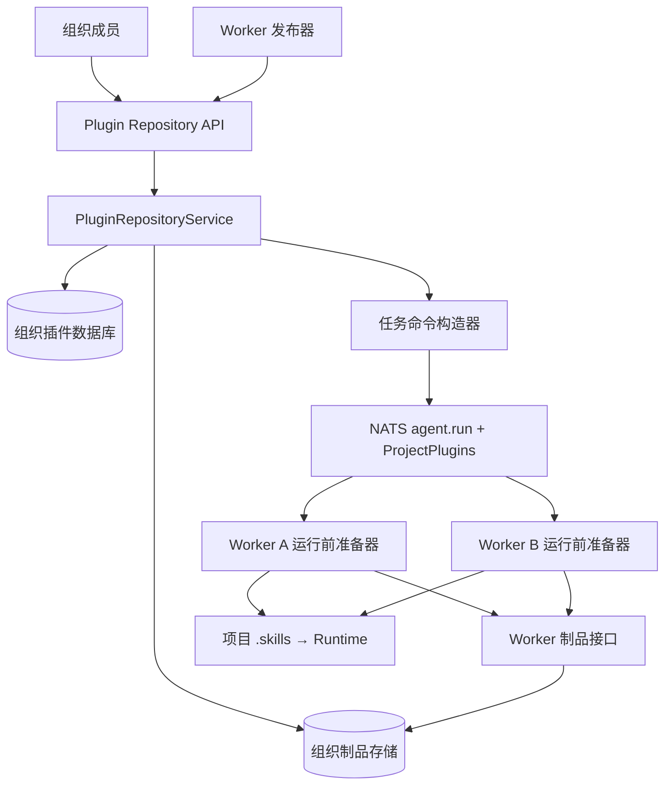
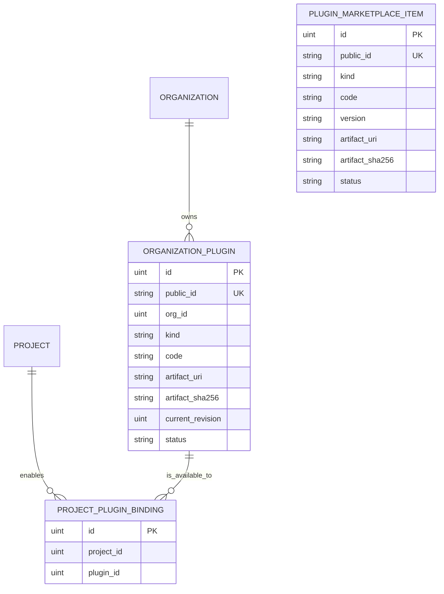
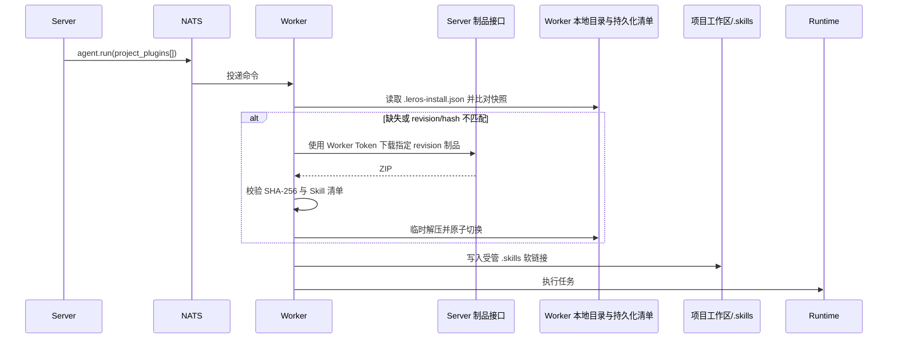

# 组织插件仓库技术设计

> 状态：草案  
> 日期：2026-07-15  
> 对应 PRD：[组织插件仓库 PRD](../product/2026-07-15-org-plugin-repository-prd.md)

## 1. 设计结论

以系统公开市场目录负责发现、组织插件仓库负责持有制品为边界，Server 在发布项目任务时附带组织插件修订快照；Worker 只在执行前发现本地内容缺失或不一致时下载、安装和执行。`Skill` 不再是管理模块的顶层概念，而是首个 `PluginKind` 适配器。



## 2. 领域模型与制品协议

### 2.1 持久化模型

新增以下类型和表，替换 `SkillMarketplaceItem` 与 `OrgSkillInstallation` 作为组织能力的事实来源。

下表是接口层的逻辑模型摘要；字段拆分、索引和事务约束以[插件数据库表结构设计](2026-07-21-plugin-database-schema-design.md)为准，其中当前制品和历史制品实际分别落在 `leros_plugin` 与 `leros_plugin_revision`。

| 模型 | 核心字段 | 约束与职责 |
| --- | --- | --- |
| `OrganizationPlugin` | `PublicID`、`OrgID`、`Kind`、`Code`、名称/描述、`CurrentRevision`、`Status`、创建/更新主体 | `OrgID + Code` 唯一；当前修订号由同插件的不可变修订记录解析。 |
| `ProjectPluginBinding` | `ProjectID`、`PluginID`、创建/更新主体 | `ProjectID + PluginID` 唯一；声明项目可使用的组织插件，不固定修订。 |
| `PluginMarketplaceItem` | `PublicID`、`Kind`、`Code`、名称/描述、来源、`Version`、当前制品 URI/SHA、状态、标签、审核状态 | 系统公开市场目录；不属于组织，组织安装时复制为自己的 `OrganizationPlugin` 修订。 |

`Kind` 先定义 `skill`、`mcp`、`workflow` 三个值。只有 `skill` 能创建或安装；其余值不能通过公开 API 发布。`Revision` 是服务端内部单调递增整数：用于 `expected_revision` 校验、Worker 按需同步和历史追溯；提供历史列表，但不提供历史版本选择或回滚。

每次组织发布将制品写入不可变对象路径 `plugins/<org>/<plugin>/<revision>/package.zip`。系统市场条目保存当前包的版本标识和当前可导入制品；组织导入后生成自己的修订，不随市场后续更新。组织历史修订可通过版本历史列表查看，但不支持选择或回滚；市场当前版本不提供历史列表。Worker 不向 Server 汇报或持久化安装状态，陈旧任务只按其携带的修订读取对应制品。



### 2.2 标准插件制品

Server 仅保存并分发标准 ZIP。根目录必须包含 `plugin.json`：

```json
{
  "schema_version": 1,
  "kind": "skill",
  "code": "example-skill",
  "entrypoint": "SKILL.md"
}
```

Skill 适配器还要求根目录存在 `SKILL.md`，并复用现有 frontmatter 校验。文件上传的单个 `SKILL.md`、旧 ZIP、GitHub 内容都会先由 Server 解包、校验、补充 `plugin.json`、重新打包和计算 SHA-256；Worker 不允许按来源自行拉取。

定义内部 `PluginKindHandler`：

```go
type PluginKindHandler interface {
    Kind() types.PluginKind
    Normalize(ctx context.Context, source PluginSource) (PluginArtifact, error)
    Validate(artifact PluginArtifact) error
    Apply(ctx context.Context, artifact LocalPluginArtifact) error
    Remove(ctx context.Context, plugin LocalPluginRef) error
}
```

`skill` 的 `Apply` 只负责把已校验制品物化到 Worker 内部插件目录；项目运行前由准备器将所需入口软链接到项目 `.skills`，不再维护全局 `.leros/skills` 副本。未来 MCP、Workflow 通过新增 handler 接入，不能在 service、NATS 或存储层分叉出新的“市场”模型。

项目只保存“可使用插件”的绑定（`ProjectID + PluginID`）；不保存用户可选版本。Server 创建一次运行时，将绑定解析为当前 active 插件的不可变执行快照。命令字段中的 `Revision` 即该次运行的版本号：它是内部发布修订，不提供历史版本选择或回滚。

## 3. Server 接口与发布行为

### 3.1 HTTP 合约

插件仓库管理面只保留五个接口。项目过滤、项目启用、项目移除和系统市场搜索/导入通过 `scope`、`project_id`、`marketplace_item_id` 参数完成，不新增单独的项目或市场 API。

| 方法 | 路径 | 用途 |
| --- | --- | --- |
| `GET` | `/api/v1/plugins?scope=organization&kind=skill&project_id=:project_id` | 列出当前组织插件；`scope=marketplace` 时搜索系统公开市场。可选按项目返回可选择插件和绑定状态。 |
| `POST` | `/api/v1/plugins/import` | 上传新插件包创建首修订；带 `plugin_id` 上传为新修订；只带已有 `plugin_id + project_id` 时将已有插件加入项目；带 `marketplace_item_id` 时复制市场当前制品到组织仓库。 |
| `DELETE` | `/api/v1/plugins/:plugin_id?project_id=:project_id` | 不带 `project_id` 软删除/归档组织插件；带 `project_id` 仅解除项目绑定。 |
| `GET` | `/api/v1/plugins/:plugin_id` | 默认获取组织插件元数据、当前修订和制品摘要；`scope=marketplace` 时获取市场条目详情。 |
| `GET` | `/api/v1/plugins/:plugin_id/versions` | 获取组织插件修订历史、哈希、大小和发布时间；系统市场条目仅展示当前版本标识，不提供版本历史、选择或回滚。 |

Worker 按任务快照获取制品的 `GET /api/v1/worker/plugins/:plugin_id/artifact?revision=:revision` 是受保护的内部资源访问，不属于上述五个插件仓库管理接口。Worker 创建或修改插件时复用导入接口的内部调用形式，不新增 Worker 发布接口。

五个用户接口沿用 `requireCallerOrg`；本期组织内调用者均可操作，不增加细粒度角色权限。市场搜索只读取 `PluginMarketplaceItem`，市场导入由 Server 复制并重新校验制品后写入组织插件。Worker 资源接口使用现有 Worker Token，并校验 Worker 部署、组织和插件归属一致。导入成功只表示事务已完成：制品已保存、插件当前 revision 已更新。接口响应包含当前 revision 和制品 SHA-256，不包含 Worker 同步状态。

Worker 新建请求不携带 `plugin_id`，必须携带 `kind`、`code`、`expected_revision=0` 与 `Idempotency-Key`；`OrgID + Kind + Code` 已存在时返回冲突。更新请求必须携带 `plugin_id`、正数 `expected_revision` 和 `Idempotency-Key`；同一 key 的重试返回第一次成功的结果，不得重复递增 revision。

### 3.2 发布事务

1. 校验调用方所属组织、插件类型、制品大小和结构。GitHub 导入仅接受公开 `github.com`、`raw.githubusercontent.com` URL，不跟随重定向；私有仓库必须先由用户下载后作为文件上传。拒绝内网地址、文件 URL 和其他来源。
2. 解包时拒绝路径穿越、绝对路径、符号链接和危险权限位；压缩包最大 100 MiB、最多 1,000 个文件、单文件最大 10 MiB、解压后总大小最大 100 MiB，防止 ZIP bomb。
3. 对更新校验 `expected_revision`；不一致返回冲突，不写入制品。
4. 将标准制品写入组织隔离的不可变修订路径，记录 URI 与 SHA-256。
5. 在一个数据库事务内创建/更新 `OrganizationPlugin`，递增 revision 并提交；若来源是市场，额外记录 `marketplace_item_id`；发布流程不查询或请求 Worker。

## 4. Worker 按需安装与执行

### 4.1 任务快照协议

不新增 `cmd.plugin` 安装/删除 lane。`agent.run` 新增强类型 `ProjectPluginSnapshot` 字段，取代 Worker 对项目 Skill 的本地猜测：

```go
type ProjectPluginSnapshot struct {
    PluginID       string `json:"plugin_id"`
    Kind           string `json:"kind"`
    Code           string `json:"code"`
    Revision       uint64 `json:"revision"`
    ArtifactSHA256 string `json:"artifact_sha256"`
}
```

每条运行命令携带 `ProjectPlugins []ProjectPluginSnapshot`。它由 Server 根据项目绑定和当前 active 插件在创建命令时生成，后续仓库更新不会改变已入队命令的目标内容。



Worker 目录采用“临时解包 → 验证 → 原子 rename”流程；安装失败时保留当前已运行制品，不能留下半安装目录。Server 删除插件不会触发 Worker 清理缓存；Worker 在后续项目任务准备 `.skills` 时删除该项目不再引用的受管链接。无引用的内部缓存由独立的本地清理策略处理，不影响任务正确性。

Worker 不使用 SQLite 或其他独立状态库。实际制品保存在内部共享目录 `.leros/plugins/<kind>/<plugin_id>/current/`，目录内由 Worker 写入 `.leros-install.json`：

```json
{
  "plugin_id": "plg_example",
  "kind": "skill",
  "code": "example-skill",
  "revision": 12,
  "artifact_sha256": "...",
  "installed_at": "2026-07-15T00:00:00Z"
}
```

元文件与制品内容均在临时目录准备完成后，随 `current/` 的原子切换一同生效。Worker 启动及执行前扫描插件目录并读取该元文件；目录、元文件、入口或制品摘要任一项缺失/不一致，均视为未安装。

在执行 `agent.run` 前，Worker 按 `ProjectPlugins` 顺序比对插件目录中的 `.leros-install.json`。缺失或 `revision`/`artifact_sha256` 不一致时，Worker 请求 `/worker/plugins/:plugin_id/artifact?revision=:revision`，完成 SHA-256 校验和原子目录/元文件更新后才继续。资源请求、校验或写入失败时返回 `plugin preparation failed`，该 Run 不进入 Runtime。

准备成功后，Worker 维护项目工作区 `<workspace>/.skills/`：每个受管条目 `<code>` 软链接至对应 `current/` 目录或 Skill 入口。`.skills/.leros-managed.json` 记录由系统创建的链接，清理时只能删除该清单列出的链接，不能删除用户自行放入 `.skills` 的文件。项目快照未包含的受管链接会被移除；全局 `.leros/plugins` 缓存不因项目解绑而删除。

现有 `cmd.skill` 安装、导入、卸载和远程抓取职责移除，不以新的 Worker 命令 lane 替代。本地 `leros skill search/install`、市场缓存和外部源路由移除；Worker 的 Skill 创建工具改为“创建/编辑本地目录 + 通过导入接口的内部调用形式显式发布插件”。

### 4.2 按需收敛与失败处理

没有 Server 到 Worker 的全量同步器，也没有每 Worker 安装状态表。每个 `agent.run` 都是一次独立的按需一致性检查：Worker 只需保证本地目录符合该命令的 `ProjectPlugins`，无需与组织插件仓库的最新状态全量一致。

| 场景 | 期望行为 |
| --- | --- |
| Worker 离线 | 不创建同步任务；任务待 Worker 可用后投递，运行前再检查其插件快照。 |
| 网络或下载失败 | 本次 Run 返回 `plugin preparation failed`；任务重试时重新执行检查和下载。 |
| 本地已匹配 | revision 和摘要均匹配时跳过下载，直接生成项目 `.skills` 链接。 |
| 陈旧任务 | 依据任务携带 revision 下载不可变制品；不会被仓库后续发布覆盖。 |
| 项目 Run 的插件落后 | Worker 依据 `ProjectPlugins` 下载指定修订、原子更新插件目录和 `.leros-install.json`，并重建该项目 `.skills` 链接后再执行。 |
| 项目 Run 插件准备失败 | 返回 `plugin preparation failed`，不得使用本地旧修订或启动 Runtime。 |
| 制品校验失败 | 返回不可安装错误，保留旧内容；任务重试时再次请求制品。 |
| 插件删除 | 新任务不再携带该插件；Worker 历史缓存不由 Server 主动删除。 |

## 5. 前端、迁移与清理

- 用 `pluginRepositoryApi` 和通用 `OrganizationPlugin` 类型替换 `skillMarketplaceApi`。现有 Skill 列表、详情、聊天选择器和项目配置请求 `kind=skill`；项目配置改为持久化 `ProjectPluginBinding`，而不是将 Worker 本地 Skill 名称作为事实来源。
- 插件详情页显示当前制品摘要和版本历史入口，不展示 Worker 同步明细；导入入口保留文件/GitHub/系统市场三种来源，删除旧市场浏览和“下载量”等字段。
- 新增一次性迁移：先盘点每个 `org/code/worker` 的本地摘要；摘要一致的安装自动归并，摘要不一致的安装标记冲突并要求选定规范来源或重新导入。确定来源后，由持有该内容的 Worker 上传标准制品；无法导出的旧记录标记为待重新导入，并保存迁移映射和进度。
- 迁移完成后删除/停用 `SkillMarketplaceItem`、`BuiltinSkillMarketplaceItem`、`OrgSkillInstallation` 的读写路径、`/skill-marketplace/*` 路由以及外部市场 fetch/cache 包。保留 Skill 执行日志和项目引用，引用按 Skill `code` 映射到 `OrganizationPlugin(kind=skill)`。

## 6. 实施顺序与验证

1. 增加插件领域类型、迁移、DAO、制品规范化和 Skill handler；完成服务端制品校验、ZIP 安全边界、GitHub 来源限制单测。
2. 增加五个插件仓库 API、Worker Token 制品接口及项目插件绑定；完成组织隔离、导入幂等、删除语义和不可变修订历史读取测试。
3. 扩展 `agent.run` 的 `ProjectPlugins` 快照和运行前准备；完成两 Worker 按需下载、版本/哈希不匹配、准备失败阻断、元文件损坏恢复、项目 `.skills` 软链接隔离与受管链接清理测试。
5. 将 Runtime/Skill 工具切换到项目 `.skills`，并替换前端仓库页面与 Skill 选择器数据源。
6. 实现旧安装导出迁移，清理市场路径，并运行回归验证。

提交前至少执行：

```bash
go test ./backend/internal/service/... ./backend/internal/worker/... ./backend/internal/api/...
go test ./backend/agent/...
go vet ./backend/internal/service/... ./backend/internal/worker/... ./backend/internal/api/...
git diff --check
```
