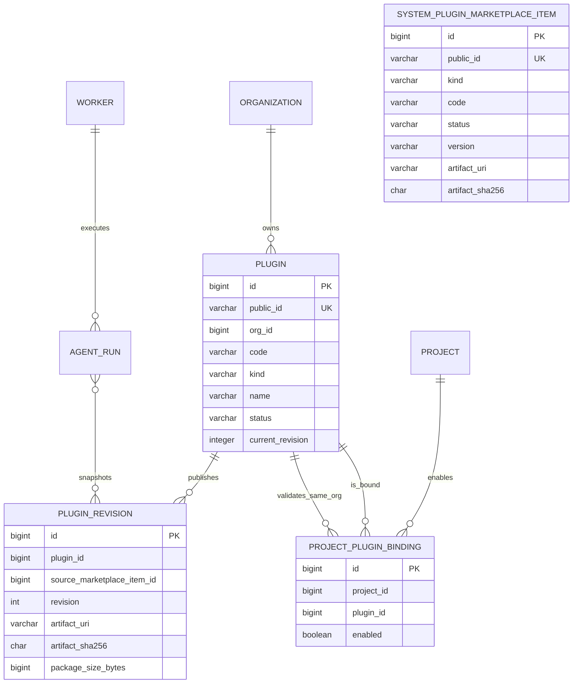
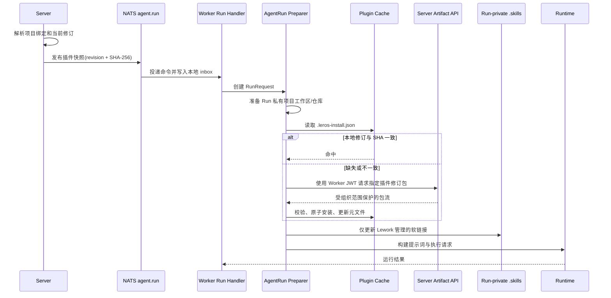
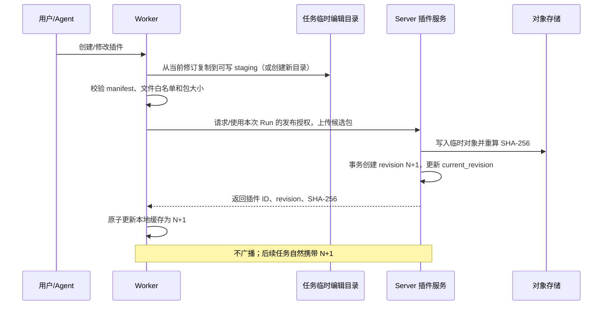
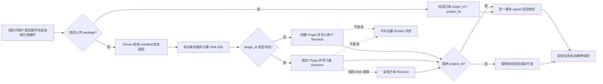
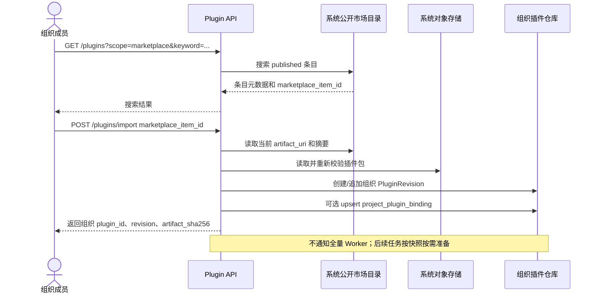
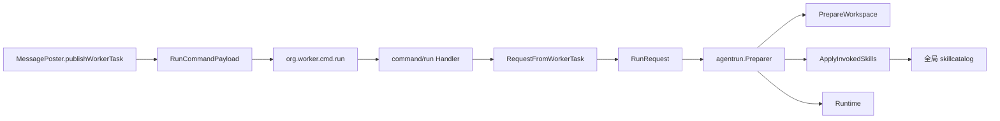

# 组织插件仓库：目标架构与现状改造计划

> 状态：提案
>
> 日期：2026-07-16
>
> 关联文档：[组织插件仓库设计](2026-07-15-org-plugin-repository-design.md)、[产品 PRD](../product/2026-07-15-org-plugin-repository-prd.md)、[Agent Runtime 架构](../architecture/agent-runtime.md)、[工作空间与产物设计](../architecture/workspace-artifact.md)

## 阅读方式

本文上半部分定义完成改造后的目标：组织插件仓库、数据库、任务快照与 Worker 按需准备流程。下半部分基于当前仓库实际代码说明现状、差距和分阶段迁移路径。

本文中的 **修订号（revision）** 是服务端每次发布内容时自动递增的内部序号。它用于任务复现和 Worker 校验；本期不提供语义化版本、版本选择、发布通道、回滚页面或版本市场。

---

# 上半部分：目标架构

## 1. 改造目标与边界

### 1.1 目标

将当前以“Skill 市场安装并同步到所有 Worker”为中心的实现，调整为以“系统公开市场负责发现 + 组织插件仓库负责持有 + 项目显式引用 + 任务快照按需准备”为中心的系统。

最终满足以下规则：

1. 组织插件归属于组织；系统公开市场只提供可搜索、可导入的目录和制品来源，不直接成为组织任务的运行来源。
2. 插件是统一扩展实体，首批落地 `skill`，模型可扩展到 `mcp`、`workflow` 和未来类型。
3. 项目显式选择可用插件；没有被项目引用的组织插件不得进入该项目任务的运行环境。
4. 每条 `agent.run` 都携带不可变的插件快照：插件 ID、类型、代码、修订号和包 SHA-256。
5. Worker 在执行前比对本地目录元文件；只有缺失或不一致时才向 Server 获取插件包。Server 发布新内容时不广播安装命令。
6. Worker 持久化插件文件和元文件，不新增 Worker SQLite。每次 Run 的项目私有工作目录通过 `.skills` 中的软链接使用已准备内容。
7. Worker 创建或修改插件时，必须走发布流程回写组织仓库；新任务才会看到新修订，已经入队或正在运行的任务继续使用其快照。

### 1.2 本期非目标

- 不实现开放式第三方市场、跨组织组织数据浏览或市场版本历史/选择能力；本期增加系统维护的公开目录，用于搜索和导入，并记录当前包版本号。
- 不实现用户手动选择历史版本、灰度通道、回滚 UI；历史修订仅作为任务可复现与后续版本能力的基础。
- 不要求 Server 在插件变化后主动让全部 Worker 同步，也不维护 `plugin_worker_sync` 一类状态表。
- 不把插件包写入项目 Git 仓库，不把 Worker 私有缓存作为组织事实来源。
- 不在 `project.metadata.extra` 继续保存插件引用；该 JSON 只能承载非关键兼容信息，不能承载关系型权限与运行决策。

### 1.3 关键设计决策

| 决策 | 结论 | 原因 |
| --- | --- | --- |
| 组织内容真相源 | Server 数据库 + 对象存储 | Worker 可重建、可替换，不能成为唯一来源。 |
| 任务一致性 | `agent.run` 内嵌插件修订和 SHA-256 | 排队、重试、跨 Worker 执行都得到同一份内容。 |
| 同步时机 | Worker 在 `Prepare` 阶段按需同步 | 避免一处更新唤醒全组织 Worker，离线 Worker 也无需补偿任务。 |
| Worker 状态 | 文件目录 + `.leros-install.json` | 满足持久化与可人工排查需求，避免额外 SQLite 生命周期。 |
| 项目授权 | 独立 `project_plugin_binding` 表 | 可索引、可审计、可做组织边界校验，避免 JSON 隐式引用。 |
| 管理 API | 列表、导入、删除、详情、版本历史五个接口 | 导入覆盖创建和发布，删除覆盖归档和项目解绑，避免为内部事务拆出过多公开接口。 |
| 内容更新 | 不可变修订包 + 当前修订指针 | 老任务不会因缓存被覆盖而读取到新内容。 |
| Run 隔离 | 每个 Run 使用私有项目工作目录 | 同一项目并发 Run 可能要求不同修订，不能共同改写一个 `repo/.skills`。 |

## 2. 目标领域模型



`AGENT_RUN` 不是当前数据库中的独立模型；图中的任务快照表达的是 NATS `agent.run` 命令与 Worker 本地 inbox 中的持久化载荷。若未来引入 Server 侧 Run 表，可以把该快照原样落库，但本期不以此为前置条件。

### 2.1 插件类型与执行适配

| `kind` | 首期状态 | Worker 准备结果 | 后续运行适配 |
| --- | --- | --- | --- |
| `skill` | 首期完整实现 | 链接到项目 `.skills/<code>` | Native 上下文加载、CLI Runtime 的 Skill 发现。 |
| `mcp` | 数据模型和包校验支持 | 准备插件目录，暂不自动启用 | 将 manifest 转为 `agent.MCPServerConfig`。 |
| `workflow` | 数据模型和包校验支持 | 准备插件目录，暂不自动调度 | 由 Workflow 编排器读取定义并创建子 Run。 |

所有类型共享发布、项目绑定、快照、下载、哈希校验和 Worker 缓存机制。类型特有的运行注入必须在独立 Adapter 中实现，不能在通用仓库服务中通过 `switch` 堆积运行逻辑。

## 3. Server 数据库设计

字段级表结构、索引、事务和迁移细节见 [组织插件仓库数据库表结构设计](2026-07-21-plugin-database-schema-design.md)。本节保留目标架构中的关系总览，详细实现以该设计文档为准。

### 3.1 新表

表名均沿用 `leros_` 前缀和 GORM 软删除约定。字段名以下划线表示数据库列。

#### `leros_plugin`

组织内插件的稳定身份和当前发布指针。

| 字段 | 类型/约束 | 说明 |
| --- | --- | --- |
| `id` | bigint PK | 内部主键。 |
| `public_id` | varchar(255), unique, not null | 外部稳定 ID，建议 `plg_` 前缀。 |
| `org_id` | bigint, not null | 所属组织。 |
| `code` | varchar(128), not null | 组织内稳定机器名；用于 `.skills/<code>`。 |
| `kind` | varchar(32), not null | `skill`、`mcp`、`workflow` 等枚举。 |
| `name` | varchar(255), not null | 展示名称。 |
| `description` | text | 展示说明。 |
| `status` | varchar(32), not null | `active`、`archived`；`archived` 不能新绑定或新快照。 |
| `current_revision` | integer, not null, default 0 | 当前已发布修订号；`0` 表示尚未发布。 |
| `created_by` / `updated_by` | bigint, not null | 用户或 Worker 发布的审计主体。 |
| `created_at` / `updated_at` / `deleted_at` | GORM 标准字段 | 软删除与审计时间。 |

约束与索引：

- 唯一索引 `(org_id, code)`，并在服务层校验 `code` 仅含小写字母、数字和 `-`。
- `current_revision` 必须为 `0`，或能在同一插件下找到状态为 `published` 的同号修订；由发布事务验证。
- 除公开 ID 和组织内 code 的业务唯一索引外，不预建关联字段、状态字段或审计字段索引；列表查询出现真实慢查询后再补。

#### `leros_plugin_revision`

每次发布**新内容**生成一个不可变内容记录。它是实现任务快照所需的技术修订基础，不等同于对用户开放的版本产品。

| 字段 | 类型/约束 | 说明 |
| --- | --- | --- |
| `id` | bigint PK | 内部主键。 |
| `plugin_id` | bigint, not null | 所属插件。 |
| `revision` | integer, not null | 对同一插件单调递增，从 `1` 开始。 |
| `artifact_uri` | varchar(500), not null | 仅 Server 可见的对象存储 URI，不下发到 NATS。 |
| `artifact_sha256` | char(64), not null | 压缩包字节流的 SHA-256；Worker 强制校验。 |
| `package_size_bytes` | bigint, not null | 下载限额与审计。 |
| `published_by_type` / `published_by_id` | varchar + bigint | `user` 或 `worker` 及主体 ID。 |
| `created_at` / `deleted_at` | GORM 标准字段 | 已发布修订原则上不物理删除。 |

约束与索引：

- 唯一索引 `(plugin_id, revision)`。
- 唯一索引 `(plugin_id, artifact_sha256)`；提交相同内容视为幂等发布，直接返回既有修订，不增加修订号。
- Server 在导入时校验包内 manifest，但不将 manifest 或其摘要持久化到修订表。
- 发布事务先将包写入临时对象键、做完整性校验，再锁定对应插件行并插入下一修订、更新 `plugin.current_revision`；事务失败时由对象存储清理任务回收孤儿文件。行锁（或等价的乐观锁重试）保证并发发布时修订号单调且当前指针不丢更新。

#### `leros_project_plugin_binding`

项目可使用哪些组织插件的唯一授权来源。

| 字段 | 类型/约束 | 说明 |
| --- | --- | --- |
| `id` | bigint PK | 内部主键。 |
| `project_id` | bigint, not null | 项目。 |
| `plugin_id` | bigint, not null | 插件。 |
| `enabled` | boolean, not null, default true | 关闭后不再进入新任务快照。 |
| `created_by` / `updated_by` | bigint, not null | 审计主体。 |
| `created_at` / `updated_at` / `deleted_at` | GORM 标准字段 | 软删除与审计时间。 |

约束与索引：

- 唯一索引 `(project_id, plugin_id)`。
- 绑定、启用和删除均在事务中校验 `project.org_id = plugin.org_id`、插件 `status = active` 且 `current_revision > 0`。
- 本期没有版本锁定字段。每个新任务解析插件当前修订；历史任务依靠其命令快照固定内容。

#### `leros_plugin_marketplace_item`

系统公开市场目录。它保存可搜索元数据和当前可导入制品，不属于任何组织；组织安装时复制制品并生成自己的 `PluginRevision`。市场下架、更新不会自动修改组织插件。

### 3.2 不新增的表

以下表不是目标设计的一部分：

- **不新增 `plugin_worker_sync`**：不存在“所有 Worker 必须已同步”的全局完成态。
- **不新增 Worker SQLite 表**：缓存状态仅放在 Worker 插件目录的元文件。
- **不新增 `project.metadata.extra.skills`**：项目插件关系迁移到绑定表。
- **不新增市场安装状态表或市场版本历史表**：市场条目保存当前 `version` 和当前制品；组织安装状态和版本历史分别由组织插件及其修订承载。

### 3.3 与旧表的关系

| 当前表 | 目标处理 |
| --- | --- |
| `leros_skill`、`leros_skill_registry`、`leros_skill_execution_log` | 与旧 Go `Skill` 接口绑定，先停止作为项目插件来源；数据清点后另立删除迁移，不在首个上线版本直接删表。 |
| `leros_builtin_skill_marketplace_item` | 迁移为 `leros_plugin_marketplace_item` 或明确保留 Runtime 内建；不再直接作为市场列表来源。 |
| `leros_skill_marketplace_item` | 迁移为系统市场目录候选；新市场 API 改读 `leros_plugin_marketplace_item`。 |
| `leros_org_skill_installation` | 迁移为组织插件 + 项目绑定后冻结写入；不再表示“应安装到每个 Worker”。 |
| `leros_message_resource` | 保留消息审计。后续增加 `plugin_public_id`、`revision` 或新建强类型关联时再迁移；本期不得再用它推导项目可用插件。 |

## 4. 任务快照与协议

### 4.1 `agent.run` 增量字段

在 `pkg/messaging.RunCommandPayload` 增加强类型字段：

```go
type PluginSnapshot struct {
	PluginID       string `json:"plugin_id"`
	Code           string `json:"code"`
	Kind           string `json:"kind"`
	Revision       int    `json:"revision"`
	ArtifactSHA256 string `json:"artifact_sha256"`
}

type ProjectPluginSnapshot struct {
	ProjectID string           `json:"project_id,omitempty"`
	Plugins   []PluginSnapshot `json:"plugins,omitempty"`
}
```

`RunCommandPayload` 新增 `Plugins ProjectPluginSnapshot`。字段必须同时经过：

```text
pkg/messaging RunCommandPayload
  → command/run runTask
  → agentrun/domain RunRequest
  → agentrun Preparer 的 PluginPreparer
```

不得把下载 URL、存储 URI或用户访问令牌放进 NATS 命令。Worker 收到的是“需要什么内容”的声明，而不是“到哪里匿名下载”的凭据。普通 `agent.run` 也不携带发布权限；仅插件编辑专用 Run 可额外携带一次性、范围受限的发布授权，该授权不能用于下载任意包或调用用户 API。

### 4.2 快照生成规则

Server 在发布 `agent.run` 前，以一次只读事务查询：

```text
project_plugin_binding (enabled = true)
  JOIN plugin (same org, status = active)
  JOIN plugin_revision (plugin_id = plugin.id AND revision = plugin.current_revision)
```

排序固定为 `(kind asc, code asc, plugin_id asc)`；这使命令 JSON、日志和测试结果稳定。查询失败、组织不匹配、插件没有当前修订时，任务不得发布，直接返回可读业务错误。

项目为空的普通会话发送空快照。空快照不意味着可回退到 Worker 全局 Skill 目录；它表示此任务没有项目插件。

### 4.3 快照示例

```json
{
  "workspace": {"project_id": "prj_7d", "task_id": "tsk_3n"},
  "plugins": {
    "project_id": "prj_7d",
    "plugins": [
      {
        "plugin_id": "plg_audit",
        "code": "security-audit",
        "kind": "skill",
        "revision": 12,
        "artifact_sha256": "b6c4...9fd1"
      }
    ]
  }
}
```

这个字段中的 `revision` 即产品讨论中“任务携带 Skill 版本”的实际实现。其语义是“本任务必须使用第 12 次已发布内容”，不是“使用 latest”。

## 5. Worker 本地存储与按需同步

### 5.1 文件布局

`$LEROS_WORKSPACE_ROOT` 是现有 `pkg/leros.WorkspaceRoot()` 的根目录。目标目录：

```text
$LEROS_WORKSPACE_ROOT/
├── .leros/
│   └── plugins/
│       └── skill/
│           └── plg_audit/
│               ├── revisions/
│               │   └── 12/
│               │       ├── SKILL.md
│               │       └── references/...
│               ├── current -> revisions/12
│               └── .leros-install.json
└── projects/<org-id>/<project-public-id>/
    ├── repo/                         # 共享的 canonical checkout；不写托管 .skills
    └── runs/<request-id>/repo/        # 本次 Run 私有 project worktree/overlay
        └── .skills/
            ├── security-audit -> $LEROS_WORKSPACE_ROOT/.leros/plugins/skill/plg_audit/revisions/12
            └── .leros-managed.json
```

这里的“项目目录 `.skills`”是**本次 Run 的项目工作目录**，不是当前共享的 `projects/<org>/<project>/repo/.skills`。现有 `workspace.ResolveTaskWorkspace` 为同一项目复用一个 `repo`，若在这个共享目录中改写同名链接，修订 13 的任务会破坏修订 12 的并发任务。因此阶段 3 必须先让 WorkspaceManager 为 Run 提供私有 worktree/overlay，并将 `Runtime.WorkDir` 指向它；canonical checkout 不创建或修改托管 `.skills`。

项目链接必须直接指向 `revisions/<revision>`，而非 `current`。这样即使新的任务准备了修订 `13` 并更新 `current`，正在运行的修订 `12` 仍指向正确内容；Run 私有目录进一步保证同项目并发任务不会覆盖链接名。

`.skills/.leros-managed.json` 只记录 Lework 创建的链接，例如：

```json
{
  "schema_version": 1,
  "entries": [
    {
      "code": "security-audit",
      "plugin_id": "plg_audit",
      "kind": "skill",
      "revision": 12,
      "target": "/workspace/.leros/plugins/skill/plg_audit/revisions/12"
    }
  ]
}
```

禁止清空整个 `.skills` 目录；清理时只删除此元文件记录且仍指向预期路径的软链接。创建链接前必须以 `Lstat` 检查冲突，绝不覆盖项目仓库已有或已跟踪的 `.skills/<code>` 文件；冲突时以 `plugin_link_conflict` 失败，而非删除用户内容。Run worktree 在执行结束后整体回收，因此托管链接和元文件不会进入 canonical Git 仓库、Git 状态或产物扫描。

#### 私有 worktree 对现有最终化链路的约束

这不是仅修改目录名：当前 `agentrun.Finalizer` 会对 `WorkspacePreparation.RepoDir` 进行 Git diff 产物发现、产物上传、`git add --all`、commit 和 push。因此切换为 Run 私有 worktree 时必须同时满足：

1. `WorkspacePreparation.RepoDir`、`WorkDir`、artifact manifest 和 `PreRunTreeSHA` 都指向同一个 Run 私有 worktree；不能运行于私有目录、最终化时却回到 canonical repo。
2. `pushWorkspace` 必须显式排除托管 `.skills`、`.leros-managed.json` 和其他运行时目录，不能继续无条件 `git add --all`；这些链接不应被 commit、上传为产物或带回项目仓库。
3. 多个 Run 可以并行执行，但项目 Git 写回必须受项目级提交 lease 保护。在 lease 内执行 fetch/rebase（或等价合并）再 push；发生真实代码冲突时返回确定性的 `workspace_conflict`，绝不能以最后一个 Run 覆盖前一个 Run 的提交。
4. Run worktree 的回收只能在最终化、artifact 上传和 Git push 已完成后发生；失败 Run 保留受限诊断窗口后清理。

该 worktree 调整同时修复当前共享 repo 的并发写风险，是插件快照隔离的必要前置，不应被当作可选的目录优化。

### 5.2 Worker 安装元文件

每个插件根目录保存 `.leros-install.json`，无需 SQLite：

```json
{
  "schema_version": 1,
  "plugin_id": "plg_audit",
  "kind": "skill",
  "installed_revisions": [
    {
      "revision": 12,
      "artifact_sha256": "b6c4...9fd1",
      "installed_at": "2026-07-16T10:30:00Z"
    }
  ],
  "current_revision": 12,
  "updated_at": "2026-07-16T10:30:00Z"
}
```

写入顺序必须是：下载到同文件系统临时目录 → 校验 SHA-256 → 安全解压与 manifest 校验 → 原子 `rename` 到 `revisions/<revision>` → 原子写元文件 → 原子更新 `current` 链接。任一步失败都不得把半成品当作已安装修订。

### 5.3 执行前准备流程



插件准备插入在现有 `agentrun.preparer.Prepare` 的“工作区已准备”之后、“Session/Skill 上下文和系统提示词构建”之前。原因是 `.skills` 需要 Run 私有项目工作区，而 native 的 `/skill` 注入又必须在读取 `SKILL.md` 前看见本次快照内容。

### 5.4 缓存命中、锁与清理

- 同一个 `(kind, plugin_id, revision)` 的安装采用 Worker 进程内 singleflight/互斥锁；多个并发 Run 只下载一次。
- 已存在目录仍必须重新计算或验证记录的 SHA-256；目录、元文件、快照三者任一不一致即视为未命中。
- 安装目录权限默认只读；运行时不应直接修改已发布修订。
- 本期保留当前修订及本进程当前 Run 正在引用的修订。进程重启后不依赖数据库恢复“活跃引用”：缓存清理只在没有托管链接、没有本进程引用且满足 TTL 时进行；即使误清理，durable inbox 重放或新任务也会按快照重新下载。容量上限和 TTL 清理作为后续运维任务。
- 下载、解压、软链接目标均须进行路径穿越与符号链接逃逸校验，复用 `internal/workspace` 的路径安全原则。

### 5.5 Worker 创建和修改插件

运行中的 Worker 可以是插件作者，但不能直接把对缓存修订目录的写入当作发布：缓存中的已发布修订必须保持不可变。

推荐流程：



普通执行态 `.skills/<code>` 链接到只读 `revisions/<n>`。插件编辑态应链接到任务专属 staging 目录，或者使用专用的 Plugin Authoring 工具；不能让多个并发项目任务共同写入 `current`。发布完成前，staging 内容不是组织共享内容，失败或取消时可清理。

Server 对 Worker 发布请求要求三重约束：有效 Worker JWT、同组织 Worker 部署、由本次 Server 签发且绑定 `run_id + project_id + plugin_id/创建权限` 的短时发布授权。仅凭“属于该组织的 Worker”不得覆盖任意插件。

## 6. Server API、权限和运行时适配

### 6.1 插件仓库最小 API

产品和前端只保留以下五个插件仓库接口。创建、发布、项目绑定、归档和市场安装不再分别暴露 CRUD 接口，而是收敛到“列表作用域”和“导入/删除”的参数语义中。

项目插件页面复用插件列表的 `project_id` 查询；启用通过导入接口携带 `project_id` 或 `marketplace_item_id` 完成，移除通过删除接口携带 `project_id` 完成，不新增项目插件绑定接口。市场搜索复用同一列表接口的 `scope=marketplace`。

| 操作 | 接口 | 语义 |
| --- | --- | --- |
| 插件列表 | `GET /api/v1/plugins` | 默认返回当前组织插件；`scope=marketplace` 时按 `keyword`、`kind`、`category` 等条件搜索系统公开市场。带 `project_id` 时返回该项目可选择的组织插件并附 `enabled`、当前修订和包 SHA。 |
| 导入插件 | `POST /api/v1/plugins/import` | 上传包创建/追加组织插件修订；只带已有 `plugin_id + project_id` 时启用已有插件；提供 `marketplace_item_id` 时复制并导入系统市场当前制品。相同包 SHA 幂等返回已有修订。 |
| 删除插件 | `DELETE /api/v1/plugins/{plugin_id}` | 不带 `project_id` 时软删除/归档组织插件；带 `project_id` 时仅解除该项目绑定。两种操作都不物理删除插件修订和对象包。 |
| 插件详情 | `GET /api/v1/plugins/{plugin_id}` | 默认返回组织插件详情；`scope=marketplace` 时返回系统市场条目详情。均不返回对象存储 URI 或签名 URL。 |
| 插件版本历史 | `GET /api/v1/plugins/{plugin_id}/versions` | 只读返回组织插件的修订列表、修订号、包 SHA、大小、发布者和发布时间；系统市场条目本期不提供版本历史，也不提供历史版本选择、回滚或删除。 |

所有五个接口都从当前调用者上下文取得 `org_id`，请求体不得指定或覆盖组织 ID。按本期范围，组织内调用者均可执行上述操作，暂不增加细粒度角色权限；`project_id` 仍必须校验属于同一组织。

Worker 获取指定 `plugin_id + revision + artifact_sha256` 的包仍需要受保护的内部资源访问能力，但它属于执行链路，不作为插件仓库管理 API，不在前端或公开市场列表中呈现。Worker 发布插件也复用导入契约的内部调用形式，不新增另一套管理接口。

当前 Worker JWT 只含 `org_id + worker_id`，且本期不新增 Server Run 快照表，因此 artifact API 的可实现授权边界是：**所属组织的有效 Worker 可以读取该组织任一已发布插件修订**。`agent.run` 快照仍是“此 Run 可以挂载和使用什么”的唯一执行授权，但不能把 Worker HTTP 下载接口伪装为逐 Run 最小权限。若后续需要把下载收窄到任务所需修订，应新增 Server 侧 Run 快照记录，或为每个快照签发短时 artifact capability；两者均不在本期范围。

插件包下载响应应是受鉴权的流式响应或短时对象存储签名 URL。无论采用哪种方式，签名 URL 都只能在 Worker 发起受鉴权请求后获得，不能写入 `agent.run`。

### 6.2 Skill 运行时适配

当前 `ApplyInvokedSkills` 通过全局 `skillcatalog.Get(name)` 读取 `leros.SkillsDir()`。目标改为注入 `ProjectSkillCatalog`：

1. 以 `RunRequest.PluginSnapshot` 为允许集合；
2. 在 `Runtime.WorkDir/.skills` 下只解析属于本次任务的 `skill` 链接；
3. `/skill` token 只能命中允许集合，未绑定、已归档或不在快照中的 token 返回可读错误；
4. 读取 `SKILL.md` 和辅助文件时保留现有 prompt 注入逻辑，但记录插件 ID 和修订以便追踪；
5. 现有 `Assistant.Skills` 不再隐式绕过项目绑定。需要保留的平台内建能力时，明确建模为系统插件或独立 Runtime 能力。

MCP 和 Workflow 不应伪装成 `SKILL.md`：分别通过 MCP Adapter 和 Workflow Adapter 消费相同快照，避免把不同类型的生命周期耦合到 `skillcatalog`。

外部 CLI Runtime 必须有独立适配，不能依赖已下线的 `~/.claude/skills`、`~/.agents/skills` 全局链接：

- Native Runtime 使用上述 `ProjectSkillCatalog` 和 Run 私有 `.skills`。
- Claude、Codex、OpenCode 由各自 Runtime Adapter 把 Run 私有目录传入其支持的项目级 skill 配置、环境变量、临时 HOME 或显式 prompt/context 接口；选择哪一种以各 CLI 的实际能力为准。
- 如果某个 CLI 不支持隔离的项目级 Skill，切流前必须提供等价的受限 prompt 注入或暂不启用该 Runtime 的项目插件，不能回退为全局目录发现。
- 三个 CLI Runtime 都需要验证“同项目并发不同修订不可见、未绑定 Skill 不可见”。

## 7. 端到端业务流程

### 7.1 组织内用户导入并可选绑定插件



### 7.1.1 从系统公开市场导入插件



### 7.2 项目任务执行

```text
项目成员发送消息
  → Server 查询项目插件绑定和当前修订
  → Server 将快照写入 agent.run
  → Worker 安全接收命令
  → 创建 Run 私有项目工作区
  → 依据 revision + SHA 比对本地目录元文件
  → 缺失时拉取并原子安装；命中时跳过下载
  → 更新 Run 私有项目目录 .skills 管理链接
  → Runtime 执行
```

### 7.3 内容变更的可见性

| 时间点 | 已入队旧任务 | 正在运行任务 | 发布后新任务 |
| --- | --- | --- | --- |
| 插件由修订 12 发布到 13 | 仍使用快照 12 | 仍使用其链接的 12 | 解析到 13，并在需要时下载 13 |
| 某 Worker 离线 | 无需补同步 | 不适用 | 该 Worker 下次实际执行含 13 的任务时再下载 |
| Worker 缓存丢失 | 不影响组织事实 | 当前 Run 可能准备失败 | 下次/重试任务按快照重建缓存 |

## 8. 可观测性与验收标准

### 8.1 建议事件和指标

- 日志字段：`run_id`、`project_id`、`plugin_id`、`kind`、`revision`、`expected_sha256`、`cache_hit`、`download_ms`、`prepare_error_code`。
- 指标：`plugin_prepare_total{result,kind}`、`plugin_cache_hit_total`、`plugin_download_bytes_total`、`plugin_verify_failure_total`、`plugin_publish_total{actor_type,result}`、`plugin_marketplace_search_total`、`plugin_marketplace_import_total{result}`。
- 审计：插件创建、包发布、归档、项目绑定变更、Worker 发布都写入现有活动/审计体系；审计只记录哈希和对象标识，不能记录包内容或访问令牌。

### 8.2 目标验收

1. 两个 Worker 执行同一 `agent.run` 快照时，均能验证并使用相同 SHA-256 的插件包。
2. 发布新修订不会向任何 Worker 发送安装命令；未执行相关任务的 Worker 没有新增网络请求。
3. Worker 重启后只凭 `.leros/plugins` 下的文件和元文件即可命中缓存；不依赖 Worker SQLite。
4. 项目 A 绑定的插件不会出现在项目 B 的 `agent.run` 快照或 Run 私有 `.skills` 中；同项目不同修订的并发 Run 也互不覆盖。
5. 插件发布从 12 到 13 后，旧任务仍使用 12，新任务使用 13。
6. 路径穿越、压缩炸弹、哈希不符、组织越权下载、无发布授权的 Worker 修改均被拒绝且不会污染缓存。
7. 市场列表只返回可见条目；市场导入会在组织仓库生成独立修订，市场后续更新不会改变已导入组织插件。

---

# 下半部分：从当前架构到目标架构的改造

## 9. 当前架构实况

以下结论来自当前代码，不是仅依据旧设计文档推断。

### 9.1 当前 Skill 管理链路

```mermaid
flowchart TD
    UI[前端 Skill 市场] --> API[/skill-marketplace API]
    API --> M[SkillMarketplaceService]
    M --> I[OrgSkillInstallation]
    M --> C[cmd.skill skill.install]
    C --> W1[默认 Worker]
    M --> S[同步到组织全部 ready/provisioning Worker]
    S --> W2[其他 Worker]
    R[Worker ready] --> RS[syncOrgSkillsToWorker]
    RS --> W2
    W1 --> G[workspace/.leros/skills]
    W2 --> G
    G --> H[~/.claude/skills 与 ~/.agents/skills 链接]
```

实际代码位置：

- `backend/internal/service/skill_marketplace_service.go` 负责市场搜索、下载、安装、卸载、GitHub/文件导入。
- `backend/internal/service/org_skill_sync.go` 向同组织所有 ready/provisioning Worker 发 `cmd.skill`，并等待或发布安装指令。
- `backend/internal/service/worker_deployment_reconciler.go` 在 Worker 由 provisioning 变为 ready 后调用 `syncOrgSkillsToWorker`。
- `backend/internal/worker/command/skill/handler.go` 处理 `install/list/uninstall/detail/import`，安装到 `leros.SkillsDir()`，即 Worker 根目录的 `.leros/skills`，并建立用户目录链接。
- `backend/cmd/leros/worker.go` 还会在启动时同步内置 Skill。

这条链路的含义是“组织安装 = 所有 Worker 应预装”，而不是“项目任务 = 精确的内容快照”。它会导致无任务的 Worker 也被唤醒和下载，并且无法证明不同时间执行的任务是否使用同一内容。

### 9.2 当前项目与任务链路



实际代码事实：

- `backend/internal/service/message_poster.go` 的 `publishWorkerTask` 只下发工作区、项目上下文、输入、模型和执行目标；没有插件集合、版本或哈希。
- `backend/pkg/messaging/command.go` 的 `RunCommandPayload` 没有插件字段。
- `backend/internal/worker/command/run/mapper.go` 将命令转换为 `agentrun/domain.RunRequest`，同样没有插件信息。
- `backend/internal/worker/agentrun/preparer_impl.go` 已按正确顺序先 `prepareWorkspace`，再 `ApplyInvokedSkills`、构建系统提示词；这是插入按需插件准备的最小风险位置。
- `backend/internal/worker/agentrun/context/skill_invoke.go` 用全局 `skillcatalog.Get` 加载 `/skill` token，不知道项目授权或任务快照。
- `backend/internal/workspace/workspace.go` 已有稳定项目路径：`$ROOT/projects/<org>/<project>/repo`，并在仓库中维护 `.leros/tasks/...`；但这个 `repo` 对同一项目共享，不能直接作为不同修订任务的 `.skills` 写入位置。目标必须新增 Run 私有 worktree/overlay，而不是在这个共享 repo 根目录创建托管链接。

### 9.3 当前项目插件引用的真实存储

当前没有 `ProjectPlugin` 表，也没有插件绑定 API。`MessagePoster.writeSkillInvokeResources` 在解析 `/skill` 后调用 `syncSkillEntriesToProject`，把如下非强类型数据追加到 `Project.Metadata.Extra["skills"]`：

```json
[{"code": "skill-name", "name": "skill-name"}]
```

这只是“消息里曾调用过什么”的副作用记录，存在以下问题：

- 不含组织插件身份、类型、修订、哈希或包来源；无法生成可复现快照。
- `ObjectMetadata.Extra` 是通用 JSON，无法表达外键、唯一性、授权或索引。
- 解析 token 后才追加，含义是“用过即绑定”，不符合项目显式授权。
- 卸载流程依赖它寻找项目引用，耦合市场安装与项目状态。

### 9.4 当前数据库实况

`backend/internal/infra/db/database.go` 的 `runMigrations` 当前迁移：`Skill`、`SkillRegistry`、`SkillExecutionLog`、`BuiltinSkillMarketplaceItem`、`SkillMarketplaceItem`、`OrgSkillInstallation` 等模型，但没有组织插件、插件修订、项目插件绑定和系统插件市场目录模型。

其中 `OrgSkillInstallation` 的唯一键为 `(org_id, source, skill_id, version)`，并持有 `package_storage_path` 与同步状态；它表达的是市场来源安装意图，不是组织可管理插件实体。`SkillMarketplaceItem` 也以外部 `source + skill_id + version` 为核心。两者都无法承载未来 MCP/Workflow 的统一模型。

### 9.5 当前 Worker 持久化能力

Worker 已有 SQLite，用于 `cmd.run` durable inbox 和 provider session（`leros.StateDBPath()`），这是运行可靠性基础，**不应为了插件迁移而移除**。但插件缓存本身目前没有独立元文件、没有修订目录、没有哈希比对，也没有项目链接边界。

目标要求是不为插件再增加 Worker SQLite；与现有 Run inbox SQLite 并不冲突。

## 10. 差距与改造映射

| 当前实现 | 问题 | 目标替换 | 主要改动位置 |
| --- | --- | --- | --- |
| 旧公开 Skill 市场、外部 source | 组织内容边界不清、安装与 Worker 同步耦合 | 系统市场目录 + 组织插件仓库 | `service`、`api/handler`、前端路由。 |
| `OrgSkillInstallation` | 表达“所有 Worker 安装” | `Plugin` + `PluginRevision` + `ProjectPluginBinding` | `types`、`infra/db`。 |
| `cmd.skill` 安装/同步 | 发布会扇出到全部 Worker | `agent.run` 快照 + Worker Artifact API 拉取 | `org_skill_sync.go`、Worker handler、messaging。 |
| Worker `.leros/skills` 全局目录 | 项目不可隔离，缓存会覆盖 | `.leros/plugins/<kind>/<id>/revisions/<n>` + Run 私有 `.skills` | `pkg/leros`、workspace、Worker 插件包。 |
| `project.metadata.extra.skills` | 非结构化、调用即绑定 | `project_plugin_binding` | `message_poster.go`、项目 API。 |
| `skillcatalog.Get` 全局解析 | 无项目权限/修订保障 | `ProjectSkillCatalog` | `agentrun/context/skill_invoke.go`。 |
| Worker ready 同步 | 离线 Worker 补偿成本高 | 无同步动作；运行前检查 | `worker_deployment_reconciler.go`。 |

## 11. 推荐实施阶段

每个阶段应独立可验证、可回滚，避免同时替换市场 UI、协议、缓存与运行时。

### 阶段 0：定稿契约与清点（不改生产行为）

**目标：** 先固定字段、授权和迁移范围，避免随后 Server/Worker 协议分叉。

1. 确认插件包规范：根目录、必需 manifest、每种 `kind` 的文件白名单、最大大小、压缩格式和 SHA 算法。
2. 盘点 `leros_org_skill_installation`、`leros_skill_marketplace_item`、项目 `metadata.extra.skills` 的实际数据量、重复 code、无本地包项和来源不可访问项。
3. 定义 `PluginSnapshot` 的 JSON fixture，并在 Server/Worker 共享包中添加协议兼容测试。
4. 明确系统公开市场目录的维护来源、审核状态和包发布流程；市场条目只用于搜索和导入，不直接进入任务快照。
5. 明确系统内置能力的迁移方式：要么进入 `leros_plugin_marketplace_item` 并按组织导入，要么保留为 Runtime 内建能力；不得继续以隐式全局目录混入项目插件。
6. 验证 Claude、Codex、OpenCode 对项目级/临时 Skill 目录的实际注入方式；不能隔离时定义受限 prompt 注入兜底，并记录哪些 Runtime 暂不开放项目插件。

**退出条件：** 包规范、授权矩阵、旧数据分类清单和 NATS fixture 经 Server/Worker 负责人确认。

### 阶段 1：新增领域模型与组织仓库 API

**目标：** 建立新真相源，但旧市场和旧执行链暂时继续工作。

1. 在 `backend/types/` 新增 `plugin.go`、`plugin_revision.go`、`project_plugin_binding.go`、`plugin_marketplace_item.go`，在 `tables.go` 增加表名常量。
2. 在 `backend/internal/infra/db/database.go` 的 migration model 列表加入四个新模型；增加系统市场目录 seed/backfill 和组织数据 backfill，遵循现有先迁移、后回填、再清理旧字段的模式。
3. 在 `backend/internal/infra/db/` 新增强类型 repository 方法：组织/市场列表、详情、导入（上传包或市场条目）、删除（归档或解除项目绑定）、版本历史、按项目解析快照。禁止跨层用 `map[string]interface{}` 传插件数据。
4. 在 `backend/internal/service/` 新增 `PluginService`、`PluginSnapshotResolver`；导入和删除操作使用数据库事务和对象存储临时键，项目绑定由导入/删除参数驱动，不再单独建设 `ProjectPluginService` API。
5. 在 `backend/internal/api/handler/` 只增加上述五个插件仓库 handler/contract；Worker artifact 下载作为执行链路的内部资源访问复用 `WorkerAuthHandler`，不新增面向产品的插件管理接口。
6. 前端新增“组织插件仓库”和“项目插件”页面/面板，先不删除旧市场入口，但将新建导入优先写入新模型。

**数据库迁移要点：**

- 新表上线前不修改 `Project.Metadata` 和旧市场表语义。
- `plugin.current_revision` 的更新与 `plugin_revision` 插入必须在一个事务内；对象写入失败不得留下指向不存在包的修订。
- 对象存储 URI 不出现在前端、NATS 和 Worker 持久化元文件中。

**退出条件：** 用户能通过五个接口搜索系统市场、导入市场或本地包、删除组织插件、查看详情和版本历史；市场导入会生成组织自己的修订并可选绑定项目；组织隔离和市场条目状态测试通过，但尚未影响任务执行。

### 阶段 2：任务快照贯通

**目标：** 每个新项目任务携带精确插件修订，但 Worker 先只记录、不安装。

1. 在 `pkg/messaging/command.go` 增加 `ProjectPluginSnapshot` 和 `PluginSnapshot`，并更新 command JSON 测试与兼容反序列化测试。
2. 在 `MessagePoster.publishWorkerTask` 调用 `PluginSnapshotResolver`，把快照填入 `RunCommandPayload`。解析失败时不要发布半完整任务。
3. 扩展 `command/run` 的 task DTO、`RequestFromWorkerTask`、`agentrun/domain.RunRequest` 和 `CloneRequest`，保证重试/恢复时保留快照。
4. 在 Worker 日志中仅记录插件 ID、修订、哈希前缀；不打印包 URI、令牌和完整 manifest。
5. 把项目插件“曾被调用”记录从 `syncSkillEntriesToProject` 中解耦：保留消息审计，但停止写 `metadata.extra.skills`。

**兼容策略：** 老 Server 发来的命令没有 `plugins` 时只允许执行为“无项目插件”的任务，不能回退读取全局组织安装。先用功能开关允许旧 Worker 忽略快照；当所有 Worker 升级后开启 Server 强制快照。

**退出条件：** 抓取 NATS 命令可看到项目绑定的精确 `revision + artifact_sha256`；命令在 Worker inbox 恢复后字段不丢失。

### 阶段 3：Worker 文件缓存与 `.skills` 注入

**目标：** 实现稀疏按需同步，替换全量预安装。

1. 在 `backend/internal/worker/` 新增独立 `plugin` 包，职责为 `EnsureRevision`、`AttachProjectSkills`、元文件读写、包下载、校验、安全解压和并发锁；不要把实现放入 `command/skill`。
2. 扩展 `WorkspaceManager`：在现有 canonical repo 基础上创建或复用 Run 私有 worktree/overlay，返回私有 `WorkDir` 与 `RepoDir`；artifact manifest、diff 基线、最终化必须使用同一私有 `RepoDir`。托管 `.skills` 只允许写入该目录，禁止改写共享 `repo/.skills`。
3. 为 `agentrun.Preparer` 增加 `PluginPreparer` 端口。`PrepareWorkspace` 成功后调用该端口，并把私有 skills root、允许快照传给上下文/Runtime Adapter；失败按现有 `phase=prepare` 终止 Run，并给出脱敏错误码。
4. 在 Worker app composition root 中装配 artifact HTTP client、Worker token 刷新、缓存根目录和 PluginPreparer；以 fake client 编写单元测试。
5. 在 `agentrun/context` 实现 `ProjectSkillCatalog`，让 `/skill` 解析从私有 `Runtime.WorkDir/.skills` 和本次快照读取。将 `ApplyInvokedSkills` 改为接收 catalog 端口而非直接访问全局 catalog。
6. 对 `skill` 先完成软链接注入，并为 Claude/Codex/OpenCode 分别实现项目私有目录适配；`mcp`、`workflow` 只校验与缓存，不自动改变 Runtime 行为。
7. 改造 Finalizer 的 staging/push：排除 `.skills` 等运行时内容，并以项目级提交 lease 完成 fetch/rebase/push；将代码冲突报告为确定性失败。
8. 添加崩溃恢复测试：在解压前、rename 前、元文件写前中断后，下次任务不得误判缓存已命中。

**退出条件：** 两个 Worker 对同一快照均通过 SHA 校验；第二次执行不下载；项目之间、同项目并发不同修订的 `.skills` 都相互隔离；全程没有插件 SQLite 文件。

### 阶段 4：Worker 发布与编辑态

**目标：** Worker 产出的插件成为组织仓库的新修订，而不是本机漂移文件。

1. 新增 Plugin Authoring 工具/命令契约：创建、编辑、校验、打包、发布；它必须明确区分普通执行态和可写 staging。
2. Server 在符合项目权限的 Run 中签发短时发布授权；授权绑定组织、Worker、Run、项目、目标插件和允许的动作。
3. Worker 将 staging 包通过导入接口的内部调用形式提交；Server 重新计算哈希、校验 manifest，写入新修订并原子更新当前指针。
4. Worker 在发布成功后把新修订安装到自己的缓存；其他 Worker 不接收广播，后续任务按快照自行下载。
5. 将插件发布、编辑失败和发布授权拒绝写入审计与运行事件。

**退出条件：** Worker 发布的修订能被另一 Worker 在新任务中按需获取；旧任务仍使用旧修订；并发编辑不会污染 `current` 或其他项目目录。

### 阶段 5：切流与旧链路下线

**目标：** 停止旧 Skill 市场安装和全 Worker 同步，切换到系统市场目录导入和组织插件按需准备。

1. 先将旧 `/skill-marketplace` UI 设为只读迁移入口，禁用旧安装操作；新插件页面改读 `leros_plugin_marketplace_item` 并使用五个插件接口。
2. 停止 `SkillMarketplaceService` 对 `cmd.skill install` 的调用；删除 `syncSkillPayloadToOrgWorkers`、`publishSkillPayloadToOrgWorkers`、`syncOrgSkillsToWorker` 的生产调用，但保留系统市场目录的搜索和导入能力。
3. 移除 `WorkerDeploymentReconciler` 的 ready Skill 同步触发。
4. 移除或隔离 `command/skill` 的 install/uninstall/import/list/detail，保留与插件作者工具不冲突的诊断命令（如有）。
5. 在 Native 与 Claude/Codex/OpenCode 的项目私有适配均通过验收后，停止 Worker 启动时将全局 Skill 写入 `.leros/skills`，处理 `~/.claude/skills` 与 `~/.agents/skills` 链接的兼容清理提示。
6. 观察一个完整发布周期后，再删除旧市场表的写路径；表物理删除必须是单独、可回滚的数据库变更。

**退出条件：** 新插件发布不会调用 `LaneSkill`；所有生产项目运行从 `RunCommandPayload.Plugins` 获得插件；旧表仅剩可审计的历史数据或已按计划归档。

## 12. 历史数据迁移计划

### 12.1 映射原则

迁移采用“可验证复制，延迟删除”：先生成新插件和绑定，再比对，最后停旧写入。任何无法恢复为可校验包的旧记录都不能伪造为已发布插件。

| 旧来源 | 新实体 | 条件 | 无法迁移时的处理 |
| --- | --- | --- | --- |
| `OrgSkillInstallation` + 本地缓存包 | `Plugin(kind=skill)` + Revision 1 | 包存在、可解压、manifest 合法、SHA 可计算 | 标记迁移失败，提示管理员重新导入。 |
| 内置市场包 | `PluginMarketplaceItem` | 包与 license/manifest 完整 | 保留为 Runtime 内建能力或人工补包。 |
| `Project.Metadata.Extra.skills` | `ProjectPluginBinding` | 能在同组织新插件中唯一匹配 `code` | 不自动绑定；输出人工处理清单。 |
| 仅市场缓存元数据 | 不迁移为可执行插件 | 缺少可信包 | 可保留展示历史，不进入任务快照。 |

### 12.2 执行步骤

1. 导出旧表和项目 metadata 的只读审计报告，冻结迁移输入批次。
2. 为每个可恢复包创建新插件与 Revision 1，重算 SHA-256，不信任旧记录中的 hash 或路径。
3. 用 `(org_id, normalized_code)` 匹配项目 metadata；一对一自动创建绑定，多对一或零匹配进入人工清单。
4. 生成校验报告：旧安装数、新插件数、成功绑定数、失败原因、每个新修订 SHA。
5. 选择小组织灰度；该组织的新任务先使用新快照，旧市场仅只读，系统市场目录继续提供搜索和导入。
6. 灰度稳定后按组织批次启用；保留旧表至少一个观察周期。

### 12.3 回滚原则

- 阶段 1、2 出错：关闭快照功能开关，旧执行链仍可运行；新表和对象包不影响旧路径。
- 阶段 3 出错：关闭 Worker PluginPreparer，回到阶段 2 的“只携带快照不注入”；不要让 Worker 回退到隐式全局缓存。
- 完成阶段 5 后，不以恢复全量同步作为常规回滚手段；应修复 snapshot/cache 问题并重试，因为旧模型无法保证版本一致性。

## 13. 测试矩阵

| 层级 | 核心用例 |
| --- | --- |
| types / db | 同组织唯一 code、市场条目公开 ID、市场状态过滤、插件与项目组织不匹配拒绝、修订单调递增、同包 hash 去重、绑定唯一性。 |
| service | 发布事务失败不更新 current、快照只取 enabled + active + current revision、归档插件不进入新任务。 |
| API | 五个管理接口的组织隔离、`scope=marketplace` 搜索、市场导入来源、导入/删除语义、Worker JWT 资源访问、包大小和 manifest 校验；本期不增加细粒度 RBAC。 |
| messaging | 新旧 payload 兼容、snapshot 序列化稳定排序、inbox 恢复后字段一致。 |
| Worker cache | 命中、SHA 不符、半安装恢复、并发 singleflight、恶意压缩包、软链接逃逸、只清理托管链接。 |
| Workspace / Finalizer | 私有 worktree 的 diff、产物上传和最终化都使用同一 `RepoDir`；`.skills` 不进入 Git/产物；并发 Run 的提交 lease 与冲突失败语义。 |
| AgentRun | Run 私有工作区后且 prompt 前准备、准备失败产生 `prepare` 终态、`/skill` 只能读取项目快照插件。 |
| Runtime Adapter | Native 与 Claude/Codex/OpenCode 都只能发现 Run 私有插件；不支持目录注入的 CLI 必须验证受限 prompt 兜底。 |
| E2E | 两 Worker 同 hash、发布新修订后的新旧任务隔离、同项目并发修订 12/13 的 `.skills` 不互相覆盖、Worker 离线后按需下载、Worker 编辑发布跨 Worker 可见。 |
| 回归 | 现有 `cmd.run` SQLite inbox、附件、项目 Git 工作区、Runtime 工具和 Session 上下文均不受影响。 |

## 14. 开发拆分建议

| 工作包 | 依赖 | 交付物 |
| --- | --- | --- |
| A. 领域与迁移 | 无 | 四张新表、repository、系统市场目录 seed、迁移/回填框架。 |
| B. 仓库与项目 API | A | 五个插件仓库接口与前端基础页面；项目绑定通过列表/导入/删除参数完成。 |
| C. 快照协议 | A | `PluginSnapshot`、MessagePoster 解析、Worker mapper/domain 透传。 |
| D. Worker 缓存 | C | 文件元数据、artifact client、原子安装、`.skills` 链接。 |
| E. Skill Adapter | D | ProjectSkillCatalog 与 `/skill` 项目范围加载。 |
| F. Worker 发布 | B、D | staging、发布授权、导入接口的 Worker 内部调用。 |
| G. 下线旧链路 | B、C、D、E | 移除旧市场写路径、全量同步和全局 Skill 安装，保留新系统市场目录。 |

建议并行推进 A+B 与 C 的协议设计；D 必须在 C 的命令字段稳定后开始；E 在 D 提供目录和快照接口后接入；G 只能在 E2E 验收完成后执行。

## 15. 需要在实施前确认的产品决策

以下是后续增强决策，不影响本期五个接口和组织内统一操作模型：

1. 本期不区分组织内角色，所有组织成员均可执行五个接口；后续是否增加角色权限？
2. “Worker 创建/修改插件”是否只允许显式的插件作者任务，还是任何普通任务都可请求发布授权？推荐前者。
3. 平台内置 Skills 是必须自动可用，还是也必须由项目显式启用？推荐将其区分为 Runtime 内建能力和系统插件两类。
4. 初期是否支持用户上传的 MCP/Workflow 包，还是仅先让数据模型接受类型而 UI 只开放 Skill？推荐后者，以降低运行时安全面。
5. 插件归档后，是否允许已有项目继续生成新任务使用它？本文默认不允许；已入队任务按快照继续完成。

在上述决策未变化的前提下，本方案可直接作为后端、Worker、前端和测试的实施基线。
