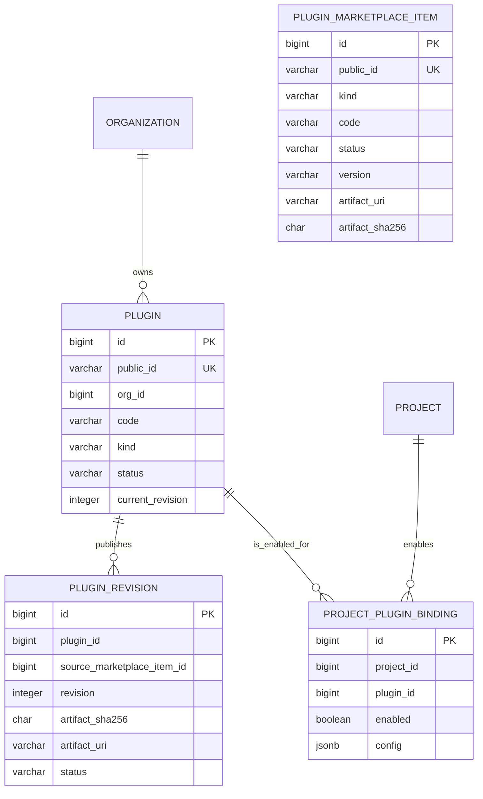
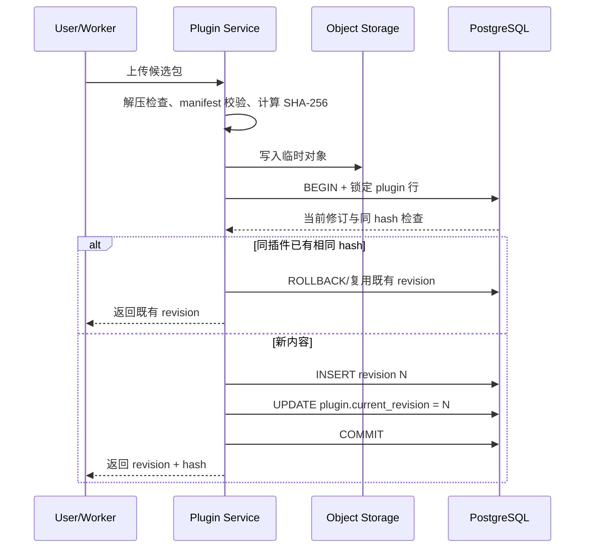

# 组织插件仓库数据库表结构设计

> 状态：提案
>
> 日期：2026-07-21
>
> 适用范围：组织插件仓库、项目插件绑定、插件发布修订、`agent.run` 插件快照与 Worker 文件缓存
>
> 关联方案：[组织插件仓库目标架构与现状改造计划](2026-07-16-organization-plugin-repository-refactor-plan.md)

## 1. 结论摘要

本期新增四张 Server 数据库表：

1. `leros_plugin`：组织拥有的插件逻辑实体。
2. `leros_plugin_revision`：插件不可变发布内容及包校验信息。
3. `leros_project_plugin_binding`：项目允许使用哪些插件。
4. `leros_plugin_marketplace_item`：系统公开市场中的可搜索插件条目和当前可导入制品。

组织从系统公开市场安装时，不直接把市场条目当作组织插件使用，而是由 Server 读取市场条目的当前制品，复制并导入组织插件仓库，生成组织自己的 `leros_plugin_revision`。市场条目后续更新不会自动改动已经安装到组织的插件，也不会触发 Worker 同步。

任务发布时将项目绑定解析为插件快照，直接放入 `agent.run` 命令，不新增 Worker SQLite，也不要求本期新增 Server Run 表。Worker 仅在本地插件目录写入文件和 `.leros-install.json` 元文件。



### 1.1 本期明确不建的表

- `plugin_worker_sync`：不保存“所有 Worker 是否已同步”，因为同步改为任务执行前按需发生。
- Worker 侧插件安装表：不使用 Worker SQLite；本地目录元文件是真实缓存状态。
- `project_plugin_version`：本期不支持项目固定历史修订。新任务解析当前修订，旧任务使用已经下发的快照。
- `run_plugin_snapshot`：当前 `agent.run` 通过 NATS 和 Worker durable inbox 传递快照；只有后续需要 Server 端 Run 审计或逐 Run 下载授权时再增加。

## 2. 当前数据库问题

当前 `backend/internal/infra/db/database.go` 迁移了以下旧 Skill 相关模型：

| 当前表 | 当前含义 | 不能满足的目标 |
| --- | --- | --- |
| `leros_skill` | 旧 Skill 实体，`code` 全局唯一，包含 schema/config 等字段 | 无统一插件类型边界；无法表达一个组织内同 code 的隔离。 |
| `leros_skill_registry` | Skill 注册关系 | 与旧 Skill 接口绑定，不是项目授权。 |
| `leros_skill_execution_log` | Skill 执行日志 | 不记录任务实际使用的修订包。 |
| `leros_skill_marketplace_item` | 外部市场搜索缓存 | `source + skill_id + version` 是外部来源标识，不是组织插件身份。 |
| `leros_builtin_skill_marketplace_item` | 内置市场条目 | 内置 Skill 与公开市场概念耦合。 |
| `leros_org_skill_installation` | 组织希望安装到 Worker 的记录 | 把组织安装误当成所有 Worker 预装，不含项目授权。 |
| `leros_project.metadata.extra.skills` | 消息调用后写入的 JSON 数组 | “调用过”不等于“项目允许使用”；无外键、无 hash、无 revision。 |

相关真实代码位置：

- `backend/types/project.go`：`Project` 没有插件关系字段。
- `backend/types/task.go`：`Task` 没有插件快照字段。
- `backend/pkg/messaging/command.go`：`RunCommandPayload` 没有插件字段。
- `backend/internal/service/message_poster.go`：`publishWorkerTask` 只构造项目上下文和运行参数。
- `backend/internal/service/org_skill_sync.go`：安装/发布会向组织内 Worker 扇出 `cmd.skill`。

因此不建议继续扩展 `Skill` 或 `OrgSkillInstallation`，而应建立新的插件领域模型，旧表只承担兼容和迁移职责。

## 3. 表一：`leros_plugin`

### 3.1 作用

保存插件的稳定身份、组织归属、展示元数据和当前修订指针。它不保存插件包内容；包内容和发布历史在 `leros_plugin_revision`。

### 3.2 字段设计

| 字段 | PostgreSQL 类型 | GORM 建议 | 空值 | 说明 |
| --- | --- | --- | --- | --- |
| `id` | `bigint` | `gorm.Model` | 否 | 内部主键。 |
| `public_id` | `varchar(255)` | `not null;uniqueIndex` | 否 | 外部稳定 ID，如 `plg_a8k...`。 |
| `org_id` | `bigint` | `not null` | 否 | 所属组织。插件不是公开市场资源。 |
| `code` | `varchar(128)` | `not null` | 否 | 组织内唯一机器名，用于 `/skill` 和 `.skills/<code>`。 |
| `kind` | `varchar(32)` | `not null` | 否 | `skill`、`mcp`、`workflow` 等。 |
| `name` | `varchar(255)` | `not null` | 否 | 展示名称。 |
| `description` | `text` | 无 | 是 | 展示说明。 |
| `status` | `varchar(32)` | `not null;default:'active'` | 否 | `active`、`archived`。 |
| `origin` | `varchar(32)` | `not null;default:'org'` | 否 | `org`、`import`、`worker`、`system_marketplace`、`system_migrated`；仅记录来源，不代表当前是否仍来自市场。 |
| `current_revision` | `integer` | `not null;default:0` | 否 | 当前可用于新任务的修订号；`0` 表示尚未发布。 |
| `created_by` | `bigint` | `not null` | 否 | 创建者用户 ID；Worker 创建时记录发布主体 ID。 |
| `updated_by` | `bigint` | `not null` | 否 | 最近修改元数据或当前修订号的主体。 |
| `created_at` | `timestamp` | GORM 标准字段 | 否 | 创建时间。 |
| `updated_at` | `timestamp` | GORM 标准字段 | 否 | 更新时间。 |
| `deleted_at` | `timestamp` | GORM 标准字段 | 是 | 软删除。 |

### 3.3 索引与约束

```sql
-- 组织内 code 唯一；软删除后允许重新创建同名 code
CREATE UNIQUE INDEX ux_plugin_org_code
ON leros_plugin (org_id, code)
WHERE deleted_at IS NULL;

CREATE UNIQUE INDEX ux_plugin_public_id
ON leros_plugin (public_id);
```

约束规则：

- `code` 在服务层规范化为小写，允许 `[a-z0-9-]`，长度建议 1–64；数据库长度保留 128 以便迁移。
- `kind` 不在数据库层写死完整枚举，服务层维护注册表；未知类型可入库但不能执行。
- `current_revision` 必须为 `0`，或能在同一 `plugin_id` 下找到状态为 `published` 的同号 `revision`。
- 当前修订号和新修订记录必须在同一事务更新；`plugin.org_id = project.org_id` 等关系一致性由事务服务层验证。
- 归档插件不删除历史修订；新项目绑定和新任务快照均拒绝归档插件。

本期只创建上述两个业务唯一索引：前者保证组织内机器名唯一，后者支持公开 ID 路由。`org_id`、`kind`、`status`、审计人等字段不因为关联或筛选可能性自动建索引；后续仅在真实慢查询出现后，按实际查询条件补充。

## 4. 表二：`leros_plugin_revision`

### 4.1 作用

保存一次插件内容发布的不可变记录。`revision` 是内部修订号，不提供用户选择版本的产品能力；`artifact_sha256` 是 Worker 判断本地缓存是否一致的核心字段。

### 4.2 字段设计

| 字段 | PostgreSQL 类型 | GORM 建议 | 空值 | 说明 |
| --- | --- | --- | --- | --- |
| `id` | `bigint` | `gorm.Model` | 否 | 内部主键。 |
| `plugin_id` | `bigint` | `not null` | 否 | 所属插件。 |
| `source_marketplace_item_id` | `bigint` | `nullable` | 是 | 若该修订来自系统公开市场，记录来源条目；手工导入或 Worker 发布为空。 |
| `revision` | `integer` | `not null` | 否 | 插件内单调递增，从 1 开始。 |
| `status` | `varchar(32)` | `not null;default:'published'` | 否 | `published`、`revoked`。 |
| `artifact_uri` | `varchar(1000)` | `not null` | 否 | Server 对象存储 URI；不下发到 NATS 或 Worker 元文件。 |
| `artifact_sha256` | `char(64)` | `not null` | 否 | 压缩包字节流 SHA-256，小写十六进制。 |
| `package_size_bytes` | `bigint` | `not null` | 否 | 下载大小和安全限额。 |
| `content_type` | `varchar(128)` | `not null;default:'application/zip'` | 否 | 当前首选 zip；后续可支持 tar。 |
| `published_by_type` | `varchar(32)` | `not null` | 否 | `user` 或 `worker`。 |
| `published_by_id` | `bigint` | `not null` | 否 | 发布主体 ID。 |
| `published_at` | `timestamp` | `not null` | 否 | 发布成功时间。 |
| `created_at` | `timestamp` | GORM 标准字段 | 否 | 记录创建时间。 |
| `deleted_at` | `timestamp` | GORM 标准字段 | 是 | 原则上不删除已发布修订。 |

### 4.3 索引与约束

```sql
CREATE UNIQUE INDEX ux_plugin_revision_number
ON leros_plugin_revision (plugin_id, revision);

-- 相同内容再次发布时幂等返回现有 revision，不生成新的 revision
CREATE UNIQUE INDEX ux_plugin_revision_content
ON leros_plugin_revision (plugin_id, artifact_sha256)
WHERE deleted_at IS NULL;
```

规则：

- 相同插件提交相同 `artifact_sha256` 时返回已有修订，这是幂等发布，不增加修订号。
- 不同内容才创建 `MAX(revision) + 1`。生成修订号前必须锁定 `leros_plugin` 行，不能只在应用层读取最大值。
- `revoked` 修订不可被新任务解析，也不能作为当前指针；已经拿到该快照的任务是否允许继续，按安全策略决定，默认允许已开始任务完成但禁止再次下载。
- Server 在导入时从包内读取并校验 manifest，但不将 manifest 或其摘要写入本表。API Key、MCP 密钥、OAuth refresh token 等必须存现有 Secret/credential 系统的引用。
- `source_marketplace_item_id` 只用于溯源和审计，不参与任务授权；市场条目下架后，已导入的组织修订仍按组织仓库规则独立运行。

修订表只保留两个索引：`(plugin_id, revision)` 支持按修订号定位和版本历史扫描，`(plugin_id, artifact_sha256)` 保障同一插件重复导入的幂等性。来源条目、状态、发布时间和单独 hash 不建索引。

## 5. 表三：`leros_project_plugin_binding`

### 5.1 作用

表达项目对组织插件的授权关系。它表示“项目可以使用这个插件”，不表示某条消息已经调用过插件，也不保存 Worker 安装状态。

### 5.2 字段设计

| 字段 | PostgreSQL 类型 | GORM 建议 | 空值 | 说明 |
| --- | --- | --- | --- | --- |
| `id` | `bigint` | `gorm.Model` | 否 | 内部主键。 |
| `project_id` | `bigint` | `not null` | 否 | 项目内部 ID。 |
| `plugin_id` | `bigint` | `not null` | 否 | 插件内部 ID。 |
| `enabled` | `boolean` | `not null;default:true` | 否 | 是否进入新任务快照。 |
| `config` | `jsonb` | `not null;default:'{}'` | 否 | 项目级非秘密配置；秘密只存引用。 |
| `created_by` | `bigint` | `not null` | 否 | 绑定主体。 |
| `updated_by` | `bigint` | `not null` | 否 | 最近修改主体。 |
| `created_at` | `timestamp` | GORM 标准字段 | 否 | 创建时间。 |
| `updated_at` | `timestamp` | GORM 标准字段 | 否 | 更新时间。 |
| `deleted_at` | `timestamp` | GORM 标准字段 | 是 | 软删除。 |

### 5.3 索引与约束

```sql
CREATE UNIQUE INDEX ux_project_plugin_active
ON leros_project_plugin_binding (project_id, plugin_id)
WHERE deleted_at IS NULL;
```

服务层必须在绑定事务内校验：

1. `project.org_id == plugin.org_id`。
2. `plugin.status == active`。
3. `plugin.current_revision > 0`，且同号修订为 `published`。
4. 调用者属于当前插件组织；本期不增加组织内的细粒度项目绑定权限。
5. `config` 经过对应 `kind` 的 schema 校验，不能包含明文凭据。

本期不增加版本锁定字段；新任务始终读取插件主表的当前修订号，旧任务始终依赖已下发的命令快照。

绑定表只保留 `(project_id, plugin_id)` 活跃绑定唯一索引。该索引同时覆盖按项目读取绑定的主路径；不为 `plugin_id`、`enabled` 或审计字段建立额外索引。

### 5.4 现有表的调整边界

| 现有表/类型 | 本期调整 | 说明 |
| --- | --- | --- |
| `leros_project` | 不增加 `plugin_ids` 或 JSON 字段 | 插件关系由 binding 表承载，避免项目模型继续膨胀。 |
| `leros_task` | 不增加插件字段 | 当前任务命令由会话消息触发；插件快照在 `agent.run` 中传递。需要 Server Run 审计时再增加独立 Run 表。 |
| `leros_session` / `leros_session_message` | 不改变主表结构 | `SessionMessage.RunID` 继续关联运行；插件使用记录应通过运行审计或 message resource 扩展解决，不能反写项目 metadata。 |
| `leros_project_activity` | 增加 `project.plugins.changed` action 和插件 ID payload 字段 | 用于记录绑定/解绑/启停；兼容现有 `project.skills.changed`，迁移期不要重写历史活动。 |
| `leros_resource` / `leros_resource_binding` | 默认不增加 Plugin ResourceType | 组织插件管理走组织 RBAC，项目绑定走项目权限；只有未来要求单个插件独立 ACL 时再新增资源类型。 |
| `leros_message_resource` | 保留原表 | 可新增 `resource_type = plugin` 的审计记录，但不能从消息资源推导项目授权。 |
| `leros_worker_deployment` | 不增加插件同步状态 | Worker 是否有缓存由本地目录元文件判断，Server 不维护安装完成度。 |
| `Project.Metadata.Extra["skills"]` | 停止新增写入，迁移期只读 | 它只能作为历史迁移来源，不再作为业务真相源。 |

建议同步扩展 `ProjectActivityPayload`：

```go
type ProjectActivityPayload struct {
	AddedSkillIDs      []string `json:"added_skill_ids"`
	RemovedSkillIDs    []string `json:"removed_skill_ids"`
	AddedMemberIDs     []string `json:"added_member_ids"`
	RemovedMemberIDs   []string `json:"removed_member_ids"`
	AddedAITeammateIDs []string `json:"added_ai_teammate_ids"`
	RemovedAITeammateIDs []string `json:"removed_ai_teammate_ids"`
	AddedPluginIDs     []string `json:"added_plugin_ids,omitempty"`
	RemovedPluginIDs   []string `json:"removed_plugin_ids,omitempty"`
	ChangedPluginIDs   []string `json:"changed_plugin_ids,omitempty"`
}
```

如果为了避免修改现有 payload 结构而使用新增 JSON 字段，必须仍由具名 DTO 序列化，不应在业务接口中传递 `map[string]interface{}`。

## 6. 表四：`leros_plugin_marketplace_item`

### 6.1 作用

该表是系统维护的公开市场目录，不属于任何组织，也不是 Worker 安装状态表。它只负责让组织搜索、查看和选择可导入的插件条目，并保存当前可导入制品的定位和摘要。

市场条目与组织插件必须解耦：组织执行“安装”时，Server 从市场条目读取制品，重新校验并复制到组织插件修订；后续市场条目更新、下架或删除，不会自动覆盖组织已有修订。

本期一个市场条目只维护一个当前可导入制品，并在 `version` 记录该当前包的版本标识；不新增市场版本历史表。组织需要追溯的版本历史由导入后生成的 `leros_plugin_revision` 保存。

### 6.2 字段设计

| 字段 | PostgreSQL 类型 | GORM 建议 | 空值 | 说明 |
| --- | --- | --- | --- | --- |
| `id` | `bigint` | `gorm.Model` | 否 | 内部主键。 |
| `public_id` | `varchar(255)` | `not null;uniqueIndex` | 否 | 市场条目公开 ID，如 `mkt_plg_...`。 |
| `kind` | `varchar(32)` | `not null` | 否 | `skill`、`mcp`、`workflow` 等。 |
| `code` | `varchar(128)` | `not null` | 否 | 市场展示和导入时使用的机器名；导入组织后仍需按组织规则校验。 |
| `name` | `varchar(255)` | `not null` | 否 | 展示名称。 |
| `description` | `text` | 无 | 是 | 搜索和详情说明。 |
| `author` | `varchar(255)` | `not null;default:''` | 否 | 作者或发布方。 |
| `source_type` | `varchar(32)` | `not null` | 否 | `builtin`、`curated`、`external`。 |
| `source_ref` | `varchar(1000)` | `not null` | 否 | 来源标识；不得直接作为 Worker 下载地址。 |
| `status` | `varchar(32)` | `not null;default:'published'` | 否 | `published`、`unlisted`、`archived`。 |
| `artifact_uri` | `varchar(1000)` | `not null` | 否 | 系统对象存储 URI；仅 Server 读取。 |
| `artifact_sha256` | `char(64)` | `not null` | 否 | 当前可导入包的 SHA-256。 |
| `version` | `varchar(64)` | `not null` | 否 | 当前包版本标识，如 `1.0.0`；仅表示当前制品，不形成市场历史。 |
| `package_size_bytes` | `bigint` | `not null` | 否 | 当前包大小。 |
| `content_type` | `varchar(128)` | `not null;default:'application/zip'` | 否 | 当前首选 ZIP。 |
| `category` | `varchar(100)` | `not null;default:''` | 否 | 市场分类。 |
| `tags` | `jsonb` | `not null;default:'[]'` | 否 | 搜索标签；使用强类型列表序列化。 |
| `icon` | `varchar(1000)` | 无 | 是 | 图标地址或系统图标标识。 |
| `verified` | `boolean` | `not null;default:false` | 否 | 是否经过系统审核/验证。 |
| `published_at` | `timestamp` | `not null` | 否 | 上架时间。 |
| `created_at` / `updated_at` / `deleted_at` | `timestamp` | GORM 标准字段 | 部分 | 目录审计和软删除。 |

### 6.3 索引与约束

```sql
CREATE UNIQUE INDEX ux_plugin_marketplace_public_id
ON leros_plugin_marketplace_item (public_id);

CREATE UNIQUE INDEX ux_plugin_marketplace_source
ON leros_plugin_marketplace_item (source_type, source_ref)
WHERE deleted_at IS NULL;
```

本期仅保留公开 ID 和来源身份两个业务唯一索引。市场目录初期用 `kind`、`category`、`status` 过滤及 `name/code/description` 的简单匹配；目录规模和慢查询证据足够时，再按实际检索方案增加组合索引或全文索引。

### 6.4 市场导入规则

1. 市场列表只返回 `status = published` 的条目；`unlisted` 仍可通过明确 ID 查看，`archived` 不允许新导入。
2. Server 读取 `artifact_uri`，重新计算包 SHA、校验包内 manifest 和安全边界，不能信任市场表中未经复核的摘要。
3. 导入成功后创建或追加组织 `leros_plugin_revision`，并在 `source_marketplace_item_id` 保存来源条目 ID。
4. 相同市场包导入同一组织插件时按 `artifact_sha256` 幂等，不生成重复修订；导入到不同组织时分别生成各自组织修订。
5. 市场条目的安装次数可以在导入事务成功后异步聚合更新；计数失败不能回滚组织插件导入。
6. Worker 只从组织插件修订资源获取制品，不直接访问市场条目的 `artifact_uri`。
7. 系统更新市场条目时，在同一事务更新 `version` 与当前制品字段；市场不保留旧版本条目或历史表。

## 7. 任务快照与数据库表的关系

### 7.1 本期快照不单独建表

Server 查询绑定表和当前修订后，在 `RunCommandPayload` 中携带：

```go
type PluginSnapshot struct {
	PluginID       string `json:"plugin_id"`
	Code           string `json:"code"`
	Kind           string `json:"kind"`
	Revision       int    `json:"revision"`
	ArtifactSHA256 string `json:"artifact_sha256"`
}
```

查询关系：

```sql
SELECT
    p.public_id,
    p.code,
    p.kind,
    r.revision,
    r.artifact_sha256
FROM leros_project_plugin_binding b
JOIN leros_project project ON project.id = b.project_id
JOIN leros_plugin p
  ON p.id = b.plugin_id
 AND p.org_id = project.org_id
JOIN leros_plugin_revision r
  ON r.plugin_id = p.id
 AND r.revision = p.current_revision
WHERE b.project_id = $1
  AND project.org_id = $2
  AND b.enabled = TRUE
  AND p.status = 'active'
  AND p.current_revision > 0
  AND r.status = 'published'
  AND b.deleted_at IS NULL
  AND p.deleted_at IS NULL
  AND r.deleted_at IS NULL
ORDER BY p.kind ASC, p.code ASC, p.public_id ASC;
```

查询和任务发布应使用同一个只读事务，避免发布恰好发生在读取插件和修订之间造成不一致。任务命令中的快照一旦发布，不再回查 `current_revision`。

### 7.2 什么时候再增加 `leros_run_plugin_snapshot`

后续出现以下需求时，再新增 Server 侧快照表，不要把这些状态放进 Worker SQLite：

- 需要在 Server UI 查看某个 Run 实际使用的所有插件。
- artifact API 必须做到逐 `run_id` 的最小下载权限，而不仅是组织 Worker 权限。
- 需要在 Worker 离线后由 Server 精确恢复某个 Run 的插件快照。
- 需要审计“插件发布后哪些 Run 使用过旧修订”。

届时可采用一对多结构：

```text
leros_run
  id, run_id, org_id, project_id, task_id, status, created_at, ...

leros_run_plugin_snapshot
  id, run_id, plugin_id, kind, code, revision, artifact_sha256, created_at
```

这属于运行审计增强，不是本期插件仓库落地的前置条件。

### 7.3 五个仓库接口与表操作映射

插件仓库管理面只提供五个接口；下面的数据库动作是接口内部的事务步骤，不应再拆成独立 HTTP 接口：

| 接口 | 主要读写表 | 关键行为 |
| --- | --- | --- |
| `GET /api/v1/plugins` | `leros_plugin`、`leros_plugin_revision`、可选 `leros_project_plugin_binding` 或 `leros_plugin_marketplace_item` | `scope=organization` 查询组织插件；`scope=marketplace` 按关键词、类型、分类搜索系统公开市场；带 `project_id` 时返回项目可选择插件及绑定状态。 |
| `POST /api/v1/plugins/import` | `leros_plugin`、`leros_plugin_revision`、可选 `leros_project_plugin_binding`、`leros_plugin_marketplace_item` | 无 `plugin_id` 且上传包时创建插件并写首个修订；有 `plugin_id` 且带包时追加修订；只有已有 `plugin_id + project_id` 时仅 upsert 项目绑定；提供 `marketplace_item_id` 时复制并导入市场当前制品。 |
| `DELETE /api/v1/plugins/{plugin_id}` | `leros_plugin` 或 `leros_project_plugin_binding` | 无 `project_id` 将插件软删除/归档；有 `project_id` 仅解除该项目绑定；修订和对象包不物理删除。 |
| `GET /api/v1/plugins/{plugin_id}` | `leros_plugin`、当前 `leros_plugin_revision`、可选 `leros_project_plugin_binding` 或 `leros_plugin_marketplace_item` | 默认返回组织插件详情；带 `scope=marketplace` 时返回市场条目详情，不返回存储 URI。 |
| `GET /api/v1/plugins/{plugin_id}/versions` | `leros_plugin_revision` | 仅对组织插件返回不可变修订历史和哈希摘要；系统市场条目本期不提供版本历史，不提供选择、回滚或删除修订。 |

所有接口的 `org_id` 都来自调用者上下文，禁止由请求体传入。Worker 按任务快照获取制品的资源访问是执行链路内部能力，不计入上述五个管理接口。

## 8. 导入和删除的内部事务拆分

以下小节描述 `import` 与 `delete` 的内部事务边界，不代表额外的公开 API。

### 8.1 导入：新建插件并发布首修订

```text
BEGIN
  校验调用者组织归属、code 和 kind
  INSERT leros_plugin(current_revision = 0)
COMMIT
```

导入新插件不创建空修订；导入事务成功后即有首个已发布修订。没有已发布修订的插件不能绑定项目。

### 8.2 导入：追加新修订

对象存储没有跨数据库事务，因此采用“临时对象 + 数据库事务 + 孤儿回收”：



实现要求：

- 数据库事务内 `SELECT ... FOR UPDATE` 锁定 `leros_plugin` 行，保证同一插件并发发布不会生成两个相同 revision。
- 临时对象转为稳定对象键后再写 `artifact_uri`，或者使用可直接长期读取的幂等对象键；数据库提交失败由后台任务清理孤儿对象。
- `current_revision` 只能更新为本事务刚插入或已验证存在的同插件修订号。
- 发布失败不改变当前修订，不向 Worker 广播任何命令。

### 8.3 导入：可选绑定项目

导入接口有两种绑定方式：上传新包时同时携带 `project_id`，或只提交已有 `plugin_id + project_id` 以将现有插件加入项目。后者不创建新修订。

```text
BEGIN
  SELECT project FOR UPDATE
  SELECT plugin/current revision FOR UPDATE
  校验 project.org_id == plugin.org_id
  校验 plugin active + current revision published
  UPSERT project_plugin_binding
  写 project activity: project.plugins.changed
COMMIT
```

绑定成功后不触发 Worker 安装。只有项目下一次发布任务时才读取绑定并生成快照。

### 8.4 删除：软删除插件或解除项目绑定

- `DELETE /api/v1/plugins/{plugin_id}` 不带 `project_id` 时，将 `leros_plugin.status` 改为 `archived`，不删除 `plugin_revision` 和对象包。
- 带 `project_id` 时只软删除对应 `leros_project_plugin_binding`，不影响组织插件及其他项目。
- 新绑定、新任务快照均拒绝归档插件；已经发布且携带旧快照的任务默认可以继续执行。
- 删除不触发 Worker 批量卸载，Worker 缓存由后续 TTL 清理回收。

## 9. Worker 文件元数据与 Server 表的对应

Worker 不建立数据库表，但必须在以下目录保存文件：

```text
$LEROS_WORKSPACE_ROOT/.leros/plugins/<kind>/<plugin_public_id>/
├── revisions/<revision>/...
├── current -> revisions/<revision>
└── .leros-install.json
```

元文件记录的是 Server 表的派生缓存：

| Worker 元数据 | 来源表/字段 | 用途 |
| --- | --- | --- |
| `plugin_id` | `leros_plugin.public_id` | 找到缓存目录。 |
| `kind` | `leros_plugin.kind` | 选择插件适配器和目录层级。 |
| `revision` | `leros_plugin_revision.revision` | 对应任务快照。 |
| `artifact_sha256` | `leros_plugin_revision.artifact_sha256` | 判断内容是否一致。 |
| `installed_at` | Worker 本地时间 | 诊断和 TTL，不是组织事实。 |
| `current_revision` | 本地便利指针 | 不参与任务授权；项目链接应直接指向指定 revision。 |

如果 Worker 元文件丢失，Worker 不需要向 Server 写回状态，也不需要 SQLite 恢复；按任务快照重新下载并重建元文件即可。

## 10. 旧表迁移与保留策略

### 10.1 迁移顺序

1. 新增四张表和索引，不修改旧表写路径。
2. 从内置包和已审核来源建立 `PluginMarketplaceItem`；市场条目必须重新读取包并计算 SHA-256。
3. 从 `OrgSkillInstallation` 和旧组织安装记录生成候选 Plugin；组织包必须重新读取并计算 SHA-256。
4. 为每个可恢复包写入 `PluginRevision(revision = 1)`，再更新 `Plugin.current_revision = 1`。
5. 将 `Project.Metadata.Extra["skills"]` 中能在同组织唯一匹配的新插件转换为 `ProjectPluginBinding`。
6. 生成差异报告：无法找到包、code 冲突、组织不一致、manifest 不合法的记录进入人工清单。
7. 灰度组织使用新快照执行；观察完成后关闭旧市场安装和全量 Worker 同步。
8. 保留旧表只读一个发布周期，再单独提交删除旧写路径和物理表的迁移。

### 10.2 旧表处理建议

| 旧表 | 第一阶段 | 切流后 | 删除条件 |
| --- | --- | --- | --- |
| `leros_org_skill_installation` | 停止新增以外的语义变化，作为迁移源 | 只读历史 | 新插件仓库稳定且迁移报告关闭。 |
| `leros_skill_marketplace_item` | 迁移为系统市场目录候选 | 只读或归档 | 新市场 API 改读 `leros_plugin_marketplace_item`。 |
| `leros_builtin_skill_marketplace_item` | 迁移为系统市场目录或明确保留 Runtime 内建 | 不再直接作为市场来源 | 内置能力迁移完成。 |
| `leros_skill` / `skill_registry` | 保留旧接口兼容 | 禁止作为项目快照来源 | 所有调用方切换到 Plugin。 |
| `project.metadata.extra.skills` | 停止新增 | 保留历史 JSON | 迁移报告确认无新写入后再清理。 |

## 11. GORM 与 migration 实现建议

### 11.1 类型文件

建议新增：

```text
backend/types/plugin.go
backend/types/plugin_revision.go
backend/types/project_plugin_binding.go
backend/types/plugin_marketplace_item.go
```

并在 `backend/types/tables.go` 增加：

```go
TableNamePlugin                 = tablenamePrefix + "plugin"
TableNamePluginRevision         = tablenamePrefix + "plugin_revision"
TableNameProjectPluginBinding   = tablenamePrefix + "project_plugin_binding"
TableNamePluginMarketplaceItem  = tablenamePrefix + "plugin_marketplace_item"
```

所有公共字段使用具名类型或 `json.RawMessage`/`datatypes.JSON`，不要新增 `map[string]interface{}` 作为 repository、service 或 messaging 接口参数。

### 11.2 `runMigrations` 顺序

在 `backend/internal/infra/db/database.go` 中：

```text
1. rename/drop 旧字段准备
2. AutoMigrate Plugin、PluginRevision、ProjectPluginBinding、PluginMarketplaceItem
3. 创建文档列出的业务唯一索引
4. seed/回填系统市场目录，确保每个条目有可校验的当前制品
5. 回填旧组织 Skill 为候选 Plugin/Revision
6. 回填项目 binding
7. 输出迁移统计和异常，不自动删除旧表
```

GORM `AutoMigrate` 不应被当作唯一迁移工具：它不会自动删除旧列，也不能可靠表达所有 partial index、跨组织一致性和锁定发布逻辑。索引和回填应使用显式 migration helper，并为重复执行设计幂等条件。

### 11.3 关联字段策略

本期不创建数据库 foreign key，也不因 `OrgID`、`ProjectID`、`PluginID` 或 `source_marketplace_item_id` 是关联字段而自动创建索引。关联完整性由写入和快照解析事务保证：

- 发布时锁定插件行，以 `(plugin_id, revision)` 验证待写入的当前修订号。
- 绑定和任务快照时校验 `project.org_id = plugin.org_id`、插件状态和当前修订状态。
- `source_marketplace_item_id` 仅为可空溯源值；市场条目被软删除或清理不会影响已有组织修订。
- 软删除场景依赖 partial unique index 的业务唯一性，不用普通全局唯一索引阻止历史记录重新绑定。
- 发布修订不物理删除；对象存储清理由“无引用 + TTL + 非 current”条件控制。

## 12. 验收清单

- 同一组织内同 `code` 只能存在一个 active Plugin；不同组织可以使用相同 code。
- 插件没有 published revision 时不能绑定项目。
- 项目和插件不属于同一组织时，绑定、快照解析和 artifact 下载均失败。
- 相同包 hash 重复发布返回既有 revision；不同 hash 生成严格递增 revision。
- 发布事务并发执行不会产生重复 revision，也不会丢失 `current_revision`。
- 项目解绑/禁用后，新任务不携带该插件；旧命令快照仍保持原内容。
- Worker 丢失元文件后可仅凭任务快照重新下载，不依赖 Worker SQLite。
- 插件发布或绑定变化不向全部 Worker 发送同步命令。
- `artifact_uri`、签名 URL、密钥和发布授权不进入 `agent.run` 的普通插件快照。
- `scope=marketplace` 只返回 `published` 条目；`archived` 条目不能新导入。
- 市场导入会复制制品并记录 `source_marketplace_item_id`；市场更新、下架不会改变组织已有修订。
- Worker 不直接读取市场制品，只能读取组织插件修订资源。
