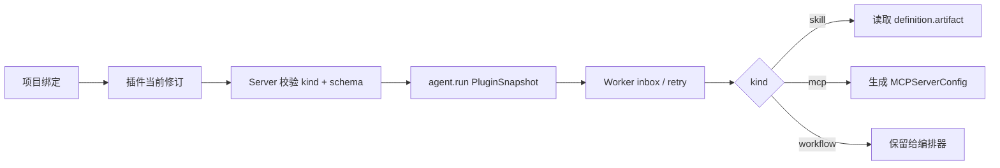

# 插件 Definition 通用结构调整

## 决策

`kind` 决定插件的解释与校验方式。`leros_plugin_revision.definition` 与
`leros_plugin_marketplace_item.definition` 是唯一的不可变内容载体；不再为制品
元数据单独保留 `artifact_uri`、`artifact_sha256`、`package_size_bytes` 或
`content_type` 列，也不设置 `payload_mode`、`definition_schema`。

`definition` 为 `JSONB NOT NULL`，顶层必须有 `schema`。当前版本：

| kind | schema | 关键内容 |
| --- | --- | --- |
| `skill` | `skill/v1` | `artifact.file_upload_id`、`artifact.sha256`，以及可选大小与类型 |
| `mcp` | `mcp/v1` | HTTP 的 `url` 或 stdio 的 `command`、`args`、Secret 引用 |
| `workflow` | `workflow/v1` | `definition` 中的工作流定义 |

本阶段不限制 Definition 中的凭据表达方式；Secret 引用规范与密钥治理将在
后续安全治理阶段统一引入。

## 执行快照

`PluginSnapshot` 直接携带 `plugin_id`、`code`、`kind`、`revision` 和完整
`definition`。这使 revision 成为缓存和重试的一致性边界；artifact 仅携带
`file_upload_id`，Worker 后续通过受控文件资源接口获取制品。

## 数据迁移

PostgreSQL migration 会先将旧制品列组合为 `definition.artifact`，再删除旧列与
`ux_plugin_revision_content`。保留插件公开 ID、组织 code、`(plugin_id, revision)`、
项目绑定、市场公开 ID、市场来源的业务唯一索引；不创建外键或关联字段索引。

Bundle Skill 的相同 hash 在发布 Service 层判定幂等；MCP/Workflow 的每次成功发布
都会递增 revision。

## 当前 Skill 导入边界

Skill 导入只接受已上传的目录 ZIP 包。Server 校验 ZIP 中的 Skill 结构，读取或计算
包 hash，生成 `skill/v1.artifact` Definition 并写入插件与修订表。GitHub 导入会解析
链接、下载对应 Skill 目录、整理成同一标准 ZIP、上传到文件存储后复用完全相同的
校验和落库流程。两种导入均不发送 Worker 命令、不安装到 Worker 工作区，也不触发同步；
Worker 会在后续任务执行前按修订快照按需准备插件。

插件身份使用 ZIP 内 `SKILL.md` frontmatter 的 `name`，组织 ID 与该名称共同唯一：
同组织首次出现该名称时新建插件；再次导入同名 Skill 时创建新 revision（相同包 hash
视为幂等，不创建重复修订）。请求参数不再决定插件 code 或显示名称。
