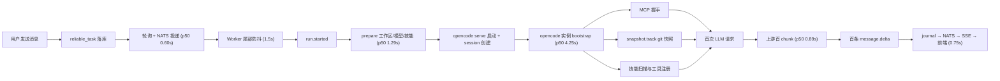
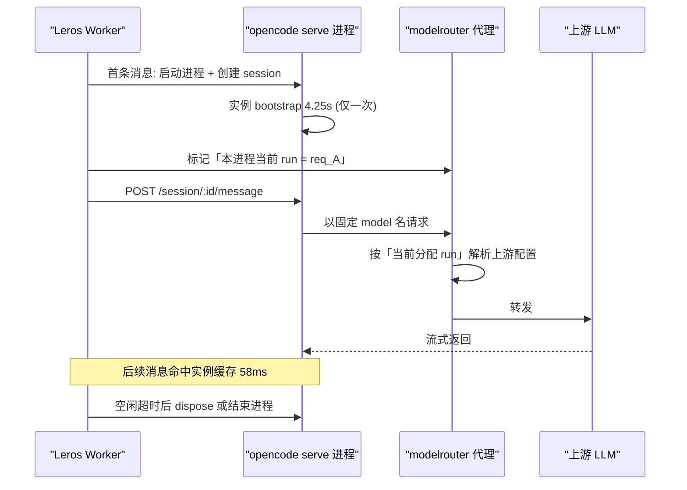

# Leros 首 token 延迟优化技术方案

> 档位：标准档 ｜ 主场景：S2 增量改造（叠加 S6 专项优化的指标义务）｜ 专题：性能与容量（主）、架构设计、配置注入契约
> 前提约束（已拍板）：**opencode 使用官方发行版、不 fork 不 patch**；**不做进程常驻复用**；**保留 undo/revert，不动 snapshot**

## 背景与目标

### 业务背景与现状

用户在会话里点击发送后，Leros 的链路是：

1. 前端 `POST AddMessage` → server 在同一事务里写 `reliable_task` 发件箱行；
2. `ReliableTaskDispatcher` 周期扫描发件箱（`backend/internal/service/run_dispatcher.go:17`，`reliableTaskScanInterval = time.Second`），投递 NATS；
3. worker 接单、落 SQLite inbox，进入 `run.Coordinator` 的尾部防抖窗口（默认 1500ms，`backend/internal/worker/run/coordinator.go:210`）；
4. 防抖结束 → `agentrun.Service.Run` 记 `run.started`（`backend/internal/worker/agentrun/service.go:96`）→ `Preparer` 准备 → 运行时启动；
5. 运行时默认 `opencode`：**每个 run 新起一个 `opencode serve` 子进程**，跑完即停；
6. worker 本地 modelrouter 代理转发到上游 LLM；
7. 流式结果经 journal → NATS `run.stream` → server SSE → 前端渲染。

关键结构性事实：opencode 的所有一性次初始化（配置、插件、LSP、快照、MCP、技能、工具注册）都挂在 `InstanceState` 上，它是**进程内、按 directory 缓存、无 TTL、不落盘**的内存缓存。由于第 5 步每轮都新起进程，这些初始化**每条消息都要重付一遍**。

### 痛点分析

以「无附件」的 435 次真实运行统计（口径见下节），端到端首 token p50 **10.88s**、p90 **53.61s**。分段如下：

| 阶段 | p50 | p90 | 归属 |
|---|---|---|---|
| 发送 → `run.started`（发件箱轮询 + 防抖） | 1.57s | 2.71s | Leros 调度 |
| `prepare`（工作区/模型/技能准备，含进程启动） | 1.29s | 5.29s | Leros worker |
| **opencode 实例 bootstrap（session 就绪 → 首次 LLM 请求）** | **4.25s** | **7.03s** | opencode 生命周期 |
| 上游首 chunk | 0.89s | 5.81s | 上游供应商 |
| 首 chunk → 首条 `message.delta` 回传 | 0.75s | — | Leros |

**决定性对照**：同一份 opencode 二进制，以常驻进程 + 已有 session 交互时，「session 就绪 → 首次 LLM 请求」只要 **58ms**；冷启动是 **4250ms**，相差 73 倍。这证明慢的不是算力也不是模型，而是**初始化被重复支付**。

痛点落到具体场景与频次：**每一条用户消息都命中一次**（非偶发、非峰值相关）；其中 opencode 实例 bootstrap 期间 Leros 无任何用户可见反馈，用户看到的是「发了没反应」的 10.9 秒。

### 目标与非目标

**目标**

- 在「每轮新进程 + 官方发行版 + 保留 undo」的前提下，把首 token p50 从 10.88s 降到 **≤ 5.0s**、p90 从 53.61s 降到 **≤ 12s**；
- 把用户可见的首个反馈时刻从 ~10.9s 提前到 **≤ 2.0s**（感知延迟）；
- 消除已知的 61s 级异常档位（不可达附件下载）。

**非目标（超出范畴的用例）**

- **不做 opencode 进程常驻/进程池**：本次明确排除（改动跨进程生命周期、代理路由语义与清理逻辑，需独立立项，见「开放问题」）。方案中只保留一个「最小复用」P2 备选，不作为本期交付。
- **不修改 opencode 源码**：不 fork、不打补丁、不自编译。所有 opencode 侧手段仅限环境变量、`OPENCODE_CONFIG_CONTENT` 注入内容与文件布局。上游应修的问题（MCP 初始化后台化、快照移出关键路径等）整理为独立 issue 清单，不在本期范围。
- **不优化上游模型 TTFT**：上游首 chunk p50 已从早期 446ms 劣化到近期 1894ms（口径见下节），属供应商侧，本期只做观测与告警，不做路由替换。
- **不改 DB 表结构、不改对外 HTTP 契约**：本次全部改动落在 worker 运行时装配、配置注入与调度时序上。

### 约束与非功能需求

| 类别 | 约束 |
|---|---|
| 技术栈 | 后端 Go 1.25（`github.com/insmtx/Leros`）；opencode 为 Bun/TypeScript 编译的独立二进制，走官方发行版 |
| 部署形态 | worker 单进程，docker-compose（`deployments/env/docker-compose.yml`）；worker 工作目录 `.leros-workspace/` |
| 性能目标 | 首 token p50 ≤ 5.0s、p90 ≤ 12s（口径同下节）；首个用户可见反馈 ≤ 2.0s |
| 兼容性 | 无 DB 变更；opencode 注入配置为新增可选字段，旧版本忽略即可 |
| 可回退性 | 全部改动通过环境变量或配置注入实现，**每项可独立开关回退** |
| 安全 | 不新增外部依赖；注入内容中不含明文密钥（沿用现有 provider 注入方式）；日志不得打印附件签名 URL 与 token |

### 验收标准

| 项 | 阈值 | 口径 | 验证方式 | 责任方 |
|---|---|---|---|---|
| 首 token p50 | ≤ 5.0s | 无附件运行，`发送→首条 message.delta`，样本 ≥ 100 | SQL 聚合 Postgres `leros_session_message`（方法同下节） | 后端 |
| 首 token p90 | ≤ 12.0s | 同上 | 同上 | 后端 |
| 首个可见反馈 | ≤ 2.0s | 前端点击发送到出现占位/状态反馈 | 前端埋点 + 人工复核 | 前端 |
| 无回归 | 回归清单 100% 通过 | 见「回归与验证范围」 | QA 用例执行 | QA |
| undo/revert 仍可用 | 功能可用 | 手动执行一次 revert | 人工验证 | QA |

## 指标基线与测量方法

> 本节为 S6 专项优化义务。**所有数字给出口径与样本**，未经验证的收益一律标注「待验证假设」。

**基线口径**：Postgres `leros_dev.leros_session_message` 中 role=assistant 且带 chunk 的运行，用相关子查询配对同 session 内前一条 role=user 消息作为起点；时间戳为 epoch 毫秒。跨源对齐时再用 opencode 进程日志（`~/.local/share/opencode/log/opencode.log`）与 modelrouter 代理日志（`logs/modelrouter/*.jsonl`）补齐中间锚点。**样本**：624 条配对运行，其中无附件 435 条；**时间窗口**：2026-08 至 2026-09-16。**排除**：带图片附件的 159 条（其下载路径存在独立的 61s 异常，见 P0-8）。

| 指标 | 基线 p50 | 基线 p90 | 样本 |
|---|---|---|---|
| 发送 → `run.started` | 1.57s | 2.71s | 465 |
| `run.started` → 首 token | 8.42s | — | 624 |
| 发送 → 首 token | 10.88s | 53.61s | 435 |
| opencode：session 就绪 → 首次 LLM 请求 | 4.25s | 7.03s | 191 |
| 上游：请求 → 首 chunk | 0.89s | 5.81s | 704 |
| 发件箱投递延迟 | 0.60s | 0.94s | 52 |

**上游劣化的时间序列证据**（同口径，按 modelrouter 日志文件时间分段）：最早 200 次调用 p50 **446ms** → 中间 200 次 **575ms** → 最近 200 次 **1894ms**（p90 从 1.75s 涨到 17.0s）。这是独立于本方案的恶化趋势，需持续观测。

### 瓶颈假设与验证手段

| 假设 | 验证手段 | 若被推翻的应对 |
|---|---|---|
| H1：opencode bootstrap 中 MCP 握手占主导（不可达 server 的 OAuth 探测 4.5~6.9s/次） | 开 `OPENCODE_SHOW_TTFD=1`（部署的 1.18.18+ 发行版已支持该开关），对比「注入 MCP」与「不注入 MCP」各 30 次运行的 bootstrap 分布 | 转为按 bootstrap 内部阶段逐项消融（插件/技能/快照各关一项，30 次一组） |
| H2：Leros 侧固定等待 2.1s（发件箱 0.6s + 防抖 1.5s）可完全消除 | 直接改配置后重跑同一统计口径 | 无（属确定性开销） |
| H3：`OPENCODE_CONFIG_CONTENT` 无法移除全局配置里的键，导致宿主机的 MCP/插件被继承 | 设置 `XDG_CONFIG_HOME` 到空目录前后各跑 30 次，观察 opencode 日志中 `loading path=` 与 `server unavailable` 是否消失 | 若无效，改从注入内容里逐个 `enabled:false` |

**重要**：H1 目前只有间接证据（日志中 MCP 告警与 bootstrap 时长的相关性），**尚未做逐组件火焰图**。因此 P0 的策略是「先做无争议的确定性收益（P0-1~3、P0-7、P0-8），再按消融结果决定是否深入」。

## 影响面与兼容性

### 影响面盘点

| 改动 | 受影响的可观察行为 | 调用方/消费者 |
|---|---|---|
| 关闭尾部防抖（`debounce_ms: 1`） | **1.5s 窗口内的多条用户消息不再合并为一次 agent 运行**，改为各跑一次 | 前端发送逻辑、产品语义 |
| `OPENCODE_PURE=1` + `OPENCODE_DISABLE_DEFAULT_PLUGINS=1` | 外部插件与 11 个内置插件的 hook 全部不执行：`plugin/index.ts:179,168`。**项目 `.opencode/plugin(s)/*.ts` 一并失效** | 依赖插件注入 prompt/skill 的能力 |
| 收敛 skills（禁用外部/Claude 技能、清空 `skills.paths/urls`） | 只保留 Leros 自己下发的 skill；`~/.claude`、`~/.agents` 下的技能不再可用 | 依赖这些技能的会话 |
| MCP `enabled: false` / `timeout` | 对应 MCP 工具不可用，或慢 server 被判失败 | 使用该工具的 agent 流程 |
| `XDG_CONFIG_HOME` 隔离 | 宿主机 `~/.config/opencode` 的全局配置不再生效（**这本就是现有代码注释里写明的意图**，`backend/agent/runtime/opencode/config.go:259-262`） | 宿主机上手工配置过的用户 |
| SSE 类型 MCP 不再走 `npx mcp-remote` | 该 MCP 的连接方式改变 | 使用 SSE MCP 的插件 |
| 附件下载加超时 | 超过阈值的附件不再返回字节 | 带大附件的会话 |

**数据兼容性**：无 DB 表结构变更、无字段语义变更，因此不存在「新数据旧版本读不了」的问题；opencode 侧 SQLite（`OPENCODE_DB`）不受影响。

### 兼容性策略

- 所有改动均为**增量开关**：通过 worker 配置或环境变量注入，缺省值保持现状语义，逐项可独立开启与回退。
- 建议在**单个 worker** 上先启用 P0 全部项，观测 24 小时后再推广到全部 worker。
- opencode 注入内容中的新增字段（MCP `timeout`）为可选字段，旧发行版解析时忽略，不构成破坏性变更。

## 方案设计

### 总体思路

一句话：**能剥的剥掉、能并的并起来、剩下的藏起来。**

1. **剥掉**——在「不改 opencode」的边界内，用环境变量与注入配置关掉每条消息都在重付的一次性工作（宿主机全局配置、插件、外部技能、不可达 MCP），并把「最坏情况」从 60s 级压到秒级；
2. **并起来**——消除 Leros 侧 2.1s 的确定性串行等待（发件箱轮询 + 尾部防抖），并把进程启动与 prepare 并行；
3. **藏起来**——opencode 冷启动的 4.25s 在本期无法消除（常驻被排除），因此把「正在准备」的反馈提前到 `run.started` 时刻，把可感知等待从 10.9s 降到 ~1.6s。

### 总体架构



图中每个节点对应上文分段；`mcp`/`snap`/`skills` 三者并发挂在同一 bootstrap 阶段下，但整体必须 **全部 settle** 才会发出 `request`——这是长尾被放大的原因。

### 核心流程改造点

改造后链路与现状的差异集中在三处（图中 `poll`+`debounce`、`warm` 的三个子项、`ui` 之前的反馈）：

| 位置 | 现状 | 改造后 |
|---|---|---|
| `poll` + `debounce` | 串行 2.1s | 事件驱动投递 + 防抖≈0，约 0.1s |
| `warm` 下三个子项 | 含宿主机继承的 MCP/插件/外部技能 | 隔离后仅剩 Leros 自身的 MCP 与 skill；不可达 MCP 有超时上限 |
| `ui` 反馈时机 | 首条 `message.delta` 才渲染 | `run.started` 即进入「准备中」占位态 |

### 备选方案与取舍

| 方案 | 内容 | 预期收益 | 代价 | 结论 |
|---|---|---|---|---|
| **A（推荐）** | P0 配置层 + P1 调度/并行 + 感知延迟 | p50 10.88s → 4~5s；感知 → ~1.6s | 防抖语义变化、插件/外部技能消失 | **本期交付** |
| B | 仅 P0 配置层 | p50 → 6~7s | 几乎无 | 作为 A 的第一阶段（1 天可上） |
| C | A + P2 最小进程复用 | p50 → ~1s（把 4.25s 变 58ms） | 需改 modelrouter 路由语义 + 进程生命周期管理，改动约为完整常驻方案的 1/3 | 备选，需另行拍板 |
| D | fork opencode 修 MCP 后台化与快照关键路径 | 收益最大（根治） | 多一条自编译与跟进上游的维护链；**与已拍板约束冲突** | **否决** |
| E | 完整常驻复用（进程池/守护） | 根治 | 跨系统生命周期改造，**已被判定改动过大** | **否决** |

**为什么 A 而不是先做 C**：C 的唯一不可替代收益是把 4.25s 变成 58ms，但它要求把 modelrouter 的「按 model 名含 runID 路由」改为「按当前分配 run 路由」，并自行管理进程生命周期与孤儿回收——而部署的 `serve` **没有任何 SIGTERM/SIGINT 处理器**（`packages/opencode/src/cli/cmd/serve.ts` 全文无信号注册），强杀会留下孤儿 LSP/MCP 子进程与 running 状态会话。在 A 尚未验证收益前引入这层复杂度不划算。

**什么情况下不该选 A**：若产品明确依赖「1.5s 内多消息合并为一次运行」的批量语义，或依赖插件注入的 skill/prompt，则 P0-4/P0-7 需单独评估（见「开放问题」）。

### 技术选型与理由

**MCP 处置方式三选一**，是本次收益最大的单点，单独展开：

| 方式 | 做法 | 适用 | 代价 |
|---|---|---|---|
| 从插件快照中移除 | Leros 侧不下发该 MCP | 确认业务上不需要 | 工具永久不可用 |
| `enabled: false` | 注入 `{"enabled": false}`，opencode 直接跳过连接（`packages/opencode/src/mcp/index.ts:514`） | 已知不可达/无授权，但希望保留配置 | 该 server 工具不可用 |
| `timeout: <ms>` | 注入 per-server 超时（`mcp/index.ts:286,359`） | server 可用但偶发慢 | 慢 server 会误判失败 |

**选型建议**：对**已确认不可达**的 MCP（如宿主机继承来的、以及授权过期的）用 `enabled: false`；对**业务必需**的 MCP 用 `timeout: 1500~3000` 作为兜底。

**为什么不依赖 `experimental.mcp_timeout`**：该配置只作用于工具调用与列表请求（`mcp/index.ts:672,707,754`），**不影响连接超时**。连接超时只认 per-server 的 `timeout`。这一点极易踩坑。

**为什么必须用 `XDG_CONFIG_HOME` 而不是 `OPENCODE_CONFIG_DIR`**：全局配置目录来自 `packages/core/src/global.ts:12-13`（`xdgConfig`），而 `OPENCODE_CONFIG_DIR` 只改 `Global.Service` 上的字段（`global.ts:64`），`config.ts:258-260` 读的是静态 `Global.Path.config`。因此只有 `XDG_CONFIG_HOME` 能真正切断宿主机全局配置。

## 详细设计

### P0：配置层（零业务代码改动，当天可上）

| # | 改动 | 落点 | 预期收益 | 代价 | 回退 |
|---|---|---|---|---|---|
| P0-1 | 注入 `XDG_CONFIG_HOME=<持久目录>`（如 `{worker_home}/.opencode-isolated`） | `backend/agent/runtime/opencode/config.go:246-273` `buildServerEnv` | 移除宿主机继承的 MCP（`notion`/`openwork` 需授权）与 `superpowers` 插件，实测每次 4.5~6.9s | 该目录**必须持久化**：首次会执行一次依赖 reify，之后命中 `packages/core/src/npm.ts:147-157` 的快速路径 | 删除该 env |
| P0-2 | 新增 `OPENCODE_MODELS_PATH=<预热 models.json>` | 同上 | 避免缓存缺失时 `populate` 退化成 `{}` 导致 model 解析失败（`core/src/models-dev.ts:216-231`） | 需随镜像分发一份约 4.6MB 的 models.json 并定期更新 | 删除该 env |
| P0-3 | 新增 `OPENCODE_DISABLE_DEFAULT_PLUGINS=1`（`OPENCODE_PURE=1` 已设） | 同上 | 关闭 11 个内置插件工厂与 `chat.params`/`chat.headers`/`system.transform` 三个每请求 hook | 若产品依赖内置插件能力需评估 | 删除该 env |
| P0-4 | 新增 `OPENCODE_DISABLE_EXTERNAL_SKILLS=1`、`OPENCODE_DISABLE_CLAUDE_CODE_SKILLS=1`；注入配置中 `skills.paths`/`skills.urls` 置空 | 同上 + `buildConfigContent` | 去掉 `~/.claude`、`~/.agents`、逐级目录扫描与 `skills.urls` 远端拉取 | 外部技能不再可用 | 删除 env |
| P0-5 | `agent.MCPServerConfig` 增加 `Timeout int`，`buildMCPConfig` 输出 `timeout` | `backend/agent/adapter.go:4-13`、`backend/agent/runtime/opencode/config.go:161-208` | 单 MCP 最坏耗时从 2×30s（两个 transport 各超时一次，`mcp/index.ts:289`）降到 2×timeout | 慢 server 被误判 | 不输出该字段 |
| P0-6 | 不可达 MCP 注入 `enabled: false` | 同上（值来自插件快照） | 直接跳过连接 | 工具不可用 | 改回 true |
| P0-7 | 发件箱事件驱动 + `run.debounce_ms: 1` | `backend/internal/service/run_dispatcher.go:17`；`deployments/dev/worker.config.yaml`（`backend/config/worker.go:53-54` 兜底为 1） | −1.95s | 失去多消息合并语义 | 恢复 1s 轮询与 1500ms 防抖 |
| P0-8 | 附件下载加超时 | `backend/internal/worker/agentrun/preparer_impl.go:147-200,355-368`（当前用无超时的 `http.DefaultClient`） | 消除 61s 异常档位 | 超大附件需更长阈值 | 恢复无超时 |

P0-5 的接口契约（注入到 opencode 的 MCP 条目）：

```jsonc
{
  "mcp": {
    "brandkit": { "type": "remote", "url": "https://mcp.example.com/sse", "timeout": 2000 },
    "legacy-a": { "type": "remote", "url": "https://legacy.example.com/mcp", "enabled": false }
  }
}
```

### P1：Leros 代码小改

| # | 改动 | 落点 | 预期收益 | 代价 |
|---|---|---|---|---|
| P1-1 | 每轮 `git pull origin main` 改为后台 fetch + 失败降级 | `backend/internal/workspace/workspace.go:303-359`（当前失败即 fatal） | 0.3~0.5s，并消除一类致命失败 | 工作区可能短暂落后远端 |
| P1-2 | 进程启动与 prepare 并行化 | `backend/internal/worker/agentrun/preparer_impl.go` `Prepare` 流程 | 0.3~0.5s | prepare 失败时需回收已启动进程 |
| P1-3 | 工作区 git 卫生治理：确保 `.gitignore` 覆盖 `node_modules/` 与构建产物；Leros 自身工作数据不落在被跟踪的 worktree 内 | 项目仓库模板 + worker 工作目录布局 | 大仓库 0.5~3s（`snapshot.track()` 的成本由 `ls-files --others --exclude-standard` 的 O(文件数) 决定） | 需逐项目确认 |
| **P1-4** | **感知延迟：`run.started` 即透出「准备中」反馈** | 事件侧已有 `run.started`（`backend/internal/worker/agentrun/service.go:96`）；前端需在发送后进入占位态，不再等 `message.created` | **感知首响应 10.9s → ~1.6s** | 无（纯新增反馈） |

**P1-4 说明**：当前前端只在收到 assistant 的 `message.created` 后才开 SessionEvents 流，因此在 opencode 冷启动的整段时间里界面无反馈。`run.started` 在 worker 侧已经作为 journal 事件产生，把它透出为 UI 状态即可——这是「不改 opencode、不做常驻」前提下**体感收益最大且成本最低**的一项。

### P2（备选，本期不交付）：最小进程复用

若后续需要把 4.25s 彻底变回 58ms，最小可行做法不是进程池，而是「一个进程 + 一个活跃 run + 固定 model 名」：



关键点：`POST /session/:id/message` 的请求体里 `model` 是**每请求字段**（`packages/opencode/src/session/prompt.ts:1502`），所以 model 名不必再编 runID；把 run 的识别从「model 名后缀」移到「代理侧的当前分配」，就能让注入配置在进程内保持不变，从而绕开「配置按 directory 缓存、同进程无法按请求更换」这个硬约束。

**不该选 P2 的情形**：需要同一进程内并发多个 run（则「当前分配」不再无歧义），或无法接受 modelrouter 路由语义变更。

## 实施计划

### 阶段与里程碑

| 阶段 | 内容 | 可独立上线 | 时间估算 |
|---|---|---|---|
| M1 | P0-7（发件箱 + 防抖）+ P0-8（附件超时） | 是 | 0.5 天 |
| M2 | P0-1~P0-4（环境隔离与插件/技能收敛） | 是 | 0.5 天 |
| M3 | P0-5~P0-6（MCP timeout / enabled）+ 30 次消融验证 | 是 | 1 天 |
| M4 | P1-4（感知延迟，前后端联调） | 是 | 1~1.5 天 |
| M5 | P1-1~P1-3（pull 降级、并行化、git 卫生） | 是 | 1.5~2 天 |
| M6 | 全量复测 + 回归 | — | 1 天 |

**合计 5.5~6.5 人日**（假设：1 名后端 + 0.5 名前端 + QA 并行介入；若 MCP 消融结果显示 H1 不成立，M3 可能追加 1~2 天做逐项消融）。

### 资源需求

- 后端 1 人（P0/P1 全部 + 复测脚本）
- 前端 0.5 人（M4 占位态与埋点）
- QA 0.5 人（M6 回归）
- 一个可灰度到单个 worker 的环境（已有 `deployments/dev`）

## 风险评估与应对

| # | 风险 | 触发条件 | 动作 | 责任方 |
|---|---|---|---|---|
| R1 | 关闭防抖导致同一意图被拆成多次运行 | 同一 session 内 5s 出现 >1 个 run 的会话占比 > 5% | 恢复 `debounce_ms: 1500`；或改为「仅对首条消息跳防抖」的折中 | 后端 |
| R2 | `enabled:false` 误杀可用工具 | 用户反馈工具缺失，或运行内 `tool_call` 数显著下降 | 对单个 server 恢复 `enabled: true` 并改用 `timeout` 兜底 | 后端 |
| R3 | 隔离目录未持久化，导致每轮重新 reify，反而变慢 | 冷启动耗时上升且 opencode 日志出现依赖安装 | 把隔离目录挂到持久卷；确认 `node_modules` 常驻 | 运维 |
| R4 | `OPENCODE_MODELS_PATH` 缺失或过期 | 出现批量 `Model not found` | 移除该 env（退化为读默认缓存路径）或补发 models.json | 后端 |
| R5 | 插件/外部技能关闭后被证明业务需要 | 相关会话能力缺失的反馈 | 逐项恢复 env（每项独立） | 产品 + 后端 |
| R6 | 隔离后 `XDG_CACHE_HOME` 被一并清空 | model 解析失败 | **不要**清空 `XDG_CACHE_HOME`；若必须隔离缓存，必须同时设 `OPENCODE_MODELS_PATH` | 后端 |
| R7 | 上游继续劣化抵消收益 | 上游首 chunk p50 > 3s 持续 1 天 | 属范围外：加观测告警，另行评估换路由 | 后端 |

## 开放问题

**需拍板**

1. **防抖是否可以降到 1ms**（即放弃 1.5s 内的多消息合并语义）？默认倾向：可以，因为当前产品形态是「一次发送 = 一轮问答」。
2. **是否允许关闭全部插件**（`OPENCODE_PURE=1` + `OPENCODE_DISABLE_DEFAULT_PLUGINS=1`）？默认倾向：允许，但需产品确认没有依赖插件注入的 skill/prompt。
3. **是否需要 P2 最小进程复用**？默认倾向：本期不做，等 M1~M6 复测结果出来再评估。

**实现中确定**

4. 各 MCP 的 `timeout` 具体取 1500ms 还是 3000ms——取决于 M4 之前采集到的正常连接耗时分布。
5. P1-3 的 git 卫生治理适用范围——是所有项目仓库统一模板，还是仅对已知大仓库。

**范围外后续**

6. 上游模型 TTFT 劣化（446ms → 1894ms）的归因与路由策略。
7. 向 opencode 上游提交的补丁清单（MCP 初始化后台化、两 transport 并发、快照移出关键路径、实现 OAuth discovery 缓存、插件安装加超时、`serve` 注册信号处理）。
8. 完整常驻复用方案（C 的完整形态）的独立立项。

## P0 实施与验证记录

实施分支：`perf/opencode-startup-config-isolation`（基于 `release-0.6`）。

### 落地清单

| 项 | 落点 | 说明 |
|---|---|---|
| P0-1 `XDG_CONFIG_HOME` 隔离 | `backend/agent/runtime/opencode/config.go`（`ensureOpenCodeConfigHome` + `buildServerEnv`）、`server.go` 调用点 | 隔离目录为 `<dataDir>/config-home`，即 `.leros-workspace/.opencode/config-home`，随 worker 工作目录持久存在 |
| P0-2 `OPENCODE_MODELS_PATH` | 未改代码 | 经复核**不需要实施**：本次只隔离配置目录，未触碰 `XDG_CACHE_HOME`，`models.json` 路径不变；且模型由注入配置内联声明，不依赖 models.dev 注册表。运维如需固定模型清单，直接在 worker 进程环境里设该变量即可（子进程继承 `os.Environ()`） |
| P0-3 关闭内置插件 | `config.go` `buildServerEnv` | `OPENCODE_DISABLE_DEFAULT_PLUGINS=1`。**副作用评估**：内置插件全部是第三方 provider 的鉴权插件（Codex/Copilot/Modal/GitLab/Poe/Cloudflare/Azure/DigitalOcean/Snowflake/Xai），Leros 使用自建的 `leros-provider`，不依赖它们 |
| P0-4 技能收敛 | 同上 | `OPENCODE_DISABLE_EXTERNAL_SKILLS=1` + `OPENCODE_DISABLE_CLAUDE_CODE_SKILLS=1`。**准确收益**：Leros 原本已设 `OPENCODE_DISABLE_CLAUDE_CODE=1`，因此 `~/.claude` 本就被排除；本次新增排除的是 `~/.agents` 扫描与逐级向上的 `up()` 目录遍历 |
| P0-5 MCP 连接超时 | `backend/agent/adapter.go`（`TimeoutMS`）、`backend/agent/mcp_policy.go`（策略）、`backend/agent/runtime/internal/cli/runner.go`（收口）、`config.go` `buildMCPConfig` | 注入 `timeout` 字段；单 MCP 最坏耗时由 2×30s 降为 2×timeout |
| P0-6 MCP 禁用 | 同上（`Disabled`） | 注入 `enabled: false`，opencode 直接跳过连接 |
| P0-7 发件箱事件驱动 | `backend/internal/service/run_dispatcher.go`（`NotifyRunDispatch`）、`message_poster.go`（提交后唤醒）、`session_service.go`、`backend/internal/api/router.go`（装配） | 1s 轮询保留为兜底；防抖由 `run.debounce_ms` 控制 |
| P0-8 附件下载超时 | `backend/internal/worker/agentrun/preparer_impl.go` | 专用 `http.Client`（建连 10s、响应头 30s、总 120s），替换无超时的 `http.DefaultClient` |

配置落地：`deployments/dev/worker.config.example.yaml`（示例）与 `deployments/helm/leros/templates/worker/configmap.yaml` + `values.yaml.template`（可选透传）已加入 `cli.mcp.timeout_ms`、`cli.mcp.disabled`、`run.debounce_ms`。本机 `deployments/dev/worker.config.yaml` 已设为 `timeout_ms: 1500`、`debounce_ms: 1`（该文件被 gitignore，不随提交生效）。

### 实测验证记录

以下两项用**本机部署的 opencode 1.18.31 二进制**做了 A/B 实测，不是源码推断：

| 验证项 | 对照组（现状） | 实验组（P0 开关） |
|---|---|---|
| 宿主全局配置泄漏：在 `$HOME/.config/opencode/opencode.json` 写入标记 MCP `perfprobe`，用 `opencode debug config` 观察 | 标记出现 **2 次**（泄漏确认） | 设 `XDG_CONFIG_HOME=<空目录>` 后出现 **0 次** |
| 宿主机技能泄漏：在 `$HOME/.claude/skills/perfprobe-skill/SKILL.md` 放标记技能，用 `opencode debug skill` 观察 | 标记出现 **2 次** | `OPENCODE_DISABLE_EXTERNAL_SKILLS=1` → **0 次**；`OPENCODE_DISABLE_CLAUDE_CODE_SKILLS=1` → **0 次** |

补充确认：`OPENCODE_DISABLE_DEFAULT_PLUGINS`、`OPENCODE_DISABLE_EXTERNAL_SKILLS`、`OPENCODE_DISABLE_CLAUDE_CODE_SKILLS` 三个变量均存在于 opencode 的 `runtime-flags.ts`（行 19/21/29），不是臆造的变量名。

#### 端到端 A/B 实测：首 token 13.32s → 3.42s（−74%）

**为什么必须做当日 A/B**：改造前基线跨数周，且上游 TTFT 随时间漂移（文档前述 p50 从 446ms 漂到 1894ms），拿"今天的新代码"比"过去几周的历史数据"会把上游漂移算进改造收益。因此本实验在同一台机器、同一天、用**同一批 20 条提示词**分别驱动旧代码与新代码。

实验条件（两组完全一致，仅被测变量不同）：

| 维度 | arm A（对照） | arm B（实验） |
|---|---|---|
| server/worker 二进制 | `release-0.6`（9c346ee4）干净构建 | P0 分支构建 |
| worker 配置 | 无 P0 旋钮（防抖默认 1500ms） | `run.debounce_ms: 1`、`cli.mcp.timeout_ms: 1500` |
| 提示词 | 同一批 20 条短问答 | 同左 |
| 附件 | 无 | 无 |
| 执行方式 | 严格串行（等上一条 run 结束再发下一条） | 同左 |
| 样本 | 20 条，全部 completed | 20 条，全部 completed |

分段结果（同一统计口径，与基线分析逐字节同源）：

| 分段 | arm A p50 | arm B p50 | 变化 | arm A p90 | arm B p90 |
|---|---|---|---|---|---|
| 发送 → `run.started` | 1.99s | **0.04s** | **−1.95s（−98%）** | 2.23s | 0.07s |
| `run.started` → 首 token | 11.48s | **3.38s** | **−8.10s（−71%）** | 12.95s | 4.40s |
| **发送 → 首 token** | **13.32s** | **3.42s** | **−9.90s（−74%）** | 14.69s | 4.44s |
| 首 token → 收尾 | 3.45s | 3.44s | 持平 | 3.70s | 4.86s |

最后一行的"持平"是重要的内部一致性校验：改造只作用于首 token 之前的路径，首 token 之后的生成耗时不受影响——若该行也大幅变化，说明实验存在系统性偏差。

**归因证据**（不是推测，是两组日志的直接对照）：

| 证据 | arm A | arm B |
|---|---|---|
| 注入进 prompt 的 MCP server | `<server name="notion">`（含完整 Notion 工具 schema） | **无任何 MCP server** |
| `leros_llm_history` 平均 prompt tokens | **21031** | **5559（−74%）** |
| 最大 prompt tokens | 41841 | 10887 |
| 平均上游 latency_ms | 1264 | 1226（持平，属噪声） |

结论：收益**几乎全部来自本地**——`run.started` 前的 1.95s 来自发件箱事件驱动 + 防抖收敛（P0-7）；`run.started` 后的 8.10s 来自 opencode 启动阶段不再连接宿主泄漏的 `notion` MCP、不再加载宿主插件与额外 provider（P0-1/3/4）。上游本身没有变快（1264ms vs 1226ms）。附带收益是每次请求的 prompt 少了约 15.5k tokens，这是成本与 prompt 洁净度的改善，**不应**与 TTFT 收益混为一谈。

### 尚未验证

| 项 | 现状 | 需要的动作 |
|---|---|---|
| MCP `timeout` / `enabled:false` 的实际效果（P0-5/P0-6） | **本环境未被执行到**：Leros 侧 `cli.mcp.servers` 为空，没有需要注入超时的 MCP；本次观察到的 MCP 开销全部来自宿主泄漏（由 P0-1 消除） | 在真正配置了 Leros MCP 的环境里放一个不可达 MCP，对比 `timeout` 注入前后的 `run.started → 首个 LLM 请求` 分段 |
| 历史基线口径的复测（样本 ≥ 100） | 本次 A/B 每组仅 20 条，分位数（尤其 p90）置信度有限 | 按「指标基线与测量方法」口径在更大样本上复测 |
| 上游 TTFT 漂移对结论的影响 | 已用当日同批提示词 A/B 规避；但未做多时段重复实验 | 可选：不同时段重复 2~3 轮 A/B，确认结论稳定 |
| 各 P0 项的独立贡献 | 本次为两组设计，只能给出"P0 整体"的收益与"首 token 前/后"的切分；未拆分 P0-1 与 P0-3/4 各自多少 | 如需归因，加一组"旧代码 + 仅 `XDG_CONFIG_HOME` 隔离"作第三组 |
| undo/revert 可用性 | 本次未触碰 snapshot 相关代码 | 人工执行一次 revert 验证 |

## 向后兼容与上线检查

### 编译与接口层：兼容

- 无导出签名变更。`buildServerEnv` 为包内未导出函数，签名调整只影响本包调用点（已同步）。
- 新增结构体字段（`MCPServerConfig.TimeoutMS/Disabled`、`RuntimeAdapterOptions.MCPPolicy`、`Driver.mcpPolicy`）均为追加字段；仓库内所有字面量都是带字段名的键值写法，不构成破坏。
- `RunDispatchNotifier` / `RunDispatchNotifierAware` 是新增接口，装配端用类型断言获取，旧调用方不受影响；`NotifyRunDispatch` 对 nil 接收者与 nil channel 都做了短路，漏装配只会退化为轮询。
- 全仓仅一处 `NewReliableTaskDispatcher` 调用点（构造函数内），`notify` 通道不会为 nil；兜底轮询 `reliableTaskScanInterval` 保留。
- **enterprise 构建通过**（`go build -tags enterprise` 退出 0）。
- `go vet -tags integration` 报 2 处 import cycle，但在干净 `release-0.6` 上完全相同，属既有问题，非本次引入。

### 运行时行为：三处刻意变更

| 变更 | 影响 | 是否可退回 |
|---|---|---|
| opencode 子进程不再读取宿主 `~/.config/opencode/opencode.json` | 之前"意外可用"的宿主 MCP / provider / plugin 全部消失。这是 P0-1 的目的，但属于行为变更 | **无开关**。`ensureOpenCodeConfigHome` 仅在 dataDir 为空时返回空串，而生产上 dataDir 恒非空，隔离总是生效 |
| `XDG_CONFIG_HOME` 被改写（副作用，非仅 opencode） | 子进程内**所有 XDG 感知工具**都受影响。本机具体涉及 `~/.config/gh`、`~/.config/jgit`、`~/.config/yarn`；git 不受影响（走 `~/.gitconfig`，且 `~/.config/git/` 不存在）。已确认 Leros 内置技能不调用 `gh`，当前实际影响低 | 如需保留，可在隔离目录内对非 opencode 条目建软链回宿主 |
| 附件下载加超时（原为无上限） | 极大附件 + 慢链路可能由"成功但很慢"变为"失败并告警跳过附件" | 常量在 `preparer_impl.go`，可按需放宽 |

**已知残余泄漏（未修）**：`~/.opencode` 仍会被扫描——opencode 的 `config/paths.ts:34-38` 对 `Global.Path.home` 做无条件 `up()` 扫描，不受 `XDG_CONFIG_HOME` 影响。本机 `~/.opencode` 为空，因此未触发（这也是本次 A/B 中 arm B 完全没有 MCP 注入的原因）。若某台机器的 `~/.opencode/opencode.json` 存在配置，仍会合入。

### 新增配置：全部可选，缺省即旧行为

| 配置键 | 缺省时 | 备注 |
|---|---|---|
| `cli.mcp.timeout_ms` | 不下发 `timeout` 键 | `<=0` 视为未设 |
| `cli.mcp.disabled` | 不下发 `enabled` 键 | 名称大小写不敏感 |
| `run.debounce_ms` | `<1` → 1500ms（原默认值，未改动） | 设为 1 会改变多消息合并语义 |

关键保证：`applyMCPOverrides` 只在显式设置时写入键，未设置时不产生额外键，注入内容与历史逐字节一致（由 `TestBuildMCPConfigOmitsOverridesWhenUnset` 覆盖）。`config/worker.go` 新增字段均带 `omitempty`（yaml + json），旧配置文件反序列化不受影响。

**要拿到本次实测的收益，`run.debounce_ms: 1` 必须显式配置**：实测中 `发送 → run.started` 的 1.95s 由"防抖 1500ms"与"轮询最多 1000ms"两部分构成；只装配唤醒器（代码改动）约省下轮询部分，剩余约 1.5s 仍需靠该配置消除。

### 数据库：无需任何调整

未改动 `backend/types/`（GORM 模型）与 `backend/internal/infra/db/`，因此按 AGENTS.md 的迁移约定，无需注册 `legacyColumns` / `renamesToApply` / `legacyTables`，也无需数据回填。本次没有任何 schema 变更。

### 环境前置问题（会掩盖收益）

`deployments/dev/server.config.yaml` 的 `scheduler.server_addr` 为 `127.0.0.1:8080`。若该端口被其它进程占用（本机当前被另一个项目占用），`scheduler` 拉起的 worker 会因取不到 token 而 `exit status 1`，表现为"改造毫无效果"。这不是本次改动引入的，但上线验证前应先确认该地址指向真实的 Leros server。

## 附录

### 参考资料

- 本仓库结构参考：`docs/operations/project-structure.md`
- opencode 源码基线：upstream `anomalyco/opencode`，tag **v1.18.16**（本地检出 `/Users/morehao/Documents/study/ai/cli/open-code`）。**注意**：部署运行的二进制为 1.18.18/1.18.31，本文引用的行号以 v1.18.16 为准，较新版本中个别特性（如 `OPENCODE_SHOW_TTFD`、file watcher 阶段）在 v1.18.16 中不存在。
- 文中所有 `文件:行号` 引用均已按行读取比对校验。

### 术语说明

- **TTFT**（Time To First Token）：从用户触发到首个 token 返回的时间；本文特指「用户点击发送 → 前端收到首条 `message.delta`」。
- **实例 bootstrap**：opencode 为某个工作目录建立运行实例的过程，含配置、插件、快照、MCP、技能与工具注册。
- **尾部防抖**（trailing debounce）：worker 在收到命令后等待一个时间窗，窗口内若有新命令则合并为一次运行。
- **发件箱**（outbox）：`reliable_task` 表，用于保证「业务事务成功 = 任务最终被投递」。
- **实例缓存**：opencode 的 `InstanceState`，进程内按目录缓存初始化结果，进程退出即失效。

### 评审检查清单

**目标与范围**

- [ ] 目标可衡量（p50/p90/感知延迟均有阈值与口径）；非目标已按「超出范畴的用例」表述并给原因
- [ ] 范围与标准档匹配，未引入成本/容灾等超出需要的企业级章节

**影响面与兼容**

- [ ] 已盘点受影响的可观察行为（防抖合并语义、插件 hook、外部技能、MCP 工具、全局配置继承）
- [ ] 已说明无 DB 契约变更，且每项改动可独立回退

**量化与回归**

- [ ] 基线、目标、口径、样本量、时间窗口完整；未验证的收益已标「待验证假设」
- [ ] 已给出回归清单与验收责任方（后端/前端/QA）

**方案与选型**

- [ ] 5 个备选方案均写明代价与否决理由；MCP 处置三选一有适用边界
- [ ] 每项优化都写了「预期收益 + 代价 + 回退开关」

**风险**

- [ ] 7 项风险均含触发条件 + 动作 + 责任方，无「加强监控」类空话
