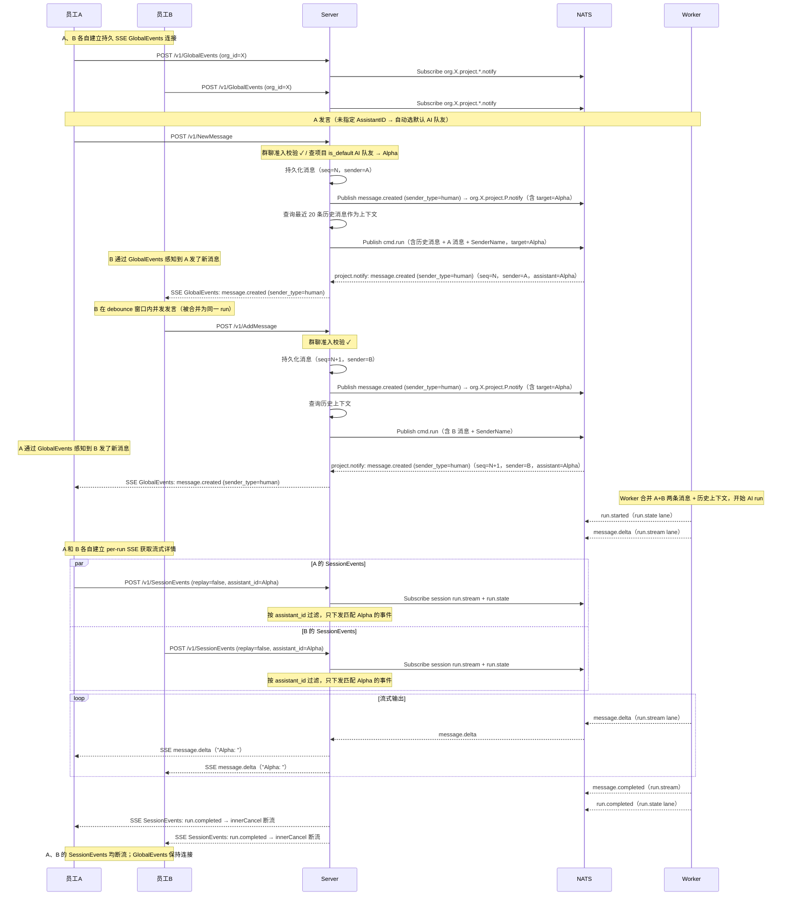

# 任务内群聊协作与会话状态感知技术设计

> 状态：草案待评审
> 日期：2026-07-02
> 范围：后端（`backend/`）+ 前端（`frontend/`）

本文档描述将任务会话从**单用户对话模式**升级为**群聊模式**的完整设计方案，覆盖现状分析、核心决策、方案设计、数据流、影响面与改动清单。

---

## 1. 需求背景

当前 Lework 后端任务会话为**单用户对话模式**——只有 session 创建者能与 AI 队友对话。需要升级为**群聊模式**，让项目中多个真实员工可同时参与同一任务会话。存在以下能力缺口：

1. **任务会话权限锁死单用户**：`getSessionForCaller` 做 owner 校验，非 session 创建者无法访问 SSE 订阅、AddMessage 等。群聊模式下需要项目成员均可参与。
2. **用户消息不广播**：`AddMessage` 持久化用户消息后不发布广播事件，群聊中的其他用户无法实时感知新消息。
3. **发言者身份丢失**：`InputMessage`/`ChatMessage`/`SessionMessage` 均无 sender 字段，群聊中 AI 无法区分多人发言，前端无法展示消息作者。
4. **会话状态无感知**：群聊成员无法实时感知新消息的到来和 AI 队友的处理状态。
5. **AddMessage 缺历史上下文**：AI 每次仅收到当前单条消息，群聊中无法获取之前的多人对话做上下文。

变更目标：
- 任务会话升级为**群聊模式**：多真实员工可同时参与同一任务会话，实时感知彼此消息和 AI 队友状态。
- AI 回复时携带队友身份信息，前端可区分不同队友的输出。
- 群聊成员通过 `GlobalEvents`（全局 SSE 通知接口）实时感知新消息；通过 `SessionEvents`（per-run SSE）的 AI 队友身份字段和 `assistant_id` 过滤，实时感知指定 AI 队友的流式回复。
- AddMessage 自动注入历史对话上下文，群聊中 AI 能理解前后文。

---

## 2. 现状要点

### 2.1 核心模型

| 模型 | 说明 |
|------|------|
| `Task` | `AssigneeID *uint`，注释明确"由 AI 队友执行" |
| `DigitalAssistant` | "AI 队友"实体，每个关联一个 Worker Deployment |
| `Session` | `AllocatedAssistantID` 记录会话分配的 worker；`Uin` 为创建者 |
| `SessionMessage` | 会话消息，按 `Sequence` 排序 |

### 2.2 SSE 与事件体系

- `POST /v1/SessionEvents` 聚合 `run.stream` + `run.state` 双 lane，按 `Seq` 去重下发。
- 现有 17 种事件：`message.delta` / `reasoning.delta` / `tool_call.*` / `run.*` 等，所属 lane 为 `run.stream`（流式增量，7 种）和 `run.state`（状态事件，10 种）。
- 关键约束：per-run 生命周期（终端事件断流），单用户权限（owner 校验），无用户消息广播事件。
- `GetSessionMessages` 走独立的 `getSessionMessagesForCaller`，worker caller 分支跳过 owner 校验。

### 2.3 任务执行入口

`NewMessage` → `RunNewMessage` 编排：创建 project session → 创建/复用 task → 创建 task session → `publishWorkerTask` 投递 worker。

### 2.4 RunCoordinator debounce

`run/coordinator.go` 已支持短时间内并发提交合并为一次 run。`mergeSubmissions` 按 FIFO append 合并 `Input.Messages`，这是群聊模式下多人并发发言合并为单次 AI 调用的基础。

### 2.5 消息持久化与 Worker 投递

`AddMessage` → `PostMessage` 流程：取序号 → 构造消息 → 持久化 → 更新 session 统计 → 异步标题生成 → 投递 `publishWorkerTask`。

`BuildUserInput` 将 `req.Input.Messages` 拼为 `"{role}: {content}"` 格式传给 AI。

---

## 3. 核心变更 — 群聊模式

### 3.1 权限放开（群聊准入）

**改造 `getSessionForCaller`**（user caller 分支）：

```
当 session.Type 为 task/project 且 session.ProjectID != nil:
    校验 caller 是该项目的 user 成员（查 ProjectMember）→ 群聊准入
否则（纯 chat session）:
    保持原 owner-only 校验（单用户对话）
```

**改造 `getSessionMessagesForCaller`**：worker caller 分支保留现状不动；user caller 分支同上述项目成员校验。

受益方法：`StreamSessionEvents`、`AddMessage`、`SubmitApproval`、`SubmitQuestionAnswer`、`CancelSessionRun`、`GetSessionMessages`。

### 3.2 发言者身份（群聊多人区隔）

群聊场景下，需要区分不同成员的发言。

**输入侧**：
- `ChatMessage` 和 `InputMessage` 新增 `SenderName` 字段（omitempty，NATS 向后兼容）。
- `publishWorkerTask` 中按 `caller.Uin` 查 `User.Name` 填充 `SenderName`。
- `BuildUserInput` 改为优先 `"{sender_name}: {content}"`，空则回退 `"{role}: {content}"`。
- `mergeSubmissions` 按 FIFO append 自动携带 `SenderName`，无需改动。

**输出侧**：
- `SessionMessage` 新增 `SenderUin *uint` + `SenderName string` 字段。
- user message 落库：填 `SenderUin=caller.Uin`、`SenderName=User.Name`。
- AI 回复落库：`SenderName` 填 `DigitalAssistant.Name`（反查），`SenderUin` 留空。
- `GetSessionMessages` 响应含 sender 字段，前端展示作者名。

**Actor 处置**：`Actor.UserID` 保留 `session.Uin` 不改。Actor 仅用于工具调用上下文与平台提示词选择，per-message `SenderName` 才是权威身份。

### 3.3 SessionEvents 保持 per-run + worker 消息过滤

`v1/sessionEvents` 保持 per-run SSE（与现状行为一致）：

- run 开始时客户端建立 SSE 连接，run 完成/失败/取消时服务端 `innerCancel` 断流。
- **不改造**为持久流，**不新增** chat lane 订阅，**不改造** fan-out。
- **新增 `assistant_id` 过滤参数**：客户端请求 `SessionEvents` 时可传入 `assistant_id`，服务端只下发该 AI 队友的事件。群聊中多 AI 队友场景下，用户可仅订阅特定队友的流式输出，前端通过请求参数即可知道当前订阅的是哪个 AI 队友。不传 `assistant_id` 时行为与现状一致（不下发过滤）。
- 过滤逻辑在服务端 `StreamSessionEvents` 中实现：收到 NATS 事件后，比对事件中的 `assistant_id` 与请求中的 `assistant_id`，不匹配则跳过不下发。事件中的 `assistant_id` 来源于 session 分配时绑定的 `AllocatedAssistantID`，无需在事件 payload 中额外扩展。
- **职责边界**：sessionEvents 只下发 AI 队友的流式回复与 run 状态事件，**不含真实用户消息**。会话页面中的用户消息统一由 GlobalEvents（§3.4）推送，前端通过二者拼接得到完整消息列表（详见 §3.4 前端处理要点）。

### 3.4 新增 GlobalEvents（全局实时通知接口）

新增 `POST /v1/GlobalEvents`（持久 SSE 长连接），是一个 project 级别的全局实时通知接口——让群聊中所有成员实时知道"谁发了新消息"，架构可扩展以支持后续更多事件类型（成员变更、任务指派、系统公告等）。

**核心决策**：

| 决策点 | 选择 | 理由 |
|--------|------|------|
| 流式返回方式 | SSE | 实时推送、浏览器原生 EventSource、与现有 SessionEvents 架构一致 |
| 事件路由粒度 | Project 级 subject | `org.*.project.*.notify`，匹配权限模型，用户只需订阅所属项目 |
| 前端连接管理 | 单全局连接 | App 启动建立，页面切换不断开，按 project_id/session_id 分发 |
| 消息内容推送 | 人类消息完整推送 + AI 开始回复通知 | human 携带完整 content（前端可直接渲染）；assistant 在 run.started 时发布、content 为空（仅通知"AI 开始回复"），前端收到后订阅 SessionEvents 获取流式输出 |
| 权限变更处理 | 前端主动重建连接 | 用户加入/离开项目时前端重建 SSE 连接，服务端无状态 |
| Replay 支持 | 支持 | 断线重连时携带 last_seq，服务端从 JetStream 补推断线期间事件 |

**事件类型**：

| 事件类型 | 触发时机 | 发布方 | payload |
|---------|---------|--------|---------|
| `message.created` | 用户消息持久化成功后 / AI 队友开始回复时（`run.started`） | PostMessage（`sender_type=human`，完整内容）/ HandleSessionRunStarted（`sender_type=assistant`，经 session_run_state_projector） | MessageCreatedData（`sender_type` 区分 human/assistant；human 携带完整 content；assistant content 为空，仅通知"AI 开始回复"） |

**事件 Payload 设计**：

```go
type GlobalEventType string

const GlobalEventMessageCreated GlobalEventType = "message.created"

type SenderType string

const (
    SenderTypeHuman     SenderType = "human"     // 真人用户发言
    SenderTypeAssistant SenderType = "assistant" // AI 队友回复
)

type GlobalEventPayload struct {
    Type      GlobalEventType `json:"type"`
    ProjectID uint            `json:"project_id"`
    SessionID uint            `json:"session_id"`
    Seq       uint64          `json:"seq"`       // JetStream sequence，前端 replay 去重用
    Timestamp int64           `json:"timestamp"`
    Data      json.RawMessage `json:"data"`
}

type MessageCreatedData struct {
    MessageID     uint       `json:"message_id"`
    Sequence      int        `json:"sequence"`
    SenderType    SenderType `json:"sender_type"`              // human | assistant
    SenderUin     *uint      `json:"sender_uin,omitempty"`     // 真人有值，AI 留空
    SenderName    string     `json:"sender_name"`              // 真人=User.Name，AI=DigitalAssistant.Name
    AssistantID   *uint      `json:"assistant_id,omitempty"`   // AI 队友有值（目标/回复 AI）
    AssistantName string     `json:"assistant_name,omitempty"`
    Content       string     `json:"content"`                  // human 场景为完整内容（前端可直接渲染）；assistant 场景（run.started 时发布）为空
    RunID         string     `json:"run_id,omitempty"`         // AI 回复时关联 run，前端可跳转查看详情
}
```

**实现方式**：

```
新增端点：POST /v1/GlobalEvents (SSE)

1. 服务端校验用户身份与 org 归属
2. 查询用户在该 org 的所有 project memberships → projectIDs[]
3. 为每个 projectID 订阅 NATS subject: org.{org_id}.project.{project_id}.notify
4. 所有订阅消息 fan-in 到同一 channel
5. SSE 循环：channel → SSEvent → Flush + keep-alive 心跳
6. 支持 replay：连接时携带 replay_since_seq，从 JetStream 指定 seq 补推历史事件
```

```
GlobalEvents subject 流向：

PostMessage ──→ Publish message.created (sender_type=human, 完整内容) ──→ org.{org}.project.{proj}.notify
                                                                      ↓
                                                             GlobalEventsHandler (fan-out 到各用户 SSE 连接)

HandleSessionRunStarted ──→ Publish message.created (sender_type=assistant, content 空) ──→ org.{org}.project.{proj}.notify
                                                                                           ↓
                                                                                 GlobalEventsHandler (fan-out 到各用户 SSE 连接)
```

**新增 NATS stream**：

新建独立 `GLOBAL_NOTIFY_STREAM`，project 粒度的 subject：

```go
StreamNameGlobalNotify = "GLOBAL_NOTIFY_STREAM"

StreamConfig:
  Name:              GLOBAL_NOTIFY_STREAM
  Subjects:          []string{"org.*.project.*.notify"}
  Storage:           FileStorage
  Retention:         LimitsPolicy
  Discard:           DiscardOld
  MaxAge:            24h
  MaxMsgsPerSubject: 1000
```

Subject 格式：`org.{org_id}.project.{project_id}.notify`

采用 project 粒度而非 session 粒度的原因：
- 用户只需订阅所属项目的 notify subject，无需感知 session 粒度
- 权限变更直接对应订阅变更（加入项目 = 订阅，离开项目 = 取消订阅）
- 减少 NATS subscription 数量（1 个 project vs N 个 session）
- 架构可扩展：后续新增 `member.*`、`task.*` 等事件只需发布到相同 subject，无需新建 stream

**发布方**：

`message.created` 事件由服务端在消息持久化成功后直接 Publish 到 `org.*.project.*.notify` subject，无需额外的投射层。`sender_type=human` 由 `PostMessage` 发布（用户消息持久化后，携带完整内容）；`sender_type=assistant` 由 `HandleSessionRunStarted` 发布（`run.started` 时刻，经 `session_run_state_projector`，content 为空），仅通知"AI 开始回复"，不携带消息内容（此时 assistant 消息尚未落库）。群聊成员收到后自行订阅 SessionEvents 获取流式输出与完成感知。

**前端处理要点**：

连接生命周期：
```
App 启动 → connect(org_id) → 建立 POST /v1/GlobalEvents SSE 连接
切换 org → disconnect() → connect(new_org_id)
权限变更 → disconnect() → connect(current_org_id)
App 关闭/登出 → disconnect()
```

会话页面消息拼接：

```
会话页面消息列表 =
  globalEvents message.created (sender_type=human)      → 用户消息（拉取完整内容）
+ globalEvents message.created (sender_type=assistant)  → AI 回复完成（拉取完整内容）
+ sessionEvents message.delta 等                         → AI 回复流式实时增量

拼接规则：
- 用户消息仅来自 globalEvents（sessionEvents 不含用户消息）
- AI 回复：流式过程靠 sessionEvents 实时渲染；完成时以 globalEvents 的 assistant 事件做最终确认
- 去重：同一 AI 回复经 sessionEvents（流式）与 globalEvents（完成摘要）双通道到达，按 message_id 去重
```

事件分发：
```
handleEvent(event):
  lastSeq = event.seq  // 记录 seq 用于 replay

  switch event.type:
    case 'message.created':
      // 按 sender_type 区分真人/AI 队友
      chatSlice.notifyNewMessage(event.session_id, event.message_id)
      if !isActiveSession(event.session_id):
        unreadByProject[event.project_id]++
      break
```

前端收到 `message.created` 后，调 `GET /v1/GetSessionMessages` 拉取完整消息列表。注意去重——同一 AI 回复可能通过 GlobalEvents（完成摘要）和 SessionEvents（流式增量）两个通道到达，按 `message_id` 去重。

### 3.5 AddMessage 历史上下文注入（群聊记忆）

群聊模式下，AI 需要知道之前谁说了什么，才能理解对话上下文。

```
AddMessage → PostMessage → publishWorkerTask 之前：
1. 查询当前 session 最近 N 条消息（GetSessionMessages，N 默认 20，可配置）
2. 取 Role ∈ {user, assistant} 的消息（排除 system/tool）
3. 将历史消息按 sequence 升序拼入 publishWorkerTask 的 Messages 列表
4. 历史消息中：
   - user 消息有 SenderName 的用 SenderName 做 role，无则用 "user"
   - AI 回复用 SenderName（即 DigitalAssistant.Name）做 role
5. 当前新消息追加在末尾

最终 BuildUserInput 输出示例：
"A: 帮我写一个 HTTP server\nAI队友Alpha: 好的，以下是代码...\nB: 加上 /health 端点"
```

**配置**：

```go
const defaultHistoryContextLimit = 20 // session message history 注入条数上限
```

### 3.6 RunCoordinator 合并与防抖（群聊并发发言）

群聊中多人可能同时发言。调度层合并逻辑无需改动，A、B 短时间内发言会被合并为一次 run，`mergeSubmissions` 按 FIFO 保留每条消息的 `SenderName`。配合 `BuildUserInput` 改造，AI 收到 `"A名: xxx\nB名: yyy"` 可区分多人发言。

### 3.7 项目默认 AI 队友（群聊多队友选择）

一个项目可以绑定多个 AI 队友，建 task session 时需确定由哪个队友处理。选择逻辑：

```
建 task session 时：
1. 若前端传入 AssistantID → 校验是否为项目 AI 队友（ProjectMember，MemberType=assistant），通过则使用
2. 若前端未传入 AssistantID → 查项目 is_default=true 的 AI 队友
3. 无默认队友 → 返回 ErrNoDefaultAssistant，引导先绑定默认队友
```

**数据模型**：

`ProjectMember` 新增 `IsDefault bool` 字段（`gorm:"column:is_default;type:boolean;default:false"`）。每个项目最多一个 AI 队友的 `is_default=true`，设置新默认时需先清除旧默认。

| 方法 | 路径 | 说明 |
|------|------|------|
| POST | `/v1/projects/:project_id/assistants/:assistant_id/default` | 设为默认 AI 队友 |

设为默认操作在事务内：先清除该项目其他 AI 队友的 `is_default`，再设置当前队友 `is_default=true`。

---

## 4. 端到端数据流

### 4.1 群聊模式：多人发言 + 全局通知 + 上下文注入


---

## 5. 影响面与迁移

### 5.1 破坏性变更

1. task/project session 从单用户对话升级为群聊模式——权限从 owner-only 放开到项目成员。
2. `SessionMessage` / `ChatMessage` / `InputMessage` 新增 sender 字段，群聊中用于区分发言人，AutoMigrate 自动加列。
3. `BuildUserInput` 格式从 `"role: content"` 变为 `"SenderName: content"`（有 SenderName 时优先），群聊中可区分多人。
4. 新建 `GLOBAL_NOTIFY_STREAM`（subjects: `org.*.project.*.notify`，project 粒度的全局通知 NATS JetStream stream，独立于现有 `SESSION_RUN_STREAM`）。
5. `ProjectMember` 新增 `IsDefault` 字段，建 task session 时若未指定 `AssistantID`，服务端自动选项目默认 AI 队友；无默认时返回 `ErrNoDefaultAssistant`。
6. `SessionEvents` 请求新增 `assistant_id` 可选参数，服务端按该字段过滤事件，不传时行为不变。

### 5.2 零影响

- 纯 chat session 保持单用户对话，权限不变。
- RunCoordinator 逻辑不变。
- `SessionEvents` 端点路径、请求 DTO（新增 `assistant_id` 可选字段除外）、replay 语义、innerCancel 行为不变。
- `GetSessionMessages` 的 worker caller 分支不变。
- `Actor.UserID` 保留 `session.Uin` 不改。
- 现有 `run.stream` / `run.state` lane 不变。
- 现有 `SESSION_RUN_STREAM` stream 配置不变。

---

## 6. 改动清单

### 6.1 Server 改动

| 层 | 文件 | 改动 | 归属 |
|----|------|------|------|
| 类型 | `types/session.go` | `SessionMessage` 加 `SenderUin`/`SenderName`（群聊发言人身份） | 群聊 |
| 类型 | `types/project.go` | `ProjectMember` 加 `IsDefault bool`（默认 AI 队友标记） | 群聊 |
| messaging | `pkg/messaging/subject.go` | 新增 `GlobalNotifySubject(orgID, projectID)` 函数；新增 `StreamNameGlobalNotify` + stream config | GlobalEvents |
| messaging | `pkg/messaging/command.go` | `ChatMessage` 加 `SenderName`（omitempty，群聊发言人） | 群聊 |
| messaging | `pkg/messaging/global_event.go` | 新增 `GlobalEventType`、`GlobalEventPayload`、`SenderType` 类型、`MessageCreatedData`（含 `SenderType`/`SenderUin`/`SenderName`/`AssistantID`/`AssistantName`/`RunID` 字段）类型定义 | GlobalEvents |
| assistant | `internal/assistant/domain/request.go` | `InputMessage` 加 `SenderName`；`BuildUserInput` 优先用 `SenderName`（群聊多人区隔） | 群聊 |
| DAO | `infra/db/project_dao.go` | 新增 `IsProjectMember`（群聊准入校验）、`GetDefaultProjectAssistant`（查默认 AI 队友）、`SetDefaultProjectAssistant`（设默认 AI 队友） | 群聊 |
| Service | `service/session_service.go` | `getSessionForCaller`/`getSessionMessagesForCaller` 群聊准入；新增 `StreamGlobalEvents`（全局通知接口）；`AddMessage`/`buildMessage` 填 sender 字段；`CompleteSessionMessage`/`FailedSessionMessage` 填 AI sender；`StreamSessionEvents` 支持 `assistant_id` 过滤 | 群聊 / GlobalEvents |
| Service | `service/message_poster.go` | `PostMessage` 成功后 `Publish message.created` (sender_type=human) 到 `org.*.project.*.notify`（含目标 AI 队友信息）；`CompleteSessionMessage` 成功后 `Publish message.created` (sender_type=assistant)；`publishWorkerTask` 填 `SenderName` + 注入历史上下文（群聊记忆） | GlobalEvents / 群聊 |
| Contract | `contract/session_type.go` | `SessionMessage` 加 `SenderUin`/`SenderName`（群聊发言人） | 群聊 |
| Handler | `handler/session_handler.go` | `SessionEvents` 透传 `assistant_id` 过滤参数 | 群聊 |
| Handler | `handler/global_events_handler.go` | 新增 `StreamGlobalEvents` handler（全局 SSE 通知接口 + SSE 循环 + keep-alive + replay） | GlobalEvents |
| Router | `router.go` | 注册 `POST /v1/GlobalEvents`（全局 SSE 通知端点） | GlobalEvents |
| 前端 | SSE 连接管理层 | 新增 `globalEventsSlice`（Zustand）：单全局连接 + replay + 事件分发；处理 `message.created`（按 `sender_type` 区分真人/AI 队友）触发消息列表刷新 + 未读计数；会话页面消息列表由 globalEvents + sessionEvents 拼接（按 `message_id` 去重）；`sessionEvents` 保持按需建立/关闭；`Message` 类型加 sender 字段（群聊发言人） | GlobalEvents |
| 测试 | 各包旁 | DAO 群聊准入、service 权限分支、global notify 事件发布、历史上下文注入、SSE replay | 群聊 / GlobalEvents |

### 6.2 Worker 改动

| 层 | 文件 | 改动 | 归属 |
|----|------|------|------|
| worker | `internal/worker/command/run/mapper.go` | 透传 `SenderName` | 群聊 |

---

## 7. 服务器实现要点

### 7.1 GlobalEvents 持久流与 SSE keep-alive

`StreamGlobalEvents` 新增全局 SSE 端点，需要实现 keep-alive 心跳机制和 project 级多订阅管理。

**实现要点**：

```
StreamGlobalEvents(ctx, orgID, replaySinceSeq uint64):
  1. 校验用户身份，确认属于该 org
  2. 查询用户在该 org 的所有 project memberships → projectIDs[]
  3. 为每个 projectID 创建 NATS subscription:
     org.{org_id}.project.{project_id}.notify
  4. 若 replaySinceSeq > 0:
     为每个 subject 创建 JetStream consumer，从指定 seq 开始补推历史事件
     补推完成后切换到实时订阅
  5. 所有 subscription 汇入单个 channel（fan-in）
  6. SSE 循环:
     for {
         select {
         case event := <-eventChan:
             ctx.SSEvent(string(event.Type), data)
             ctx.Writer.Flush()
         case <-heartbeatTicker.C:
             ctx.Writer.WriteString(": keepalive\n\n")
             ctx.Writer.Flush()
         case <-ctx.Writer.CloseNotify():
             return
         case <-ctx.Done():
             return
         }
     }
```

心跳机制：
1. 在订阅 goroutine 并行运行心跳 goroutine，间隔默认 15 秒
2. 心跳使用 `time.Ticker`，发送 SSE comment 行（`: keepalive\n\n`）
3. 收到 `CloseNotify` 或 `ctx.Done()` 时心跳 goroutine 退出
4. 心跳发送失败时退出心跳 goroutine，不取消整个流

### 7.2 历史上下文注入实现

`publishWorkerTask` 中注入逻辑：

```go
// 在构造 cmd.Input.Messages 时：
if session.Type == types.SessionTypeTask {
    historyMessages := db.GetRecentSessionMessages(ctx, session.ID, defaultHistoryContextLimit)
    for _, hm := range historyMessages {
        role := resolveMessageRole(hm) // SenderName 优先，否则 Role
        inputMessages = append(inputMessages, ChatMessage{
            ID:      fmt.Sprintf("%d", hm.ID),
            Role:    MessageRoleUser, // 历史消息统一 role=user 进入 input
            Content: fmt.Sprintf("%s: %s", role, hm.Content),
        })
    }
}
inputMessages = append(inputMessages, ChatMessage{...当前消息...})
```

### 7.3 权限变更处理

用户被加入/移出项目时，服务端不修改内部订阅状态。前端收到此类变更后主动断开并重建 SSE 连接：

```
前端: WebSocket/轮询 监听到 project membership 变更
      → disconnect() → connect(current_org_id)
      → 重建的 GlobalEvents 连接会自动包含/排除对应 project 的订阅
```

---

## 8. 版本历史

| 版本 | 日期 | 变更 |
|------|------|------|
| 0.1 | 2026-06-30 | 初稿：项目 AI 队友管理 + 任务内聊天协作 |
| 0.3 | 2026-07-01 | 明确「群聊模式」定位：标题、需求背景、核心变更、数据流、改动清单全面体现群聊语义 |
| 0.4 | 2026-07-01 | 新增 §3.9 项目默认 AI 队友选择（is_default 标记）；数据流图补充默认队友匹配步骤；改动清单补充 ProjectMember 和 DAO 改动 |
| 0.5 | 2026-07-02 | §3.4 SessionStateEvents 升级为 GlobalEvents（project 级全局 SSE 通知接口）：NATS stream 从 session 级改为 project 级，新增 replay 支持，新增 GlobalEventPayload 类型定义，新增前端单全局连接 + 事件分发设计，更新 §4 数据流图、§5 影响面、§6 改动清单、§7 实现要点；范围增加前端 |
| 0.6 | 2026-07-02 | 删除 §3.7 并发消息序号原子化（NATS 天然保证消息有序）、删除 §3.8 断连与取消语义（保持当前逻辑）；精简 §3.6 删除替代发言方式参考 |
| 0.7 | 2026-07-02 | 边界分离：§6 改动清单拆为 Server/Worker 两个表格；§3.4 GlobalEvents 精简为仅 `message.created`，删除 `run.*` 事件和 StateProjector 投射机制，`MessageCreatedData` 新增 `AssistantID`/`AssistantName`（目标 AI 队友）；§3.3 SessionEvents 新增 `assistant_id` 过滤参数，删除 payload 中的 `current_assistant_id/Name` 和 `RunEventBody.AssistantID/Name` 冗余字段（前端通过请求参数已确定 AI 队友身份）；§4 时序图简化为 员工A/B、Server、Worker、NATS 五节点；§7.2 删除 StateProjector 投射机制整节；§5 影响面同步更新 |
| 0.8 | 2026-07-02 | §3.4 GlobalEvents 事件拆分：拆分 `message.created` 为 `message.received`（用户发言，PostMessage 发布）和 `message.replied`（AI 回复，CompleteSessionMessage 发布）；`MessageCreatedData` 拆为 `MessageReceivedData`（含 SenderUin/SenderName、目标 AssistantID/AssistantName）和 `MessageRepliedData`（含 AssistantID/AssistantName、RunID）；更新 §4 数据流图、§6 改动清单、前端事件分发代码中的事件名 
| 0.9 | 2026-07-02 | §3.4 合并 `message.received`/`message.replied` 为单一事件 `message.created`，payload 用 `sender_type`（human/assistant）区分真人与 AI 队友，新增 `SenderType` 类型与 `MessageCreatedData` 结构；明确 sessionEvents 不含用户消息（§3.3 职责边界）；新增会话页面消息拼接语义（globalEvents + sessionEvents，按 `message_id` 去重）；更新 §4 数据流图、§6 改动清单、前端事件分发代码 |
