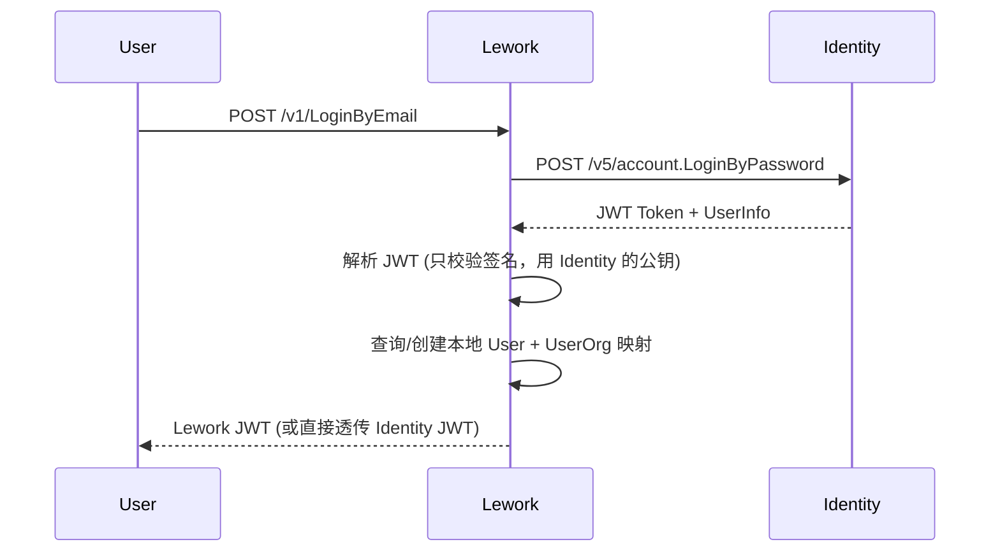

# 账号认证体系收敛分析报告

> 分析日期：2026-07-09
> 涉及项目：Lework、roc、identity-platform

---

## 1. 三项目定位与关系

```
roc (openrpacloud/roc)
  └── 功能最全的业务平台
      ├── 认证：密码 + 微信/企微/GitHub + API Key + OBO
      ├── 权限：完整 RBAC（4 表）
      ├── 组织：Company + Employee（功能完备的多租户）
      ├── 教育：Class/Student/Teacher
      ├── OAuth2：Connectors 外部平台绑定
      ├── 实名认证（个人+企业）
      └── 私有化部署

identity-platform (yygu/iam)
  └── 从 roc 剥离的精简身份平台
      ├── 认证：密码 + 微信/企微 + API Key（去掉了 OBO）
      ├── 权限：仅 SysRole（sys_admin/sys_employee）
      ├── 组织：Company + Employee（精简版）
      ├── 去掉了：教育、OAuth2 Connectors、实名认证、私有化
      └── 代码质量优化：增加索引、DAO 模式、单元测试

Lework (insmtx/Lework)
  └── AI 自动化平台，独立实现认证
      ├── 认证：邮箱密码 + 手机验证码 + Worker Token
      ├── 权限：仅 MemberRole 类型定义（未使用）
      ├── 组织：Organization + UserOrg（轻量级）
      └── 无第三方登录、无 RBAC、无多租户隔离
```

**关键关系：** identity-platform 与 roc 代码同源，但已分化演进。Lework 完全独立，不依赖前两者。

---

## 2. 用户模型深度对比

### 2.1 核心用户表

| 字段 | roc/identity | Lework | 差异影响 |
|------|-------------|--------|---------|
| ID (PK) | `gorm.Model` | `gorm.Model` | 兼容 |
| Identify | 登录标识（唯一索引） | 无 | roc 依赖 identify 做唯一登录名 |
| Name | 用户昵称 | Name | 同 |
| Email | `*string` (roc: uniqueIndex, id: index) | `string` (非指针) | **类型不兼容**，Lework 的 `string` 不能为 NULL |
| Phone | `*string` | `string` | 同上 |
| Password | `*string` bcrypt | `string` bcrypt | 同上 |
| AvatarURL | `string` | `string` | 兼容 |
| Bio | `string` | `string` | 兼容 |
| GithubID | `*uint` (uniqueIndex) | `int64` (唯一) | 类型不一致 |
| GithubLogin | 无 | `string` | Lework 额外字段 |
| Company | 通过 UserIdentification + Employee 关联 | `string`（直接存公司名字符串） | **模型差异最大** |
| Location | 无 | `string` | Lework 额外字段 |
| PublicRepos | 无 | `int` | Lework 额外字段 |
| Followers | 无 | `int` | Lework 额外字段 |

### 2.2 身份/组织关联模型

| 概念 | roc/identity | Lework | 差异 |
|------|-------------|--------|------|
| **UIN 定义** | `UserIdentification` 独立表，UIN 是用户在不同身份下的标识 | `UserOrg` 关联表，`Uin = UserOrg.ID` | **核心差异** |
| **UIN 属性** | `UserID`, `SubjectType(individual/company)`, `SubjectID`, `Issuer`, `UinStatus` | `UserID`, `OrgID`, `IsDefault` | 极简 vs 完备 |
| **多身份支持** | 一个用户可以有个人身份 + 多个公司员工身份 | 一个用户属于多个 Organization，但有默认组织 | roc 更灵活 |
| **组织模型** | `Company`（完整企业信息：版本、配额、状态、认证） | `Organization`（名称、Logo、状态、类型） | Lework 更轻量 |
| **成员模型** | `Employee`（CompanyID, UserID, Uin, SysRole） | 无独立成员表 | Lework 通过 UserOrg 直接关联 |

### 2.3 认证方式对比

| 方式 | roc | identity-platform | Lework | 备注 |
|------|-----|-------------------|--------|------|
| 邮箱密码 | ✅ LoginByPassword | ✅ LoginByPassword | ✅ LoginByEmail | 实现相似，协议不同 |
| 手机验证码 | ❌ | ❌ | ✅ | Lework 独有 |
| 企业微信 | ✅ LoginThird | ✅ LoginThird | ❌ | |
| 微信网页 | ✅ LoginThird | ✅ LoginThird | ❌ | |
| GitHub OAuth | ✅ LoginThird | ✅ LoginThird | ✅ GitHub 授权（仅运行时） | 用途不同 |
| API Key | ✅ | ✅ | ❌ | |
| Worker Token | ❌ | ❌ | ✅ | Lework 独有 |
| OBO Token | ✅ | ❌ | ❌ | |
| Refresh Token | ✅（Redis 5min） | ✅（Redis 5min） | ✅（DB 7天） | 实现差异大 |

### 2.4 JWT Token 对比

| 维度 | roc/identity | Lework |
|------|-------------|--------|
| **Claims** | `{Uin, Issuer, IssuedAt, ExpiresAt, LoginWay, Audience}` | `{Uin}` + StandardClaims |
| **Subject** | UIN 的 ID | `user:uin:{Uin}` |
| **Audience** | `user` / `api` | `user` / `worker` |
| **Issuer** | 根据域名动态设置 | 固定 `leros` |
| **签名算法** | HS256 | HS256 |
| **TTL** | 8小时（可配置） | 24小时 |
| **秘密管理** | 按 Issuer 隔离 Secret | 单一全局 Secret |

### 2.5 权限模型对比

| 维度 | roc | identity-platform | Lework |
|------|-----|-------------------|--------|
| **模型** | 完整 RBAC（4 表） | SysRole（2 角色） | 定义未实现 |
| **角色** | sys_admin, sys_employee, sys_teacher, sys_student | sys_admin, sys_employee | owner, admin, member, viewer |
| **权限点** | APIPrivilege（API路径+动作） | 仅基础 API 鉴权 | 无 |
| **中间件** | 8 个中间件文件 | 3 个中间件文件 | 1 个中间件 |

---

## 3. Lework 改造方案

### 3.1 目标

1. **SaaS 版**：Lework 对接 identity-platform 完成账号认证，identity-platform 作为统一认证源
2. **开源版**：Lework 保留内置认证实现，可独立部署运行
3. **代码复用**：尽可能共享接口抽象，减少双份维护成本

### 3.2 架构选择

#### 方案 A：Adapter 模式 —— 接口抽象 + 双实现（推荐）

```
Lework AuthService 接口
    ├── identity_adapter.go    ← SaaS 版：调用 identity-platform API
    └── builtin_auth.go        ← 开源版：当前本地实现（略作适配）
```

核心思路：将 Lework 当前的 `internal/api/contract/auth.go` 中的 `AuthService` 接口保持不变，但提供两套实现。

**接口定义**（保持当前 contract 不变，或适当扩展）：

```go
type AuthService interface {
    RegisterByEmail(ctx, req)           // 邮箱注册
    LoginByEmail(ctx, req)              // 邮箱密码登录
    SendPhoneLoginCode(ctx, req)        // 发送手机验证码
    LoginByPhoneCode(ctx, req)          // 手机验证码登录
    RefreshToken(ctx, req)              // 刷新 token
    SwitchOrganization(ctx, req)        // 切换组织
    AuthSession(ctx)                    // 获取登录会话
    // 新增：补充 identity-platform 的能力
    GetLoginSetting(ctx)                // 获取登录配置
}
```

**SaaS Adapter** 实现：

```
身份认证 → 调用 identity-platform API
    ↓
换取 identity-platform JWT
    ↓
Lework 用该 JWT 解析 Uin，查询本地 UserOrg/Organization
    ↓
校验用户在本系统中的组织和权限
```

**开源版实现**：基本维持现状，将 `services/auth_service.go` 提取到 `contract` 下作为 builtin 实现。

#### 方案 B：Identity 作为代理

```
用户 → identity-platform (认证) → identity-platform 签发 JWT
   ↓
用户携带 JWT → Lework → Lework 调用 identity-platform 验证 JWT
```

所有 Lework 的 API 依赖 identity-platform 运行时校验。开源版无法独立运行（除非 identity-platform 可自部署）。

**结论：不可行**。开源版需要能独立运行。

#### 方案 C：用户同步模式

```
用户在 identity-platform 注册 → identity-platform 通过事件/Webhook 同步用户到 Lework
   ↓
Lework 保留本地用户表作为只读副本
   ↓
认证由 identity-platform 完成，Lework 仅做身份校验
```

**问题**：多一层同步复杂度，数据一致性问题。

### 3.3 推荐方案：Adapter 模式详细设计

#### 3.3.1 构建时选择 vs 运行时选择

**推荐：构建时选择**（通过 build tags）。

```
//go:build !saas
// +build !saas
package service
→ 编译时包含 builtin 实现

//go:build saas
// +build saas
package service
→ 编译时包含 identity adapter 实现
```

也可以走运行时配置注入：

```go
// config.yaml
auth:
  mode: "builtin"  // 或 "identity-platform"
  identity_platform:
    base_url: "https://iam.example.com"
    api_key: "..."
```

**推荐构建时方式**：开源版本二进制中不应含有对 identity-platform 的依赖。

#### 3.3.2 Identity Adapter 实现

SaaS 版的核心差异：

1. **注册/登录**：调用 identity-platform API
2. **JWT 验证**：Lework 不再自己签发 JWT，而是验证 identity-platform 签发的 JWT
3. **用户映射**：identity-platform 返回的用户信息映射到 Lework 本地 User + UserOrg + Organization



#### 3.3.3 用户数据映射

identity-platform 返回的用户信息需要映射到 Lework 本地：

| identity-platform 字段 | Lework 字段 | 映射策略 |
|----------------------|-------------|---------|
| `User.ID` | 存储到 User 表的 `ExternalID` 字段 | 关联标识 |
| `User.Name` | `User.Name` | 透传 |
| `User.Email` | `User.Email` | 透传 |
| `User.Phone` | `User.Phone` | 透传 |
| `User.AvatarURL` | `User.AvatarURL` | 透传 |
| `UIN.ID` | `UserOrg.Uin` | **JWT 中的 UIN 映射到 UserOrg** |
| `Company` | `Organization` | 需要设计双向映射 |

**Lework User 表需要新增字段**：

```go
type User struct {
    gorm.Model
    ExternalID     uint   // identity-platform 中的 User.ID
    // 其余字段保持不变...
}
```

#### 3.3.4 JWT 双模式

这是最关键的差异点。identity-platform 的 JWT claims 包含 `Issuer`、`LoginWay` 等字段，Lework 当前的 JWT 只包含 `Uin`。

**方案：SaaS 模式下，Lework 不自己签发 JWT；而是验证 identity-platform 的 JWT 后，从中提取 Uin，映射到本地 UserOrg。**

```go
// SaaS 模式的 JWT 验证
func (s *IdentityAdapter) validateToken(tokenString string) (*Caller, error) {
    // 1. 用 identity-platform 的公钥/JWT Secret 验证签名
    token, err := jwt.ParseWithClaims(tokenString, &identityClaims{}, getIdentityPublicKey)
    
    // 2. 从 claims 提取 UIN
    uinID := token.Claims.(*identityClaims).Uin
    
    // 3. 查询本地映射：UserOrg 表中 external_uin = uinID
    userOrg, err := s.db.GetUserOrgByExternalUin(uinID)
    
    // 4. 返回 Lework Caller
    return &Caller{Uin: userOrg.Uin, OrgID: userOrg.OrgID, Kind: "user", State: "succ"}, nil
}
```

#### 3.3.5 Database Schema 变更

```sql
-- User 表：新增 external_id
ALTER TABLE leros_user ADD COLUMN external_id BIGINT NULL COMMENT 'identity-platform user.id';
CREATE INDEX idx_user_external_id ON leros_user(external_id);

-- UserOrg 表：新增 external_uin
ALTER TABLE leros_user_org ADD COLUMN external_uin BIGINT NULL COMMENT 'identity-platform uin.id';
CREATE INDEX idx_user_org_external_uin ON leros_user_org(external_uin);

-- Organization 表：新增 external_company_id
ALTER TABLE leros_organization ADD COLUMN external_company_id BIGINT NULL COMMENT 'identity-platform company.id';
CREATE INDEX idx_org_external_company_id ON leros_organization(external_company_id);
```

### 3.4 接口映射

Lework 现有 API → identity-platform API 映射：

| Lework API | identity-platform API | 处理方式 |
|-----------|----------------------|---------|
| RegisterByEmail | 无（identity 不支持邮箱注册） | **Saas版：** 走 identity-platform 的 LoginByPassword（不存在则返回登录页配置，由前端引导注册）<br>**或扩展 identity-platform** |
| LoginByEmail | LoginByPassword | 适配调用（参数映射） |
| SendPhoneLoginCode | 无 | **Saas版：** 需要有 SMS，identity 暂不支持 |
| LoginByPhoneCode | 无 | 同上 |
| RefreshToken | 无（identity Refresh Token 仅用于多 UIN 选择） | **Saas版：** 需要实现（或扩展 Refresh Token 逻辑到 identity） |
| SwitchOrganization | ListUin + SwitchLogin | 通过 UIN 切换实现 |
| AuthSession | Profile + ListUin | 组合调用 |
| CreateOrganization | CreateCompany | 适配调用 |

**需要注意的缺失：**
- identity-platform **不支持**邮箱注册流程（它走第三方注册）
- identity-platform **不支持**手机验证码登录
- identity-platform **不支持**长时间 Refresh Token（仅 5 分钟 Redis）

这些缺失意味着要么扩展 identity-platform，要么在 Lework Adapter 中兜底处理。

### 3.5 配置设计

```yaml
# config.yaml
auth:
  # mode: builtin 或 identity-platform
  mode: "builtin"
  identity_platform:
    base_url: "https://iam.example.com/v5"
    api_key: "..."            # 服务间调用凭证
    jwt_secret: "..."         # 验证 identity-platform 签发的 JWT
```

---

## 4. identity-platform 需要补充的能力

如果要让 Lework Saas 版完整对接 identity-platform，identity-platform 需要补充：

1. **邮箱密码注册** — `RegisterByEmail`（当前只支持第三方注册）
2. **手机验证码** — `SendPhoneCode` + `LoginByPhoneCode`
3. **长时间 Refresh Token** — 支持 JWT 续期（当前仅 5 分钟 Redis 缓存）
4. **Worker Token** — 支持 Lework 的 Worker 专门 token 类型
5. **Swagger 中暴露 User/Company 查询接口** — 供 Lework 同步用户数据
6. **可作为 JWT 签发方被第三方验证** — 暴露 JWKS endpoint 或共享 Secret

---

## 5. 开源版本保留的认证能力

开源 Lework 保留当前所有认证能力作为 builtin 实现：

| 功能 | 状态 | 备注 |
|------|------|------|
| 邮箱注册 | ✅ 保留 | 核心功能 |
| 邮箱密码登录 | ✅ 保留 | 核心功能 |
| 手机验证码（含自动注册） | ✅ 保留 | 依赖短信提供商，默认验证码 |
| Refresh Token | ✅ 保留 | 核心功能 |
| 组织切换 | ✅ 保留 | 核心功能 |
| 组织创建 | ✅ 保留 | 核心功能 |
| Worker Token | ✅ 保留 | 核心功能 |
| GitHub OAuth（运行时凭据） | ✅ 保留 | 独立于认证体系 |

---

## 6. 风险与注意事项

1. **数据迁移风险**：已有用户需要从 Lework 本地表迁移到 identity-platform，存在停机窗口
2. **UIN 映射复杂度**：两个系统的 UIN 定义不同，映射关系需谨慎设计，避免冲突
3. **双写一致性问题**：过渡期可能需要在两个系统同时写数据
4. **开源版维护成本**：两套实现意味着双份测试和双份 bug
5. **identity-platform 缺失能力**：如上所述，至少需要补充 3-4 个接口才能满足 Lework 需求
6. **SMS 提供商耦合**：手机验证码功能重度耦合 SMS 提供商配置
7. **JWT Secret 管理**：SaaS 模式下需要共享 JWT 验证秘钥

---

## 7. 推荐实施路径

```
Phase 1: 接口抽象（2周）
  ├── AuthService 接口微调，确保两套实现都能满足
  ├── Starter 模式：编译时选择 builtin/identity
  └── 已有单元测试，确保回归

Phase 2: identity-platform 能力补齐（3周）
  ├── 邮箱密码注册
  ├── 手机验证码（复用 Lework 的 SMS 方案）
  ├── 长时间 Refresh Token
  └── 作为 JWT 签发方暴露验证端点

Phase 3: Adapter 实现（2周）
  ├── identity_adapter.go 完整实现
  ├── 用户数据映射（User ↔ UserOrg ↔ Organization）
  └── 端到端集成测试

Phase 4: 在线迁移（1周）
  ├── 双写模式：用户同时在 Lework 和 identity-platform 创建
  ├── 数据校验：对比两个系统的数据一致性
  └── 切换配置：从 builtin 切换到 identity-platform

合计：约 8 周
```

---

## 附录 A：关键文件清单

### Lework 认证相关文件

```
backend/types/user.go                          # User 模型
backend/types/user_org.go                      # UserOrg 模型
backend/types/organization.go                  # Organization 模型
backend/types/auth.go                          # AuthRefreshToken, LoginAttempt 等
backend/types/util.go                          # Caller, IdentityContext
backend/types/constants.go                     # SystemUin, MemberRole 等
backend/types/tables.go                        # 表名常量
backend/config/config.go                       # JWTConfig, WorkerAuthConfig
backend/internal/api/auth/user_token.go        # JWT 签发/解析
backend/internal/api/auth/worker_token.go      # Worker Token 签发/解析
backend/internal/api/auth/identity.go          # Caller 上下文
backend/internal/api/middleware/identify.go     # 认证中间件
backend/internal/api/contract/auth.go          # AuthService 接口
backend/internal/api/contract/auth_type.go     # 认证类型定义
backend/internal/api/handler/auth_handler.go   # Handler
backend/internal/service/auth_service.go       # 认证业务逻辑（951行）
backend/internal/infra/db/user_dao.go          # User DAO
backend/internal/infra/db/user_org_dao.go      # UserOrg DAO
backend/internal/infra/db/auth_dao.go          # 认证 DAO
backend/internal/api/router.go                 # 路由注册
```

### identity-platform 关键文件

```
apps/account/internal/apis/apis.go              # 路由注册
apps/account/internal/apis/login.go             # 登录
apps/account/internal/apis/register.go          # 注册
apps/account/internal/apis/user.go              # 用户信息
apps/account/models/accounttype/user.go         # User 模型
apps/account/models/accounttype/uin.go          # UIN 模型
apps/account/models/accounttype/employee.go     # Employee + SysRole
apps/account/models/accounttype/company.go      # Company
apps/account/internal/auth/token.go             # JWT 管理
apps/account/accountmds/loginstatus.go          # 登录状态中间件
apps/account/models/user/jwt.go                 # JWT 签发
apps/account/models/user/customer.go            # 用户 CRUD
```

---

## 附录 B：三项目技术栈对比

| 技术 | roc | identity-platform | Lework |
|------|-----|-------------------|--------|
| Go 版本 | 1.23 | 1.24 | 1.22+ |
| HTTP 框架 | Gin 1.10.1 | Gin 1.10.1 | Gin |
| ORM | GORM 1.31.1 | GORM 1.31.1 | GORM |
| 数据库 | MySQL | MySQL | MySQL |
| 缓存 | Redis | Redis | Redis |
| JWT | dgrijalva/jwt-go | dgrijalva/jwt-go | dgrijalva/jwt-go |
| 密码 | bcrypt (x/crypto) | bcrypt (x/crypto) | bcrypt (x/crypto) |
| 内部框架 | yg-go (runtime/auth) | yg-go (runtime/auth) | 无（自实现） |
| OAuth | Goth | 无 | 自实现 |
| 微信 SDK | silenceper/wechat | silenceper/wechat | 无 |
| 企微 SDK | go-workwx | go-workwx | 无 |
