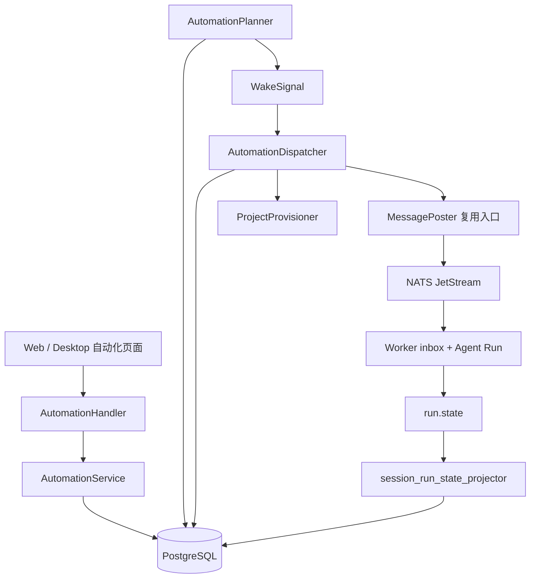

# SingerOS Agent 定时自动化任务实施计划

> 文档状态：待评审、待调整
>
> 文档日期：2026-08-05
>
> 实施状态：仅完成需求梳理、现状分析和本计划文档，产品代码尚未开始开发

## 1. 文档目的

本文档用于规划 SingerOS“Agent 定时自动化任务”能力的产品与技术实施方案，回答四个核心问题：

1. 为什么要建设这项能力，最终目标是什么。
2. 第一版具体需要做哪些功能，哪些内容明确不做。
3. 后端、Worker、消息系统和前端分别如何实现。
4. 当前系统已经具备哪些基础能力，自动化功能目前完成到什么程度。

本文档是开发前的实施基线。评审确认前不应将其中的数据结构、接口或状态机视为已经上线的实现。

## 2. 当前进度与现状

### 2.1 本需求当前完成情况

| 项目 | 状态 | 说明 |
|---|---|---|
| 产品目标与第一版范围 | 已完成 | 已明确支持日历类预设、固定间隔，支持表单创建、启停、立即运行和历史查询 |
| 核心产品规则 | 已完成 | 已确定项目复用/重建、重叠跳过、遗漏折叠、插件首次快照等规则 |
| 当前代码链路调研 | 已完成 | 已确认可复用 Project、Task、Session、Message、`agent.run` 和 Run 状态投影 |
| 技术方案与实施计划 | 已完成，待评审 | 即本文档 |
| 数据模型与数据库迁移 | 未开始 | 当前不存在 Automation 和 AutomationExecution 模型/表 |
| 后端 Service 与 API | 未开始 | 当前不存在自动化 CRUD、立即运行和历史接口 |
| Planner 与 Dispatcher | 未开始 | 当前 Server 不会扫描或触发自动化计划 |
| Worker 过期保护与 MQ 幂等 | 未开始 | 当前自动化专用命令 ID 和 `not_after` 尚未实现 |
| Run 状态回写 | 未开始 | 当前 Run 投影只处理会话消息等现有状态，不处理 AutomationExecution |
| Web/Desktop 页面 | 未开始 | 当前没有“自动化”导航、路由、列表或表单 |
| 自动化专项测试 | 未开始 | 当前没有时间计算、并发领取、幂等和 UI 测试 |

### 2.2 当前代码已经具备的基础能力

自动化不需要重新实现 Agent 执行系统，当前代码已经具备以下可复用能力：

- `types.TaskTypeCron` 已存在，但目前只是任务类型常量，没有对应调度器。
- `MessagePoster.RunNewMessage` 已能完成 `Project → Task → Session → Message → agent.run` 编排。
- Server 已能通过 NATS JetStream 向指定 Worker 发布 `agent.run`。
- Worker 已有持久化 inbox，可恢复已经接收但未完成的命令。
- `session_run_state_projector` 已统一消费 `run.started/completed/failed/cancelled` 等状态事件。
- 项目已支持成员、默认 AI 队友、Skill/MCP 插件绑定和每次 Run 的插件修订快照。
- Project、Task、Session、Message、Resource 和 ResourceBinding 已有权限与查询能力。
- Web 和 Desktop 共用 Store/App UI 组件体系，并已有项目、任务、会话跳转路径。

### 2.3 当前缺口

当前系统尚不具备：

- 长期存在的自动化计划模型。
- 每个周期的一次性执行记录和状态机。
- 对时区、月末和夏令时友好的周期计算器。
- 多 Server 实例安全领取计划的 Planner。
- 将 execution 幂等转换成项目、任务和 Run 的 Dispatcher。
- 自动化项目首次插件快照规则。
- Server 侧投递重试、命令有效期和 JetStream 消息去重。
- 自动化管理 API、前端页面和执行历史。

因此，当前完成的是“方案阶段”，不是“功能已经部分可用”。

## 3. 项目目标

为 SingerOS 增加独立的“自动化”模块，使用户可以配置一条 Agent 指令，并让系统按照日历规则或固定间隔自动执行。

核心业务链路：


目标结果：

- 用户不需要保持客户端或电脑在线，Server 托管调度和执行。
- 每一轮执行都有可查询、可追踪、可失败恢复的独立记录。
- 每一轮结果进入正常项目任务和会话，继续复用 SingerOS 已有工作流。
- Server 重启、多实例扫描、消息重投时不重复创建任务或重复执行。
- 自动化功能不改变普通任务和普通会话的现有行为。

## 4. 产品范围与确定规则

### 4.1 第一版包含

- 创建自动化。
- 查看自动化列表和详情。
- 修改名称、指令、周期、时间和时区。
- 启用和停用。
- 立即运行。
- 查看执行历史。
- 打开自动化项目。
- 打开某次执行对应的任务和会话。
- 删除自动化。

### 4.2 第一版不包含

- 通过自然语言或对话创建自动化。
- 自动化预设市场。
- 用户直接输入 Cron/RRULE 表达式；日历表达式只由系统根据表单配置生成。
- 一次性提醒。
- 手机、邮件、IM 或连接器结果推送。
- 多 AI 队友动态选择。
- 自动补绑项目创建后新增的插件。
- 同一自动化并发运行。
- 将旧任务迁移到重建后的新项目。
- 删除自动化时级联删除历史结果。

### 4.3 自动化与业务实体关系

- Automation 是长期调度配置，不是 Task。
- AutomationExecution 表示一次计划触发或手动触发。
- 自动化项目默认在第一次执行时懒创建，不在保存计划时创建（"新项目"）。
- **关联项目（可选）**：用户可在创建/编辑时显式关联一个已有项目作为执行项目。关联校验同组织、拥有 `task:create` 权限且固定 AI 队友已绑定；不修改该项目原有的 `AutomationID` 归属字段（project_generation 保持 0）。
- 编辑时回显当前关联项目；存在活动（queued/running）执行时禁止实际更换关联（返回 409）；关联失效或项目被删除后，下次执行自动创建单调递增的新一代专属项目。清空关联时保留历史专属项目的最大代数，确保不会复用旧项目。
- 当前自动化项目存在时，每轮只新增 Task、Task Session 和首条消息。
- 项目被软删除后，下次执行创建新一代项目。
- 每轮必须创建独立 Task 和 Session，不复用上一轮会话。
- 删除自动化只停止未来周期，不删除历史项目、任务、会话和产物。

### 4.4 AI 队友规则

- 创建自动化时解析当前组织的系统默认 AI 队友。
- 将解析到的 AI 队友主键固定保存在 Automation 中。
- 后续每轮执行使用该固定 AI 队友，不随组织默认值变化。
- AI 队友不存在、已停用或 Worker 未就绪时，本轮失败。
- 单轮失败不自动停用 Automation，未来周期继续重试当前配置状态。

### 4.5 插件规则

创建自动化项目时一次性绑定：

- 当前组织全部 active 且存在有效当前修订的 Skill。
- 创建者本人可见、active 且存在有效当前修订的 MCP 连接器。

项目创建后：

- 新安装的 Skill/MCP 不自动补绑。
- 用户对项目插件的手工增加、移除和启停继续有效。
- 每次 Run 仍通过现有 `ListProjectPluginSnapshots` 读取项目当前绑定并冻结修订快照。
- 项目被删除并重建时，新一代项目重新按当时有效插件集合做一次快照绑定。

## 5. 调度规则

### 5.1 规则模型

不为每天、每周、每月、每整点和每隔 N 分钟分别维护一套执行逻辑。自动化使用统一的 `ScheduleSpec`，底层只保留两种规则模式：

| `mode` | 用途 | 核心参数 |
|---|---|---|
| `calendar` | 按本地日历边界执行 | 规范化日历表达式、时区和边界策略 |
| `interval` | 从锚点开始按固定时长执行 | `anchor_at`、`interval_seconds`、时区 |

前端可以提供以下友好预设，但预设只负责生成和回显配置，不负责选择后端执行算法：

| UI 预设 | 生成的规则 | 示例 |
|---|---|---|
| 每天执行 | `calendar` | 每天 09:00 |
| 每周执行 | `calendar` | 每周一 09:00 |
| 每月执行 | `calendar` + 月末策略 | 每月 31 日 09:00 |
| 每整点执行 | `calendar` | 每个本地小时的 00 分 |
| 按固定间隔执行 | `interval` | 从 00:00 起每 30 分钟 |

`calendar` 的表达式由服务端根据结构化表单参数生成和校验，第一版不允许用户直接编辑表达式。这样新增“每两小时整点”等展示选项时，只需增加预设转换，不需要新增 Planner 分支或数据库字段。

推荐的规范化规则示例：

```json
{
  "version": 1,
  "mode": "calendar",
  "expression": "0 9 * * 1",
  "policy": {
    "month_day_overflow": "last_day"
  }
}
```

固定间隔示例：

```json
{
  "version": 1,
  "mode": "interval",
  "anchor_at": "2026-08-05T00:00:00+08:00",
  "interval_seconds": 1800
}
```

数据库保存规范化 `schedule_spec`，而不是把每一种 UI 周期拆成独立列。`preset` 可以作为编辑回显的展示元数据保存，但不能作为时间计算依据。

### 5.2 时区

- 创建时前端提交浏览器 IANA 时区，例如 `Asia/Shanghai`。
- 后端必须用 IANA 时区库验证，不接受仅 UTC 偏移量。
- 日历规则先在用户当地时间中计算，固定间隔先解析本地锚点，再以 UTC 保存 `next_run_at`。
- `next_run_at` 始终保存 UTC，Planner 只按 UTC 扫描，不解析 UI 文案或预设名称。
- 编辑时使用服务端已保存时区初始化，不能用当前浏览器时区静默覆盖。

### 5.3 月末与夏令时

- 日历规则配置 29、30 或 31 日，而目标月份没有该日期时，在该月最后一天执行。
- 夏令时切换导致目标当地时间不存在时，顺延到当天第一个有效时间。
- 夏令时回拨导致目标当地时间出现两次时，选择第一次，只生成一个 occurrence。
- 固定间隔按锚点和实际持续时间计算，不因为 UI 预设名称变化而改变语义；跨 DST 的行为必须在规则中固定为 elapsed duration。

### 5.4 下一次时间

- 创建且启用：计算严格晚于当前时间的下一次 occurrence。
- 修改周期或时区：立即从当前时间重新计算。
- 停用：清空 `next_run_at`。
- 重新启用：从当前时间向后计算，不补停用期间的周期。
- 修改名称或指令：不影响已经生成的 execution，只影响未来 execution 快照。

### 5.5 服务停机后的遗漏处理

如果 `next_run_at` 已经过期：

1. 根据规范化 `schedule_spec` 计算旧 `next_run_at` 到当前时间之间的 occurrence；固定间隔可以通过整数运算直接计算数量，不要求逐条枚举。
2. 只为最近一次遗漏创建 execution。
3. 更早遗漏数量写入 `missed_count`。
4. 同一事务将 Automation 的 `next_run_at` 推进到未来第一次 occurrence。

例如每日任务停机四天，恢复后只执行第四天一次，`missed_count=3`。

### 5.6 重叠与立即运行

- 同一 Automation 同时最多存在一个 `queued` 或 `running` execution。
- 周期到达时已有活动 execution：创建 `skipped` 历史，错误码为 `previous_execution_active`。
- 立即运行时已有活动 execution：返回 HTTP 409 和 `automation_run_in_progress`，不创建历史。
- 立即运行不修改 `next_run_at`。
- 停用状态仍允许立即运行。
- 停用或删除不取消已经生成的 execution 和 Run。

## 6. 总体技术方案

### 6.1 组件划分



职责边界：

- ScheduleEngine：编译和计算规范化规则，不访问数据库。
- AutomationService：面向 API 的 CRUD、权限和手动执行。
- AutomationPlanner：把到期计划转换为 execution，并推进下一次时间。
- AutomationDispatcher：把 queued execution 转换为项目、任务、消息和 Worker 命令。
- AutomationProjectProvisioner：负责项目代数、成员和首次插件绑定。
- MessagePoster：继续负责构建现有 Agent Run 上下文和发布命令。
- session_run_state_projector：继续作为唯一 Run 状态消费者，同时投影 execution 和 cron Task。

### 6.2 分层要求

- 模型放在 `backend/types/`。
- 数据访问放在 `backend/internal/infra/db/`。
- API contract 放在 `backend/internal/api/contract/`。
- HTTP handler 放在 `backend/internal/api/handler/`。
- 业务服务、Planner、Dispatcher 和项目准备放在 `backend/internal/service/` 或独立 `backend/internal/automation/` 包。
- 通用消息协议放在 `backend/pkg/messaging/`。
- Worker 过期检查放在 `backend/internal/worker/command/run/`。
- 进程启动/关闭由 `backend/cmd/leros/` 负责；`internal` 组件只暴露带 context 的启动函数，不调用 lifecycle、panic 或 log.Fatal。

## 7. 数据模型计划

### 7.1 `leros_automation`

新增 `types.Automation`：

| 字段 | 类型 | 作用 |
|---|---|---|
| `public_id` | varchar(255) | 对外 ID，格式 `auto_xxx` |
| `org_id` | bigint | 组织隔离 |
| `owner_id` | bigint | 创建者执行身份 |
| `name` | varchar(100) | 自动化名称，产品层限制 50 字符 |
| `instruction` | text | 每轮发送给 Agent 的完整指令 |
| `enabled` | boolean | 是否接受周期触发 |
| `schedule_mode` | varchar(16) | `calendar/interval`，只表示底层计算模式 |
| `schedule_spec` | jsonb | 版本化规范化规则；包含 calendar expression 或 interval 锚点/间隔 |
| `timezone` | varchar(64) | IANA 时区 |
| `assistant_id` | bigint | 创建时固定的默认 AI 队友 |
| `project_id` | bigint nullable | 当前自动化项目。既可能是用户显式关联的既有项目（project_generation=0），也可能是懒创建的专属项目 |
| `project_generation` | integer | 当前项目代数，初始为 0 |
| `next_run_at` | timestamp nullable | 下一次计划时间，UTC |
| `last_run_at` | timestamp nullable | 最近一次实际生成 execution 的时间 |
| `created_at/updated_at/deleted_at` | timestamp | GORM 生命周期 |

索引：

- `public_id` 唯一。
- `(org_id, owner_id, deleted_at)` 用于用户列表。
- `(enabled, next_run_at, deleted_at)` 用于 Planner 扫描。
- `project_id` 普通索引。

### 7.2 `leros_automation_execution`

新增 `types.AutomationExecution`：

| 字段 | 作用 |
|---|---|
| `public_id` | 对外 ID，格式 `autoexec_xxx` |
| `automation_id/org_id/owner_id` | 计划及权限快照 |
| `occurrence_key` | 周期使用理论计划时间；手动使用 execution public ID |
| `trigger_type` | `scheduled/manual` |
| `status` | `queued/running/succeeded/failed/skipped` |
| `scheduled_at` | 理论触发时间 |
| `not_after` | Worker 最晚允许开始时间 |
| `started_at/finished_at` | 实际生命周期 |
| `name_snapshot` | 自动化名称快照 |
| `instruction_snapshot` | 指令快照 |
| `assistant_id_snapshot` | 固定 AI 队友快照 |
| `missed_count` | 被折叠的更早遗漏数 |
| `project_id/task_id/session_id/message_id` | 已创建业务实体 |
| `run_id` | Worker Run 标识 |
| `attempt_count` | Dispatcher 投递尝试次数 |
| `lease_owner/lease_until` | 多实例执行领取租约 |
| `error_code/error_message` | 可展示失败信息 |
| `dispatched_at` | 命令成功写入 JetStream 的时间 |

索引与约束：

- `public_id` 唯一。
- `(automation_id, occurrence_key)` 唯一，作为周期最终防重边界。
- `(status, lease_until, created_at)` 用于 Dispatcher 扫描。
- `session_id`、`message_id`、`run_id` 查询索引。
- 建议增加部分唯一索引：同一 automation 在 `queued/running` 状态下最多一条活动记录，用于封闭手动触发与周期触发的并发竞争。

### 7.3 现有模型扩展

Task：

- 新增可空 `AutomationExecutionID`。
- 添加唯一索引。
- 自动化任务使用 `TaskTypeCron`。

SessionMessage：

- 新增可空 `AutomationExecutionID`。
- 添加唯一索引，确保 Dispatcher 重试不重复创建首条消息。

Project：

- 新增可空 `AutomationID`。
- 新增 `AutomationGeneration`。
- `(automation_id, automation_generation)` 唯一，支持项目创建恢复。

以上都是新增列和新增表，由 GORM AutoMigrate 处理，不加入 `legacyColumns` 或 `renamesToApply`。新增的部分唯一索引需要按照当前项目手工索引创建模式注册。

## 8. API 实施计划

沿用当前 RPC 风格，全部使用 `POST /v1/...`。

### 8.1 接口清单

| 接口 | 用途 |
|---|---|
| `/CreateAutomation` | 创建计划 |
| `/ListAutomations` | 分页查询当前用户计划 |
| `/GetAutomation` | 查询详情 |
| `/UpdateAutomation` | 部分更新和启停 |
| `/RunAutomationNow` | 创建手动 queued execution |
| `/DeleteAutomation` | 软删除计划 |
| `/ListAutomationExecutions` | 分页查询执行历史 |

### 8.2 创建请求

```json
{
  "name": "AI 热点日报",
  "instruction": "搜索过去 24 小时的重要 AI 新闻，生成分类摘要。",
  "enabled": true,
  "schedule": {
    "mode": "calendar",
    "preset": "daily",
    "config": {
      "time_of_day": "09:00"
    },
    "timezone": "Asia/Shanghai"
  }
}
```

固定间隔请求示例：

```json
{
  "schedule": {
    "mode": "interval",
    "config": {
      "anchor_at": "2026-08-05T00:00:00",
      "interval_value": 30,
      "interval_unit": "minute"
    },
    "timezone": "Asia/Shanghai"
  }
}
```

请求中的 `preset` 和 `config` 是面向表单的编辑模型。服务端负责校验并编译为规范化 `schedule_spec`；客户端不能提交任意表达式，也不能通过 `preset` 选择未注册的执行逻辑。

创建流程：

1. 校验调用者、名称、指令和 schedule。
2. 校验 `mode`、`preset/config`、时区和边界策略，并编译为 `schedule_spec`。
3. 解析组织默认 AI 队友并校验状态。
4. （可选）若提交 `project_public_id`：校验项目存在且属同组织、调用者有 `task:create` 权限、固定 AI 队友已绑定；通过则写入 `project_id`（`project_generation` 保持 0）。
5. 写入 Automation。
6. 启用时计算严格晚于当前时间的 `next_run_at`。
7. 返回计划详情，不创建项目、任务或 execution（项目首次执行懒创建）。

更新请求 `project_public_id` 三态：省略=保持原关联；`""`=切回默认新项目；非空=关联指定项目。实际更换/清空关联时若有活动执行返回 409，且关联校验、活动执行检查与其他配置字段更新在同一事务提交。响应 `Automation` 额外暴露 `project_public_id`、`project_name`（保留数字 `project_id` 兼容旧调用）。

### 8.3 查询响应

Automation 响应需要包含：

- 原始编辑配置、规范化 `schedule_spec` 和格式化摘要。
- `next_run_at`、`last_run_at`。
- 固定 AI 队友 public ID。
- 当前项目 public ID。
- 最近 execution 状态和时间。
- 最近任务/会话 public ID。
- `has_active_execution`。

列表筛选：

- `enabled`。
- 最近/历史 execution `status`。
- `keyword`。
- `offset/limit`。

### 8.4 更新

- 名称、指令和 enabled 支持部分更新。
- 修改周期时必须提交完整 schedule，服务端重新编译并校验 `schedule_spec`，避免旧配置与新模式组合成非法状态。
- 修改名称不重命名已有项目。
- 修改指令只影响尚未创建的 execution。
- 修改周期/时区或重新启用时重算 `next_run_at`。
- 停用时清空 `next_run_at`。

### 8.5 立即运行

- 即使 Automation 停用也可调用。
- 事务内检查活动 execution 并创建 manual queued execution。
- 不修改 `next_run_at`。
- 异步返回，项目/任务链接允许稍后出现。
- 与 Planner 并发时由数据库活动执行唯一约束最终仲裁。

### 8.6 删除

- 事务内设置 enabled=false、清空 `next_run_at` 并软删除 Automation。
- 不取消活动 execution。
- 不删除 execution 历史和任何业务实体。

### 8.7 稳定错误码

- `automation_not_found`
- `automation_forbidden`
- `automation_run_in_progress`
- `invalid_automation_schedule`
- `invalid_automation_timezone`
- `default_assistant_not_found`
- `default_assistant_unavailable`
- `automation_owner_unavailable`
- `automation_project_create_failed`
- `automation_plugin_binding_failed`
- `automation_dispatch_failed`
- `automation_dispatch_expired`
- `previous_execution_active`

HTTP 建议映射：参数错误 400、权限 403、不存在 404、活动冲突 409、内部依赖失败 500。响应的 machine-readable code 与展示文案分离。

## 9. 后端实施方案

### 9.1 ScheduleEngine

新增纯逻辑组件，输入规范化 `schedule_spec`、时区和基准时间，输出 UTC occurrence。执行引擎只维护两种模式，不随着 UI 预设数量增长。

必须提供：

- `Compile`：将表单的 `preset/config` 编译为版本化 `schedule_spec`。
- `Validate`：验证模式、表达式/锚点、间隔、时区和边界策略。
- `NextAfter`：计算严格晚于基准时间的下一次 occurrence。
- `LatestDue`：计算恢复时最近一次遗漏、遗漏数量和未来下一次。
- `Summary`：根据规范化规则生成前端展示摘要。

计算策略：

- `calendar`：解析服务端生成的日历表达式，在目标 IANA 时区中计算，再转 UTC。
- `interval`：将本地锚点解析为明确的时间点，使用 `anchor + k * interval` 计算，不逐条枚举固定间隔。

实现要求：

- 所有日历计算先在目标 IANA 时区中进行，再转 UTC。
- 月任务使用 `min(configuredDay, daysInMonth)`，由 `month_day_overflow=last_day` 策略控制月末回退。
- DST gap 不能直接依赖 `time.Date` 的隐式归一化，需要显式寻找当天第一个有效 wall time。
- DST repeat 固定选择第一次映射，避免同一当地时间运行两次。
- 固定间隔采用 elapsed duration 语义，DST 不改变已保存的间隔秒数。
- 不访问数据库，单元测试覆盖每种模式和所有边界。
- 未知 `mode`、不支持的表达式或不匹配的 config 返回 `invalid_automation_schedule`。

### 9.2 AutomationService

负责：

- CRUD 和输入校验。
- `org_id + owner_id` 权限隔离。
- 默认 AI 队友解析。
- schedule 与持久化字段互转。
- 手动 execution 创建。
- 启停和更新时间重算。
- 列表聚合最近 execution、项目和任务链接。

权限要求：

- 只有 Automation 所有者可查看和修改。
- 项目、任务、会话仍走现有 Resource/ResourceBinding。
- 后台执行将创建者写入 context，以原身份调用现有服务。
- 不使用系统超级用户绕过业务权限。

### 9.3 AutomationPlanner

建议每 30 秒运行一次，每次批量处理有限数量到期计划。

单条计划算法：

1. 读取 `enabled=true AND next_run_at<=now` 的候选。
2. 根据旧 `next_run_at` 计算 latest due、missed count 和未来 next。
3. 使用 `WHERE id=? AND next_run_at=? AND enabled=true` 条件更新推进计划。
4. 只有更新成功的 Server 实例获得本次 occurrence。
5. 在同一事务检查活动 execution。
6. 有活动 execution 时创建 skipped；否则创建 queued 快照。
7. 提交后触发 WakeSignal。

多实例不依赖进程锁。CAS 更新、occurrence 唯一索引和活动 execution 部分唯一索引共同构成数据库防重边界。

### 9.4 AutomationDispatcher

Dispatcher 轮询 queued execution，并可被 WakeSignal 立即唤醒。

处理流程：

1. 用 `lease_owner + lease_until` 条件更新领取 execution。
2. 校验 owner 仍属于组织。
3. 校验固定 AI 队友 active，WorkerDeployment ready。
4. 找到当前自动化项目；不存在或已删除时创建下一代。
5. 幂等创建/恢复 Task、Session 和首条消息。
6. 通过 MessagePoster 构建模型、项目、插件和 Worker 路由快照。
7. 使用稳定命令 ID 发布 `agent.run`。
8. 写入业务实体 ID、`run_id` 和 `dispatched_at`。
9. 等待现有 Run 状态事件推进 execution，不在 Dispatcher 中假设执行成功。

重试：

| 尝试 | 延迟 |
|---|---|
| 第一次失败后 | 10 秒 |
| 第二次失败后 | 30 秒 |
| 第三次失败后 | 2 分钟 |

- 最多三次重试，超过后 `failed/automation_dispatch_failed`。
- DB、Gitea 和 NATS 暂时不可用按临时错误处理。
- owner、AI 队友、权限、插件定义等配置问题立即失败。
- 错误文本截断后保存，日志不得包含密钥和完整插件配置。

### 9.5 execution 过期

- execution 创建时设置 `not_after = created_at + 30 分钟`。
- Dispatcher 发布的 RunCommand 携带 `not_after`。
- Worker 在写入 inbox 和崩溃恢复执行前都检查 `not_after`。
- 已过期命令调用 `Term` 或将本地 inbox 标记失败，不执行 Agent。
- Server 定时扫描已投递但未收到 `run.started` 且超过 `not_after` 的 queued execution，将其标记为 `failed/automation_dispatch_expired`。
- 已过期 execution 不允许被迟到的 `run.started` 恢复成 running。

### 9.6 自动化项目准备

首次执行或项目已删除时：

1. 锁定/条件更新 Automation 的项目代数。
2. generation 增加 1。
3. 以 `(automation_id, generation)` 查询是否已有项目，优先恢复。
4. 创建 Project 和项目 Resource。
5. 创建 owner ResourceBinding。
6. 绑定固定 AI 队友。
7. 创建项目级 Session。
8. 查询符合条件的 Skill/MCP 并创建 ProjectPluginBinding。
9. 回填 Automation.ProjectID 和 ProjectGeneration。

项目名为：`{自动化名称}（自动化）`。

为降低 Gitea 创建后 DB 写入失败造成的孤儿资源风险，项目 public ID、仓库名或内部 provisioning key 应由 automation public ID + generation 稳定派生；重试先查询已有项目/仓库，不直接生成新随机键。

### 9.7 每轮 Task、Session 和 Message

Task：

- 标题：`{自动化名称} · {计划时间的当地时间}`。
- Description：instruction snapshot。
- TaskType：`cron`。
- AssigneeID：assistant snapshot。
- AutomationExecutionID：当前 execution。
- 初始状态：`created`。

Session：

- 类型为 task。
- 独立关联当前 Task。
- 继承 owner、org、project 和固定 AI 队友路由。

首条用户消息：

- Content：instruction snapshot。
- Metadata source：`automation`。
- AutomationExecutionID：当前 execution。
- UI 显示“自动化触发”。

幂等恢复顺序：

1. 按 AutomationExecutionID 查询 Task。
2. 从 Task.SessionID 恢复 Session；没有则创建。
3. 按 AutomationExecutionID 查询首条 Message；没有则创建。
4. 可以安全重复发布相同稳定命令 ID。

### 9.8 MQ 幂等

- WorkerCommand ID 使用 `automation_execution.public_id`，而不是随机或消息序号。
- MQ Publisher 增加可选的幂等发布入口，将 ID 写入 `Nats-Msg-Id`。
- 普通消息继续使用现有 Publish，不改变接口行为。
- WORKER_CMD_STREAM 去重窗口设为 72 小时，与当前命令保留窗口一致。
- Server 侧 Execution 充当持久化 outbox，不新增第二张 outbox 表。
- Worker 本地 inbox 继续处理已经接收命令的崩溃恢复。

### 9.9 Run 状态投影

扩展现有 `session_run_state_projector`，不增加第二个消费者。

| Run 事件 | Execution | Task |
|---|---|---|
| `run.started` | queued → running，设置 started_at/run_id | created → in_progress |
| `run.completed` | running/queued → succeeded，设置 finished_at | → completed |
| `run.failed` | running/queued → failed，保存错误 | → failed |
| `run.cancelled` | → failed，错误码标识 cancelled | → cancelled |

投影只处理带 AutomationExecutionID 的 Task/Message；普通任务保持原逻辑。重复终态事件幂等忽略，终态和过期状态不可逆转。

## 10. 前端实施方案

### 10.1 导航和路由

- `ViewMode` 新增 `automations`。
- 左侧主导航新增“自动化”，使用时钟图标。
- Web 新增 `/automations` 页面。
- Desktop 新增 `/automations` 路由。
- App UI 导出共享 `AutomationRoutePage/AutomationView`。

### 10.2 API 与状态

新增：

- `frontend/packages/store/api/automationApi.ts`。
- `frontend/packages/store/slices/automationSlice.ts`。
- 在 appStore 中组合 AutomationStore/AutomationAction。

Store 负责：

- 列表、详情和历史加载。
- 创建、编辑、删除。
- 启停乐观更新与失败回滚。
- 立即运行和 409 冲突提示。
- 页面可见时每 10 秒轮询。
- `document.hidden` 时停止轮询。
- 手动刷新和认证作用域清理。

### 10.3 自动化列表

卡片展示：

- 名称与指令摘要。
- 启停开关。
- 周期摘要和时区。
- 下一次执行时间。
- 最近执行状态。
- 最近任务入口。
- 当前项目入口。
- 立即运行按钮。
- 编辑、历史、删除菜单。

状态文案：

- queued：等待执行。
- running：执行中。
- succeeded：执行成功。
- failed：执行失败。
- skipped：已跳过。

### 10.4 创建/编辑弹窗

字段：

- 自动化名称，最多 50 个字符。
- 任务指令，必填。
- 执行规则：日历类预设或固定间隔。
- 日历预设对应的星期、日期和时间，或固定间隔的锚点和间隔值。
- 规则摘要和下一次执行时间。
- 当前/已保存 IANA 时区，只读展示。
- 是否启用。

交互：

- 月任务可选 1–31，并提示“当月无该日期时在月末执行”。
- 保存前展示下一次执行时间预览；最终以服务端返回为准。
- 创建使用浏览器时区，编辑使用服务端时区。
- 不显示“执行方式”选择，固定文案“由 SingerOS 自动托管”。

### 10.5 执行历史

抽屉或详情弹窗展示：

- scheduled/manual 触发方式。
- 理论计划时间。
- 实际开始和完成时间。
- 当前状态。
- `missed_count`。
- 稳定错误码和用户可读原因。
- 项目、任务和会话链接。

任务跳转复用：

```text
/projects/{projectId}/tasks/{taskId}/sessions/{sessionId}
```

## 11. 配置、可观测性和安全

### 11.1 配置开关

- `features.automations`：控制客户端能力展示和路由入口。
- `server.automation_scheduler.enabled`：控制 Server 是否启动 Planner/Dispatcher。

建议发布顺序：先部署数据库/API 且前端开关关闭，再启用测试环境调度器，最后开放 UI。

### 11.2 日志字段

统一携带：

- `automation_id`
- `automation_execution_id`
- `org_id`
- `owner_id`
- `project_id`
- `task_id`
- `session_id`
- `run_id`
- `occurrence_key`

### 11.3 指标

- `automation_scheduler_due_total`
- `automation_execution_total{trigger,status}`
- `automation_execution_lag_seconds`
- `automation_execution_active`
- `automation_dispatch_retry_total`
- `automation_execution_duration_seconds`
- `automation_project_recreated_total`

### 11.4 安全

- 不记录插件密钥、OAuth Token、模型 API Key 或完整插件定义。
- error_message 入库前限制长度并清理敏感字段。
- 后台执行使用 owner 身份和 org 隔离。
- 查询接口不接受客户端提供内部自增主键作为权限依据。

## 12. 三阶段实施计划

本项目调整为三个阶段。每个阶段都可以独立验收，后一个阶段依赖前一个阶段已经稳定交付的能力。

| 阶段 | 目标 | 对用户可见的结果 |
|---|---|---|
| 阶段一：页面交互、接口、保存与回显 | 完成自动化配置的完整管理闭环 | 用户可以创建、编辑、启停、删除自动化，并刷新后看到保存的数据 |
| 阶段二：定时任务执行 | 将已保存的计划按时间转换为真实 Agent Run | 到达计划时间后自动创建项目/任务/会话并执行指令 |
| 阶段三：执行记录查询与展示 | 将执行生命周期提供给用户查看和追踪 | 用户可以查看每次执行的状态、时间、错误和任务入口 |

### 阶段一：页面交互、请求接口、保存数据和回显

#### 阶段目标

先完成自动化配置的 CRUD 闭环。阶段一不启动定时执行，不要求执行历史页面，但需要为后续阶段保存稳定的计划数据。

#### 后端工作

- 新增 `Automation` 模型、表名常量、AutoMigrate 和基础索引。
- 保存名称、指令、启用状态、规则模式、表单配置、规范化 `schedule_spec`、IANA 时区和固定 AI 队友。
- 实现 Automation DAO。
- 实现以下接口：
  - `/CreateAutomation`
  - `/ListAutomations`
  - `/GetAutomation`
  - `/UpdateAutomation`
  - `/DeleteAutomation`
- 实现创建、编辑、启用、停用和软删除语义。
- 创建和修改时校验规则模式、预设配置、间隔参数、边界策略和时区。
- 计算并保存 `next_run_at`，但只作为计划预览数据，不启动执行。
- 实现 `org_id + owner_id` 权限隔离。
- 返回前端回显所需的格式化周期摘要、时区、下一次执行时间和固定 AI 队友信息。
- 生成 Swagger/API 文档。

#### 前端工作

- 增加“自动化”导航、Web/Desktop 路由和页面容器。
- 增加 `automationApi` 和 `automationSlice`。
- 实现自动化列表卡片。
- 实现创建/编辑弹窗：名称、指令、日历类预设或固定间隔、时间/锚点、星期/日期、时区和启用状态。
- 创建时读取浏览器 IANA 时区；编辑时使用服务端返回的时区，不覆盖已有配置。
- 实现保存成功后的列表刷新和详情回显。
- 实现启停、删除确认、失败回滚和错误提示。
- 实现下一次执行时间预览、月末回退和固定间隔语义提示。

#### 阶段一不做

- 不启动 Planner/Dispatcher。
- 不创建自动化项目、Task、Session 或 Agent Run。
- 不要求执行历史列表和状态投影。
- “立即运行”按钮可以暂不开放，或只保留入口占位，避免用户误以为已具备执行能力。

#### 阶段一交付物

- 用户可以通过 Web/Desktop 创建和修改自动化。
- 关闭页面、刷新页面或重新登录后，数据仍能正确回显。
- API 可以独立完成 CRUD，且跨组织/跨用户访问被拒绝。
- 数据库迁移、API 测试、表单测试和回显测试通过。

#### 阶段一验收标准

- 创建日历类预设和固定间隔计划均能保存。
- 编辑后名称、指令、规则模式和周期配置准确回显。
- 启用/停用状态准确回显，停用后 `next_run_at` 为空。
- 时区保存为 IANA 标识，编辑不会被浏览器当前时区覆盖。
- 删除后列表不再显示，数据库中的历史关联尚不存在时也不会报错。
- 刷新页面不会丢失配置，也不会产生任何 Task 或 Run。

### 阶段二：定时任务执行

#### 阶段目标

在阶段一保存的 Automation 基础上，增加周期扫描、execution 创建、项目准备、任务创建和 Agent 投递。阶段二需要落库 execution 作为执行过程的技术基础，但阶段三才向用户开放完整的历史查询页面。

#### 数据与后端工作

- 新增 `AutomationExecution` 模型、表和索引。
- 增加 Task、SessionMessage、Project 对 AutomationExecution/AutomationGeneration 的关联字段。
- 实现 `ScheduleEngine`：表单配置编译、日历/固定间隔下一次执行、月末、时区、DST 和遗漏折叠。
- 实现 `AutomationPlanner`：
  - 每 30 秒扫描到期 Automation。
  - CAS 推进 `next_run_at`，保证多 Server 不重复领取。
  - 只补最近一次遗漏，并记录 `missed_count`。
  - 上一轮 queued/running 时创建 skipped execution。
- 实现 `AutomationDispatcher`：
  - 领取 queued execution 租约。
  - 校验 owner、固定 AI 队友和 Worker 状态。
  - 首次执行懒创建自动化项目。
  - 项目存在时复用项目，删除后创建下一代项目。
  - 首次创建项目时绑定有效 Skill 和创建者可见 MCP。
  - 每轮创建独立 cron Task、Task Session 和首条消息。
  - 通过现有 MessagePoster 发布 `agent.run`。
- 实现项目、Task、Message 按 execution 的幂等恢复。
- 使用稳定 WorkerCommand ID 和消息去重，增加 `not_after` 过期校验。
- 实现临时错误重试、永久错误失败和 30 分钟投递过期。
- 扩展现有 Run 状态投影，使 execution 至少能在数据库中从 queued/running 进入 succeeded/failed。
- 实现 `/RunAutomationNow`：停用状态可运行，不改变 `next_run_at`，有活动执行返回 409。

#### 前端工作

- 开放“立即运行”按钮。
- 卡片展示 queued、running 等基础状态。
- 展示“下一次执行”倒计时/时间和最近一次执行摘要。
- 执行期间轮询自动化详情，但不在本阶段实现完整历史分页。
- 项目和任务链接在后台创建完成后显示。

#### 阶段二不做

- 不增加完整执行记录筛选、分页和历史详情交互。
- 不做复杂的报表、趋势图和统计分析。
- 不做手机、邮件或 IM 通知。

#### 阶段二交付物

- 到达计划时间后可以自动创建 execution、项目、cron Task、Task Session 和首条消息。
- Agent 能通过现有 Worker 链路正常执行。
- 第二次执行复用同一项目但创建新任务和新会话。
- 项目删除后下一次执行创建下一代项目。
- Server 重启、多实例扫描、NATS 重投不会重复创建任务或重复执行。

#### 阶段二验收标准

- 日历类预设和固定间隔计划按目标时区/锚点语义执行。
- 月末回退、DST、停用不补跑和服务恢复遗漏折叠符合规则。
- 上一轮未完成时下一轮明确记录为 skipped。
- 立即运行不影响下一次计划时间。
- Worker 不执行已经超过 `not_after` 的命令。
- 普通 Task、Session、Message 和 Agent Run 不受影响。

### 阶段三：查看任务执行记录

#### 阶段目标

在阶段二已经产生并更新 AutomationExecution 的基础上，提供完整的执行记录 API 和前端历史查询能力，让用户能够判断每次任务是否执行、何时执行、执行结果如何以及失败原因是什么。

#### 后端工作

- 完善 `AutomationExecution` 的状态机和终态字段：
  - `queued`
  - `running`
  - `succeeded`
  - `failed`
  - `skipped`
- 完善 `session_run_state_projector` 对 execution、Task 状态和时间字段的投影。
- 实现 `/ListAutomationExecutions`：
  - 按 automation 过滤。
  - 按状态过滤。
  - 支持分页和排序。
  - 返回计划时间、实际开始/完成时间、遗漏数量、错误码和错误原因。
  - 返回项目、任务、会话和 Run 的 public ID。
- 处理重复 Run 终态事件和迟到 `run.started` 的幂等规则。
- 增加历史记录查询权限，沿用 Automation 所有者隔离。
- 增加执行耗时、延迟、成功率和失败率指标。

#### 前端工作

- 增加执行历史抽屉或详情页。
- 展示触发方式：周期触发/立即运行。
- 展示计划时间、实际开始时间、完成时间和耗时。
- 展示 queued、running、succeeded、failed、skipped 状态。
- 展示遗漏折叠次数和失败原因。
- 支持状态筛选、分页和刷新。
- 支持打开本次执行对应的项目、Task 和 Session。
- 删除 Automation 后仍允许从已有项目/任务中查看历史结果。

#### 阶段三交付物

- 用户可以完整查看某个自动化的所有执行记录。
- 每条记录都有稳定状态和生命周期时间。
- 失败、跳过、过期和遗漏折叠均可解释。
- 历史记录中的项目、任务和会话入口可用。

#### 阶段三验收标准

- Run started 后记录变为 running，终态事件后准确变为 succeeded/failed。
- skipped 记录能说明跳过原因。
- 失败记录显示稳定错误码和可读原因。
- 历史分页和状态筛选结果准确。
- 重复终态事件不会重复创建记录或篡改终态。
- 项目、任务、会话链接可正常跳转。

### 三阶段完成后的发布准备

三阶段功能完成后统一进行：

- 开启和验证 `features.automations`、`server.automation_scheduler.enabled`。
- 更新 PRD、架构、运维和 API 文档。
- PostgreSQL + NATS + 两个 Server 实例集成验证。
- 真实 Worker 验证。
- Web/Desktop 视觉验收。
- 观察调度延迟、重复率、执行成功率和历史投影延迟。

## 13. 计划修改的代码位置

以下为预计代码落点，不代表已经修改：

| 范围 | 预计位置 |
|---|---|
| 模型与常量 | `backend/types/automation.go`、`task.go`、`session.go`、`project.go`、`tables.go` |
| 迁移与 DAO | `backend/internal/infra/db/database.go`、`automation_dao.go` |
| 时间计算 | `backend/internal/automation/schedule_engine.go` 或 `backend/internal/service/automation_schedule.go` |
| API contract | `backend/internal/api/contract/automation*.go` |
| Handler | `backend/internal/api/handler/automation_handler.go` |
| Service/Planner/Dispatcher | `backend/internal/service/automation_*.go` |
| 路由装配 | `backend/internal/api/router.go` |
| 进程生命周期 | `backend/cmd/leros/server.go` |
| MQ 协议和幂等发布 | `backend/pkg/messaging/command.go`、`backend/internal/infra/mq/` |
| Worker 过期检查 | `backend/internal/worker/command/run/handler.go` |
| Run 投影 | `backend/internal/runnable/session_run_state_projector.go` |
| 前端 API/Store | `frontend/packages/store/api/automationApi.ts`、`slices/automationSlice.ts` |
| 前端页面 | `frontend/packages/app-ui/components/automations/` |
| Web 路由 | `frontend/apps/web/app/(shell)/automations/page.tsx` |
| Desktop 路由 | `frontend/apps/desktop/src/renderer/src/routes.tsx` |

## 14. 测试计划

测试按三个阶段归属，阶段二虽然暂不开放完整历史页面，但必须先把 execution 状态持久化，阶段三在此基础上提供查询与展示。

### 14.1 阶段一：配置保存与回显测试

- Automation 模型迁移和新增索引。
- 创建、查询、编辑、启停和软删除 API。
- 名称、指令、规则模式、预设配置、间隔参数和时区校验。
- 日历类预设和固定间隔配置回显。
- 编辑时保持服务端时区。
- 跨组织和跨用户访问拒绝。
- Web/Desktop 导航、路由和表单交互。
- 保存成功刷新后数据仍能回显。

### 14.2 阶段二：定时执行测试

- 日历类预设和固定间隔下一次执行。
- 固定间隔的整数运算、锚点和跨 DST elapsed duration 语义。
- 月末 29/30/31 日。
- 非法时区、星期、日期和时间。
- DST 缺失时间和重复时间。
- 编辑、停用、重新启用。
- 最近遗漏和 `missed_count`。
- overlap 判断。
- execution 状态机和终态幂等。

#### 14.2.1 DAO 与并发测试

- 两个 Planner 同时领取同一 Automation。
- occurrence 唯一约束。
- 手动触发与周期触发竞争。
- execution 租约到期恢复。
- 重复 Dispatcher 不重复创建 Task/Message。
- 项目 generation 幂等。
- 跨组织和跨用户访问拒绝。

#### 14.2.2 执行链集成测试

- 首次运行创建项目。
- 第二轮复用项目并创建新任务。
- 项目删除后创建下一代项目。
- 首次绑定所有符合权限的 Skill/MCP。
- 后续新增插件不自动绑定。
- 用户手工修改项目插件后后续 Run 使用当前绑定。
- 默认 AI 队友不可用时本轮失败、计划保持启用。
- NATS 临时失败重试。
- 过期命令不执行。
- Run 终态正确回写 Execution 和 Task。

### 14.3 阶段三：执行记录测试

- `/ListAutomationExecutions` 权限、分页、排序和状态筛选。
- queued/running/succeeded/failed/skipped 状态展示。
- 计划时间、开始时间、完成时间和耗时展示。
- 失败码、错误原因和 `missed_count` 展示。
- 重复终态事件不会篡改历史记录。
- 项目、Task、Session 和 Run 跳转。

### 14.4 前端测试

- 导航和 Web/Desktop 路由。
- 创建/编辑表单校验。
- 月末提示和下一次时间预览。
- 时区初始化和编辑保持。
- 启停乐观更新回滚。
- 立即运行 409 冲突。
- 状态展示和历史分页。
- 项目/任务跳转。
- 删除确认且历史结果保留。

### 14.5 完成验证命令

1. `gofmt -s`
2. `go vet ./...`
3. `go build ./...`
4. `go test ./...`
5. 前端类型检查
6. 前端定向测试
7. Biome 检查
8. PostgreSQL/NATS 多实例集成测试

定向测试不能替代 PostgreSQL 迁移、多实例领取、真实 Worker 和 Web/Desktop 视觉验收。

## 15. 风险与应对

| 风险 | 影响 | 应对 |
|---|---|---|
| 多 Server 重复扫描 | 重复 execution/Task | CAS 推进、occurrence 唯一索引、活动执行部分唯一索引 |
| DB 成功但 NATS 失败 | execution 长期 queued | Execution 作为 outbox，Dispatcher 租约重试 |
| NATS 成功但 DB 回写失败 | 重复发布 | 稳定 WorkerCommand ID + `Nats-Msg-Id` + Worker inbox |
| 项目创建中途失败 | 重复项目或孤儿仓库 | 稳定 generation key，先恢复再创建，补充清理告警 |
| 时区/DST 计算错误 | 早跑、晚跑或重复跑 | 纯计算组件和指定时区边界测试 |
| 周期预设不断增加导致业务 key 和分支膨胀 | API、数据库和 Planner 难以维护 | UI 预设编译为 `calendar/interval` 两种规范化规则，执行引擎不按展示选项扩展 |
| 上一轮长期不结束 | 永久跳过后续周期 | 历史明确 skipped；提供任务入口和后续人工取消能力 |
| 固定 AI 队友失效 | 每轮失败 | 明确错误历史，不自动换人；后续版本再设计迁移能力 |
| 插件包含敏感配置 | 日志泄漏 | 只记录插件 ID/Code，不记录 Definition/Token |
| 调度器开关误开 | 未验证环境开始执行 | API、调度器、UI 分阶段开关和灰度 |

## 16. 验收标准

- 用户可以创建日历类预设和固定间隔自动化，并看到正确的下一次执行时间。
- 首次运行创建一个自动化项目和一条 cron Task。
- 第二次运行复用项目，但创建新的 Task 和 Session。
- 项目删除后下一轮创建新一代项目，旧历史不迁移。
- 同一周期在 Server 重启、双实例扫描或重复消息下只产生一个 execution 和一个 Task。
- 上一轮未完成时，周期触发生成 skipped 历史；手动触发返回 409。
- 服务恢复只补最近一次遗漏，并正确记录 `missed_count`。
- 月任务在短月份按最后一天执行。
- 删除自动化后不再产生新周期，历史项目和结果仍可访问。
- AI 队友、权限、项目、插件和投递异常在历史中有稳定错误码。
- 过期 Worker 命令不会迟到执行。
- 普通 Task、Session、Message 和现有 Agent Run 行为不受影响。

## 17. 发布与回滚

建议发布顺序：

1. 上线新增表、列、DAO 和 API，调度器关闭，UI 隐藏。
2. 在测试环境启用调度器，仅创建测试自动化验证。
3. 开启内部用户 UI，观察调度延迟、重复率和失败率。
4. 灰度开放全部用户。

出现问题时：

- 首先关闭 `server.automation_scheduler.enabled`，停止生成新的周期 execution。
- 保留 API 查询和历史数据，便于定位。
- 必要时关闭 `features.automations` 隐藏入口。
- 不回滚删除已创建的项目、任务或执行记录。
- 新增列和表暂时保留，避免破坏历史关联；后续清理必须另写迁移方案。

## 18. 开发启动前检查清单

- [ ] 产品确认第一版范围和交互稿。
- [ ] 确认 AutomationExecution 是否只使用五种公开状态，取消映射为 failed + error code。
- [ ] 确认功能开关默认值和灰度范围。
- [ ] 确认系统默认 AI 队友失效后不自动切换。
- [ ] 确认 MCP“创建者本人可见”的数据库判定规则。
- [ ] 确认项目 Gitea 稳定创建键方案。
- [ ] 确认 PostgreSQL 部分唯一索引迁移与 SQLite 测试兼容方案。
- [ ] 将三个阶段拆分为可独立合并、可独立验收的开发任务。
- [ ] 阶段一确认“保存与回显”完成后再开放阶段二执行开关。
- [ ] 阶段二确认 execution 状态持续稳定后再开放阶段三历史入口。
- [ ] 评审通过后再开始产品代码开发。
