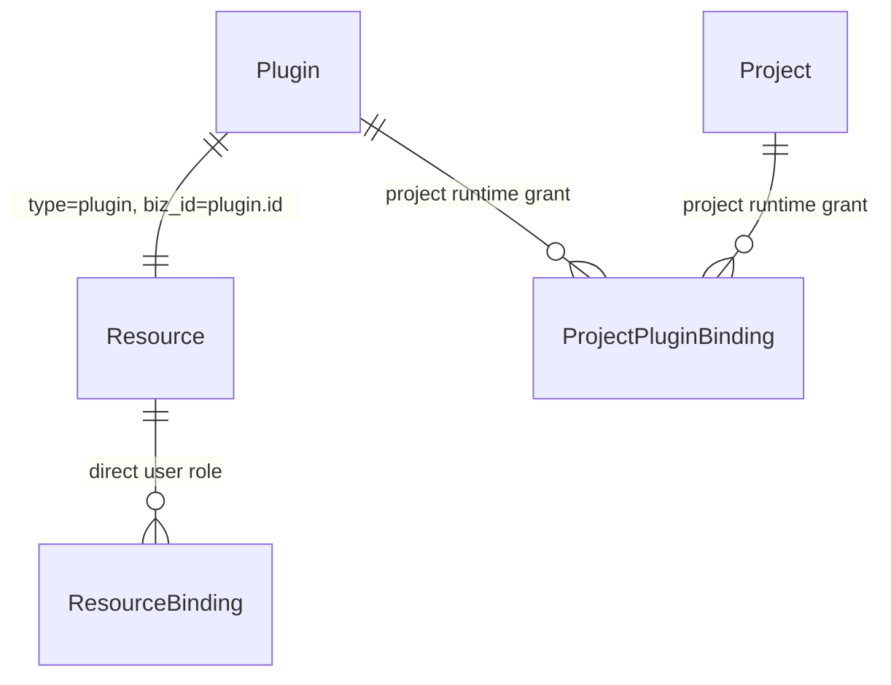

# 插件权限管理服务端开发设计

> 状态：已实现（含“创建 Skill 进入我的”所有权修订）
>
> 适用范围：组织 Skill、MCP，以及 Skill 与项目的运行时关联
>
> 本文是服务端实现依据。前端“我的”页签、权限配置弹窗和 API client 需要与本文的接口约定保持一致。
>
> 实现说明：公开 Skill 的隐式 view/use 授权以“调用者已在目标组织内完成鉴权（org_id 已由中间件绑定）”为前提，未再对 user_org 成员表做二次校验；Worker 下载链路单独通过 actor/project 上下文校验私有 Skill 权限。
>
> 所有权修订：仅用户自定义 Skill（导入/AI 创建）与 MCP 创建 owner 绑定；市场安装与 Worker 自动准备的市场 Skill 保持 public、不创建 owner、不进入“我的”。

## 1. 目标与边界

插件权限分为两条互相独立的授权链路：

1. **个人插件权限**：决定用户能否在自己的插件列表中看到、查看、使用或管理插件。
2. **项目运行授权**：决定插件是否能在某个项目的任务执行中被 Worker 调用。

项目关联不会改变成员各自的插件列表，也不会把项目成员自动写入插件的个人权限绑定。

### 1.1 v1 支持范围

- Skill 支持 `public` 和 `private`。
- 私有 Skill 支持固定角色：`owner`、`admin`、`viewer`。
- 公开 Skill 对组织成员隐式提供查看和使用能力，不为每个成员创建绑定。
- MCP 固定为私有，只有 owner 可访问，不开放共享权限配置。
- 项目成员可以在项目任务执行链路中使用已经关联的 Skill。
- 项目关联需要操作者拥有项目管理权限和 Skill 使用权限。
- “我的”按权限资源中的 owner 绑定查询，不按 `created_by` 查询。

### 1.2 v1 不支持范围

- 自定义角色、角色继承、用户组授权和邀请链接。
- 所有者转移。
- MCP 共享和 MCP 权限配置 UI/API。
- 项目关联参与个人插件列表筛选。
- 权限审计流水和权限版本号。

## 2. 总体模型

不新增 `plugin_permission` 或类似插件专属权限表。复用现有统一资源权限体系：



三类数据的职责必须保持分离：

| 数据 | 表 | 表达内容 | 是否影响个人插件列表 |
|---|---|---|---|
| 插件属性 | `leros_plugin` | Skill/MCP、公开/私有、状态、审计信息 | 是 |
| 个人直接权限 | `leros_resource` + `leros_resource_binding` | owner/admin/viewer | 是 |
| 项目运行授权 | `leros_project_plugin_binding` | 项目是否启用插件 | 否 |

不引入 `PluginPermissionSource`。公开访问由 `visibility` 表达，直接角色由 `resource_binding` 表达，项目运行授权由 `project_plugin_binding` 表达。

## 3. 数据库变更总览

### 3.1 新增表

本方案**不新增任何数据库表**。不创建 `plugin_permission`、`plugin_member`、`plugin_acl` 或其他插件专属权限表。

插件的个人权限直接复用现有 `leros_resource` 和 `leros_resource_binding`；项目运行授权继续复用现有 `leros_project_plugin_binding`。

### 3.2 现有表改动

| 表 | 当前状态 | 本次改动 | 数据库字段改动 | 索引/约束改动 |
|---|---|---|---|---|
| `leros_plugin` | 现有表 | 修改 | 新增 `visibility` | 新增 visibility 合法值约束、MCP 私有约束和列表索引 |
| `leros_resource` | 现有表 | 不改表结构 | 无 | 不新增索引；通过代码新增 `type=plugin` 资源类型 |
| `leros_resource_binding` | 现有表 | 不改表结构 | 无 | 不新增索引；通过代码新增 `resource_role=viewer` 角色 |
| `leros_project_plugin_binding` | 现有表 | 不改表结构 | 无 | 沿用现有 `(project_id, plugin_id)` 活动唯一索引 |
| `leros_plugin_revision` | 现有表 | 不改表结构 | 无 | 无 |
| `leros_plugin_marketplace_item` | 现有表 | 不改表结构 | 无 | 无 |

因此，数据库层面的实际变更只有：

1. `leros_plugin` 新增一个 `visibility` 字段。
2. `leros_plugin` 新增 visibility 相关索引/约束。
3. 为现有 `leros_resource`、`leros_resource_binding` 回填插件资源和 owner/admin/viewer 绑定数据；这会新增数据行，但不会新增表或字段。

`ResourceTypePlugin`、`ResourceRoleViewer`、plugin actions 和 `PluginAccessManager` 都是代码层新增，不是数据库表或数据库字段。

## 4. 表结构设计

以下是当前模型的有效字段和本功能涉及的变化。时间戳和软删除字段沿用现有 GORM 模型。

### 4.1 `leros_plugin`（现有表，新增字段）

现有插件表只新增 `visibility`，其余字段、表名和软删除模型保持不变。

| 字段 | 类型 | 约束/默认值 | 说明 |
|---|---|---|---|
| `id` | BIGINT | PK | 插件内部 ID |
| `public_id` | VARCHAR(255) | NOT NULL、唯一 | API 使用的插件标识 |
| `owner_scope` | VARCHAR(32) | NOT NULL | `organization` 或 `system` |
| `org_id` | BIGINT | NOT NULL | 组织隔离；system 插件为 0 |
| `code` | VARCHAR(128) | NOT NULL | 插件业务编码 |
| `kind` | VARCHAR(32) | NOT NULL | `skill` 或 `mcp` |
| `name` | VARCHAR(255) | NOT NULL | 展示名称 |
| `description` | TEXT | NULL | 描述 |
| `visibility` | VARCHAR(16) | **新增**；NOT NULL，默认 `private` | `public` 或 `private` |
| `status` | VARCHAR(32) | NOT NULL | `active` 或 `archived` |
| `origin` | VARCHAR(32) | NOT NULL | 插件来源 |
| `current_revision` | INTEGER | NOT NULL，默认 0 | 当前版本 |
| `created_by` | BIGINT | NOT NULL | 创建者审计字段，不参与运行时鉴权 |
| `updated_by` | BIGINT | NOT NULL | 更新者审计字段 |
| `deleted_at` | TIMESTAMPTZ | NULL | 软删除时间 |

约束：

- `visibility` 只能是 `public` 或 `private`。
- `kind = 'mcp'` 时必须是 `private`。
- 已有的组织插件 `(org_id, kind, code)`、system 插件 `(kind, code)` 和 `public_id` 唯一约束继续保留。

新增索引：

```sql
CREATE INDEX IF NOT EXISTS idx_plugin_org_kind_visibility_status
    ON leros_plugin (org_id, kind, visibility, status)
    WHERE deleted_at IS NULL;
```

该索引用于插件市场、组织 Skill 列表和公开/私有筛选。权限关系查询使用现有资源和绑定索引，不为每个查询额外创建插件权限索引。

### 4.2 `leros_resource`（现有表，不改字段）

表结构、字段、索引均不改，只新增代码层资源类型常量：

```text
ResourceTypePlugin = "plugin"
```

每个组织插件创建一条根资源：

| 字段 | 插件资源写入值 |
|---|---|
| `org_id` | `plugin.org_id` |
| `uin` | owner UIN，仅作归属/统计信息 |
| `type` | `plugin` |
| `biz_id` | `plugin.id`，使用内部 ID，不使用 public ID |
| `parent_resource_id` | NULL |
| `parent_resource_path_ids` | `{}` |

继续使用现有活动资源唯一约束：

```sql
UNIQUE (org_id, type, biz_id) WHERE deleted_at IS NULL
```

因此同一组织下一个活动插件只能对应一个活动权限资源。

### 4.3 `leros_resource_binding`（现有表，不改字段）

表结构、字段、索引均不改，只新增代码层通用角色常量：

```text
ResourceRoleViewer = "viewer"
```

插件权限绑定使用现有字段：

| 字段 | 插件场景规则 |
|---|---|
| `org_id` | 必须与插件资源一致 |
| `uin` | 被授权用户 UIN，非空 |
| `resource_id` | 插件资源 ID |
| `assistant_id` | NULL；插件权限 v1 不授权助手主体 |
| `resource_role` | `owner`、`admin`、`viewer` |
| `deleted_at` | 移除成员时软删除 |

现有活动绑定唯一约束 `(resource_id, uin)` 继续使用。同一用户在同一插件上只允许一条有效绑定。

`member` 角色仍服务于项目等既有资源；权限策略必须按资源类型校验插件只允许 owner/admin/viewer，不能把 project member 直接解释为插件 viewer。

数据库不增加“唯一 owner”全局索引，因为 `resource_binding` 同时承载 project/file/artifact 等资源，且不能让插件约束影响其他资源。插件服务通过事务锁定插件资源并保证：

- 每个用户管理的自定义插件（自定义 Skill 与 MCP）必须存在一个人类 owner；市场安装/Worker 自动准备的市场 Skill 保持 public 且不创建 owner 绑定。
- owner 不能被删除、降级或替换。
- v1 不支持 owner 转移。

### 4.4 `leros_project_plugin_binding`（现有表，不改字段）

表结构、字段、索引和唯一约束保持不变：

| 字段 | 说明 |
|---|---|
| `project_id` | 项目 ID |
| `plugin_id` | 插件 ID |
| `enabled` | 项目任务是否可使用 |
| `config` | 项目级插件配置 |
| `created_by` | 关联操作者审计 |
| `updated_by` | 更新操作者审计 |
| `deleted_at` | 解除关联 |

现有活动唯一约束 `(project_id, plugin_id)` 继续使用。

该表不保存用户角色、不保存权限来源、不参与个人插件列表查询。项目任务运行时只要项目插件绑定有效，即可按项目运行授权调用；项目本身的成员访问和任务执行权限仍由项目权限系统校验。

## 5. 角色与访问策略

### 5.1 固定能力矩阵

| 能力 | owner | admin | viewer | 公开 Skill 的普通组织成员 |
|---|---:|---:|---:|---:|
| 查看插件详情/版本 | ✓ | ✓ | ✓ | ✓ |
| 使用插件 | ✓ | ✓ | ✓ | ✓ |
| 编辑插件内容 | ✓ | ✓ |  |  |
| 管理非 owner 成员 | ✓ | ✓ |  |  |
| 修改公开性 | ✓ |  |  |  |
| 删除插件 | ✓ |  |  |  |
| 关联到有管理权限的项目 | ✓ | ✓ | ✓ | ✓ |

公开 Skill 的普通组织成员只有隐式查看/使用能力，不产生 `resource_binding`。如果用户已有直接 admin/viewer 绑定，响应中的 `permission.role` 返回直接角色；仅有公开隐式访问时返回空角色。

MCP 永远是私有插件，只有 owner 可查看、使用、编辑和删除。MCP 不开放成员列表和权限设置接口。

### 5.2 统一访问管理器

新增服务层 `PluginAccessManager`，集中实现：

- `RequireView`
- `RequireUse`
- `RequireUpdate`
- `RequireDelete`
- `RequirePermissionRead`
- `RequirePermissionUpdate`
- `RequireVisibilityUpdate`

访问判断顺序：

1. 校验插件存在、组织归属和 active 状态。
2. MCP 直接应用 owner-only 规则。
3. Skill 为 public 时，组织成员隐式获得 view/use。
4. Skill 为 private 时，读取插件资源的直接角色绑定。
5. 按固定角色策略校验具体动作。

删除当前 `pluginVisibleToUser` 和基于 `CreatedBy` 的 MCP 特殊判断，所有详情、版本、状态、删除、项目关联和下载入口统一调用 `PluginAccessManager`。

## 6. API 契约

### 6.1 插件列表

`GET /plugins`

新增查询参数：

```text
relation=owner|admin|viewer|shared
```

规则：

- `relation=owner`：按插件资源 owner 绑定查询，用于“我的”页签。
- `relation=admin`：返回当前用户直接为 admin 的 Skill。
- `relation=viewer`：返回当前用户直接为 viewer 的 Skill。
- `relation=shared`：返回公开 Skill、当前用户有直接角色且已被分享（存在 admin/viewer 成员）的私有 Skill，以及当前用户拥有的 MCP；用于“组织共享”页签。
- 未传 `relation`：返回公开 Skill、当前用户拥有直接角色（owner/admin/viewer）的私有 Skill，以及当前用户拥有的 MCP；作为“可用全集”供技能选择器使用。
- project binding 不参与此查询。
- 私有插件没有直接角色绑定时不可通过列表、详情或版本接口发现。

`PluginView` 增加：

```json
{
  "visibility": "private",
  "permission": {
    "role": "admin"
  }
}
```

公开 Skill 只有隐式访问、没有直接绑定时，`permission` 可以为空或 `role` 为空；具体响应保持前端类型约定一致。

### 6.2 权限读取

`GET /plugins/:plugin_id/permissions`

- 仅 Skill owner/admin 可访问。
- 返回插件公开性、owner 和全部 admin/viewer 成员的展示信息。
- 成员信息使用 `user_public_id`、显示名、头像等公开用户字段，不返回内部 UIN。
- MCP 返回 400，错误码表明该类型不支持共享配置。

响应示例：

```json
{
  "plugin_id": "plg_xxx",
  "visibility": "private",
  "members": [
    { "user_public_id": "usr_owner", "role": "owner", "display_name": "小C你" },
    { "user_public_id": "usr_admin", "role": "admin", "display_name": "王珊" },
    { "user_public_id": "usr_viewer", "role": "viewer", "display_name": "李明" }
  ]
}
```

### 6.3 权限更新

`PUT /plugins/:plugin_id/permissions`

请求体：

```json
{
  "visibility": "private",
  "members": [
    { "user_public_id": "usr_owner", "role": "owner" },
    { "user_public_id": "usr_admin", "role": "admin" },
    { "user_public_id": "usr_viewer", "role": "viewer" }
  ]
}
```

规则：

- `members` 是全量替换，不是增量操作。
- owner 必须出现在请求中，且必须是当前 owner。
- owner 可以修改 visibility 和全部非 owner 成员。
- admin 只能修改非 owner 成员，不能修改 visibility，也不能改变 owner。
- 目标用户必须是同一组织有效成员。
- 角色只能是 admin/viewer；owner 只能保留当前 owner。
- 空成员列表、重复用户、未知角色、跨组织用户均返回 400。
- 不可见插件返回 404；可见但无更新权限返回 403。
- 更新在一个数据库事务中完成，事务内锁定插件资源和现有绑定。

前端 API client 使用 `{user_public_id, role}` 作为写入结构，响应再扩展为用户展示信息。

## 7. 插件创建、编辑和删除

### 7.1 创建默认值

| 创建来源 | kind | 默认 visibility | owner 来源 |
|---|---|---|---|
| 组织新建/导入 Skill | skill | private | 当前操作者 |
| 项目任务生成自定义 Skill | skill | private | 事件中的 ActorUIN |
| 市场安装 Skill | skill | public | 安装操作者 |
| MCP | mcp | private | 创建操作者 |

插件记录、首个 revision、插件 resource 和 owner binding 必须在同一事务提交。不能先创建插件再异步补 owner，否则会产生无权限窗口。

### 7.2 编辑和删除

- 编辑插件内容需要 owner/admin。
- 修改 visibility 需要 owner。
- 删除需要 owner；删除插件时同步软删除插件资源和全部绑定。
- 若未来增加恢复能力，恢复时创建新的活动权限资源并重新创建 owner binding，不复用已软删除的权限记录。

## 8. 项目关联与 Worker 下载

### 8.1 关联项目

`AddProjectPlugin` 同时校验：

1. 当前用户拥有项目更新/管理权限。
2. 当前用户拥有插件使用权限。

因此 private Skill 的 viewer 只要能管理项目，也可以将 Skill 关联到项目。关联之后：

- 项目成员在该项目任务执行中可以使用已启用 Skill。
- 项目成员不会因为项目关联而出现在插件个人列表中。
- 移除某个直接成员不会自动解除已经存在的项目关联。
- 删除或归档插件时，运行时发现插件不可用并返回明确错误。

### 8.2 Worker 下载授权

Skill 下载接口请求需要补充运行上下文：

```json
{
  "skill_codes": ["marketing-copy"],
  "actor_uin": 10001,
  "project_id": "prj_xxx"
}
```

服务端规则：

- 有 `project_id` 时，先验证插件在该项目存在有效 binding；存在则按项目运行授权允许下载，不再要求 actor 具有个人直接角色。
- 无项目 binding 时，按 public Skill 或 actor 的 owner/admin/viewer 直接角色校验。
- 不能仅凭 `skill_code` 查到组织内任意 private Skill 并返回下载地址。
- Worker 当前运行链路中透传 actor/project 上下文，避免把 Worker 身份误当成插件 owner。

## 9. 数据迁移与幂等性

### 9.1 visibility 安全回填

不能在每次启动时把全部 Skill 更新为 public，否则会覆盖上线后新建的 private Skill。迁移采用以下顺序：

1. 在 `runMigrations` 的模型迁移前检测 `leros_plugin.visibility` 是否存在。
2. 列不存在时，以可空列形式新增 `visibility`。
3. 只更新 `visibility IS NULL` 的历史行：`kind=skill` 回填 `public`，`kind=mcp` 回填 `private`。
4. 执行 GORM AutoMigrate，使字段变为 `NOT NULL DEFAULT 'private'`，并应用合法值/MCP 私有约束。
5. 后续启动仅会处理异常 NULL，不会修改已经有明确值的新插件。

该流程不需要新增 migration version 表或权限表。

### 9.2 插件资源回填

新增 `backfillPluginResources`，在插件表和资源表迁移完成后执行：

1. 查询没有对应活动 `type=plugin, biz_id=plugin.id` 的组织插件。
2. 创建根资源，使用插件组织和内部 ID。
3. 校验 `CreatedBy` 是否仍是该组织有效成员。
4. 无效时依次回退组织创建者、组织最早成员。
5. 幂等创建 owner binding；已存在多个 owner 时保留确定的迁移 owner，其余降级为 admin，并记录告警。
6. 每次启动可安全重复执行，不创建重复资源或重复绑定。

### 9.3 Schema/代码变更清单

- `backend/types/plugin.go`：增加 visibility 常量和字段。
- `backend/types/resource.go`：增加 plugin 资源类型。
- `backend/types/resource_binding.go`：增加 viewer 角色和校验。
- `backend/internal/infra/db/database.go`：增加 visibility 预迁移、插件资源回填和索引。
- DAO/Service/Contract/Handler：增加权限查询、策略和 API。

不新增第三方依赖。

## 10. 实施顺序

### 阶段 0：文档先行

- 当前文档作为服务端实现基线。
- 评审表结构、角色矩阵、API wire shape 和迁移策略。
- 后续代码实现必须同步更新本文状态和设计变更记录。

### 阶段 1：模型与迁移

- 增加 visibility、plugin resource type、viewer role。
- 实现安全回填、资源/owner 回填、索引和事务约束。
- 添加迁移测试，验证重复启动幂等。

### 阶段 2：权限服务

- 扩展 PermissionPolicy 的 plugin actions。
- 实现 PluginAccessManager。
- 替换插件详情、版本、状态、删除和列表中的旧鉴权分支。

### 阶段 3：HTTP API

- 增加 relation 列表查询。
- 增加权限读取和全量更新接口。
- 增加 visibility、permission.role 响应字段。
- 统一 400/403/404 错误映射。

### 阶段 4：项目与 Worker

- 修改项目插件关联校验。
- 透传 actor/project 下载上下文。
- 在下载 URL 生成入口执行项目绑定或个人权限校验。

### 阶段 5：前端对齐与验收

- “我的”调用 `relation=owner`。
- 权限更新使用 `{user_public_id, role}`。
- MCP 不显示权限配置入口。
- 完成端到端测试和开发文档状态回填。

## 11. 测试与验收标准

### 11.1 数据与迁移

- 历史 Skill 回填为 public，历史 MCP 回填为 private。
- 新建自定义 Skill 默认 private，市场安装 Skill 默认 public。
- 用户管理的自定义插件（自定义 Skill 与 MCP）都存在唯一活动 resource 和唯一 owner binding；市场安装 Skill 无 owner binding。
- 重复启动不会新增资源、绑定，也不会改变新插件 visibility。
- 删除插件会软删除资源和绑定。

### 11.2 权限矩阵

- owner/admin/viewer 的查看、使用、编辑、成员管理和删除能力符合矩阵。
- admin 不能修改 visibility 或 owner。
- viewer 不能编辑或管理成员。
- 公开 Skill 的普通组织成员可以查看和使用，但不能编辑或删除。
- MCP 永远 private，非 owner 不可访问，权限接口返回 400。

### 11.3 列表与项目

- “我的”只返回 owner 绑定，不依赖 `CreatedBy`。
- project binding 不改变成员个人插件列表。
- viewer 在拥有项目管理权限时可以关联 private Skill。
- 项目成员任务中可以调用已关联 Skill。
- 未关联项目时，private Skill code 不能被越权下载。

### 11.4 代码验证

完成实现后按仓库要求执行：

```text
gofmt -s
go vet ./...
go build ./...
go test ./...
```
