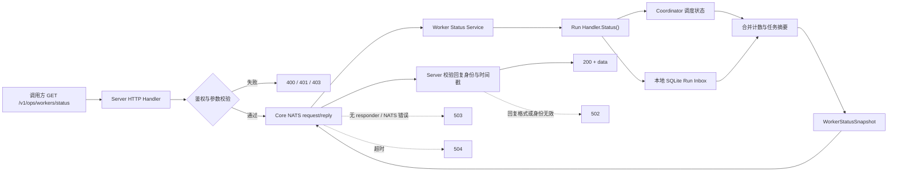

# Worker 运维状态查询接口

## 1. 接口概览

该接口查询指定 Worker 的本地运行状态快照，适用于 Worker 容量、任务等待和本地可靠投递状态排查。

```http
GET /v1/ops/workers/status?orgid=381&workerid=1
```

请求需要通过系统标准组织鉴权，并携带调用方所属组织的访问令牌：

```bash
curl --request GET \
  'http://localhost:8080/v1/ops/workers/status?orgid=381&workerid=1' \
  --header 'Authorization: Bearer <access-token>'
```

服务端会校验：

- 调用方已认证且具备组织身份；
- `orgid` 和 `workerid` 都是大于 0 的整数；
- `orgid` 必须等于访问令牌中的组织 ID。

请求处理成功后，Server 通过 Core NATS request/reply 向目标 Worker 请求快照，使用的 subject 格式为
`org.<org_id>.worker.<worker_id>.ops.status`。该查询不写入 JetStream，也不会进入任务队列；单次查询默认等待 Worker 回复 3 秒。

### 查询链路



Worker 返回的快照由两类本地状态合并而成：Coordinator 提供运行、等待、并发槽和交互等待状态；SQLite Run Inbox 提供命令、消息序号和持久化时间等详情。Server 收到回复后还会校验 `org_id`、`worker_id` 和 `snapshot_at`，校验失败不会作为成功快照返回。

## 2. 请求参数

| 参数 | 位置 | 类型 | 必填 | 说明 |
|------|------|------|------|------|
| `orgid` | query | uint | 是 | 组织 ID，必须与调用方组织一致。示例值：`381`。 |
| `workerid` | query | uint | 是 | Worker ID。示例值：`1`。 |

## 3. 成功响应

接口使用统一响应包装：

```json
{
  "code": 0,
  "message": "success",
  "data": {
    "org_id": 381,
    "worker_id": 1,
    "max_concurrency": 10,
    "running_count": 1,
    "waiting_count": 2,
    "debounce_waiting_count": 0,
    "coordinator_waiting_count": 2,
    "admission_waiting_count": 0,
    "accepted_count": 3,
    "compute_busy_count": 1,
    "interaction_waiting_count": 0,
    "inbox_pending_count": 1,
    "inbox_processing_count": 1,
    "snapshot_at": 1780000000,
    "running_tasks": [
      {
        "run_id": "run-abc",
        "task_id": "task-abc",
        "session_id": "session-abc",
        "command_id": "command-abc",
        "stream_seq": 1234,
        "status": "running",
        "created_at": 1780000000,
        "updated_at": 1780000001,
        "started_at": 1780000001
      }
    ],
    "waiting_tasks": [
      {
        "run_id": "run-def",
        "task_id": "task-def",
        "session_id": "session-def",
        "status": "queued",
        "created_at": 1780000002,
        "updated_at": 1780000002
      }
    ]
  }
}
```

`data` 的类型是 `WorkerStatusSnapshot`。除 `org_id`、`worker_id`、计数值和 `snapshot_at` 外，值为零、空数组或空字符串的可选属性可能因 JSON 的 `omitempty` 规则被省略。

### 3.1 快照顶层属性

| 属性 | 类型 | 说明 |
|------|------|------|
| `org_id` | uint | 生成快照的组织 ID。Server 会校验它必须与请求的 `orgid` 一致。 |
| `worker_id` | uint | 生成快照的 Worker ID。Server 会校验它必须与请求的 `workerid` 一致。 |
| `max_concurrency` | int | Worker 配置的最大计算并发槽数量。 |
| `running_count` | int | 已启动但尚未结束的 Runtime 数量；处于审批、问答等交互等待的 Runtime 也计入。 |
| `waiting_count` | int | Worker 已接收但尚未开始 Runtime 执行的本地 Run 总数，包含 debounce 和 Coordinator 等待阶段；不受 `waiting_tasks` 返回条数上限影响。 |
| `debounce_waiting_count` | int | 仍处于 debounce 窗口、尚未进入调度队列的 Run 数量。 |
| `coordinator_waiting_count` | int | 已进入 Coordinator 队列或正在等待计算槽的 Run 数量。 |
| `admission_waiting_count` | int | 实际阻塞在 Worker 准入 semaphore 上的消息数量。 |
| `accepted_count` | int | 已被 Worker 持久化并由当前进程拥有的命令数量，不包含尚未获得准入的消息。 |
| `compute_busy_count` | int | 当前占用计算槽的 Runtime 数量。 |
| `interaction_waiting_count` | int | 当前处于审批、问答等交互等待的 Runtime 数量。 |
| `inbox_pending_count` | int | Worker 本地 SQLite inbox 中处于 `pending` 状态的记录数量。 |
| `inbox_processing_count` | int | Worker 本地 SQLite inbox 中处于 `processing` 状态的记录数量。 |
| `snapshot_at` | int64 | 快照生成时间，Unix 秒。 |
| `degraded` | bool | 快照是否只有部分数据源可用。任一局部统计或任务详情读取失败时为 `true`。 |
| `errors` | string[] | 稳定的局部数据错误码，不返回底层错误细节。当前可能包括 `inbox_details_unavailable`、`inbox_pending_count_unavailable` 和 `inbox_processing_count_unavailable`。 |
| `running_tasks` | object[] | 正在执行的任务摘要。为空时可能省略。 |
| `waiting_tasks` | object[] | 等待执行的任务摘要，最多返回 100 条。为空时可能省略。 |
| `waiting_truncated` | bool | `waiting_tasks` 是否因达到 100 条上限而被截断。为 `true` 时，使用 `waiting_count` 获取完整等待数量。 |

### 3.2 任务摘要属性

`running_tasks` 和 `waiting_tasks` 中的每个元素都是轻量级任务摘要，只包含定位和生命周期字段，不包含 prompt、模型配置、环境变量或原始命令内容。

| 属性 | 类型 | 说明 |
|------|------|------|
| `run_id` | string | Run ID。 |
| `task_id` | string | Task ID。 |
| `session_id` | string | Session ID。 |
| `command_id` | string | Worker 命令 ID，由本地 inbox 记录补齐；详情不可用时可能省略。 |
| `stream_seq` | uint64 | 对应任务消息在消息流中的序号，由本地 inbox 记录补齐。 |
| `status` | string | 任务阶段。运行中通常为 `running`；等待任务当前可能为 `debouncing`、`slot_waiting` 或 `queued`。 |
| `created_at` | int64 | inbox 记录创建时间，Unix 秒；详情不可用时可能省略。 |
| `updated_at` | int64 | inbox 记录更新时间，Unix 秒；详情不可用时可能省略。 |
| `started_at` | int64 | Runtime 开始时间，Unix 秒。等待任务尚未开始时为零值并可能省略。 |

## 4. 错误响应

错误响应仍使用统一基础结构，通常包含 `code` 和 `message`：

```json
{
  "code": 40001,
  "message": "workerid must be a positive integer"
}
```

| HTTP 状态 | `code` | 典型 `message` | 说明 |
|-----------|--------|----------------|------|
| `400` | `40001` | `orgid is required` / `workerid must be a positive integer` | 参数缺失、不是整数或不是正整数。 |
| `401` | `40101` | `not authenticated` | 未认证或调用方没有组织身份。 |
| `403` | `40301` | `organization mismatch` | 查询的 `orgid` 与调用方组织不一致。 |
| `502` | `50001` | `worker status query bad response` | Worker 回复为空、无法解析，或回复中的组织、Worker、时间戳校验失败。 |
| `503` | `50001` | `worker status query unavailable` | NATS 不可用、没有 Worker responder，或请求发送失败。 |
| `504` | `50001` | `worker status query timed out` | Worker 未在默认 3 秒内回复。 |
| `500` | `50001` | `worker status query failed` | 未分类的服务端查询错误。 |

下游查询失败时，HTTP 状态用于区分错误类别，`code=50001` 表示服务端内部错误类响应；调用方不应只依据 `code` 判断是超时还是 NATS 不可用。

## 5. 排障时的边界

该接口反映的是目标 Worker 已接收后的本地快照：

- `waiting_count` 不包含尚未由 NATS 投递到 Worker 的任务；
- `inbox_pending_count` 和 `inbox_processing_count` 只反映该 Worker 本地 SQLite inbox；
- `degraded=true` 时，计数或任务摘要可能只有部分数据可用，但接口仍可能返回 HTTP 200；
- Worker 未启动、未订阅对应 subject 或 NATS 不可用时，接口返回 `503`；Worker 已订阅但未及时回复时，接口返回 `504`。

因此，判断完整的任务投递链路时，应将该接口的本地快照与 Server 侧发布、NATS 投递及 Worker inbox 状态结合分析，不能仅用 `waiting_count` 推断系统是否存在全链路任务积压。
